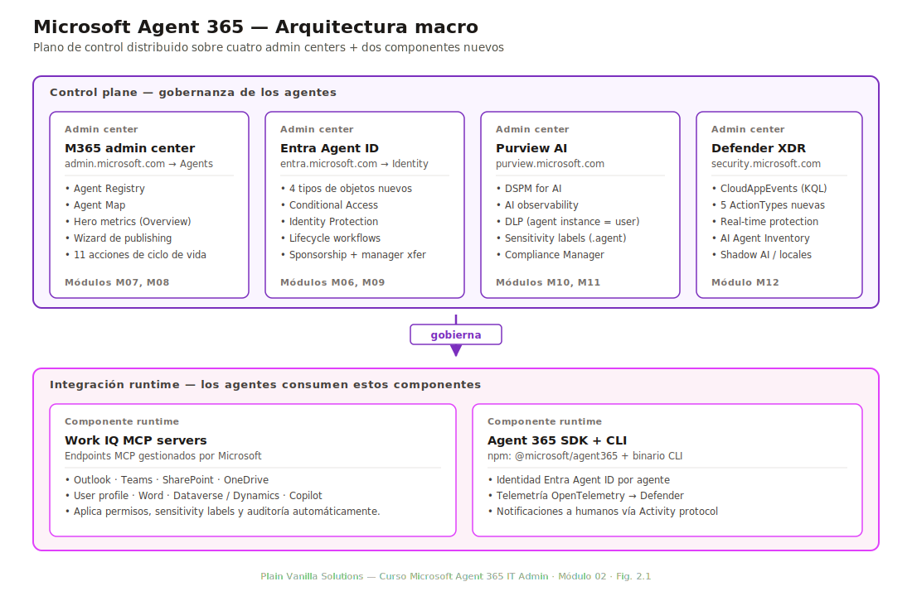
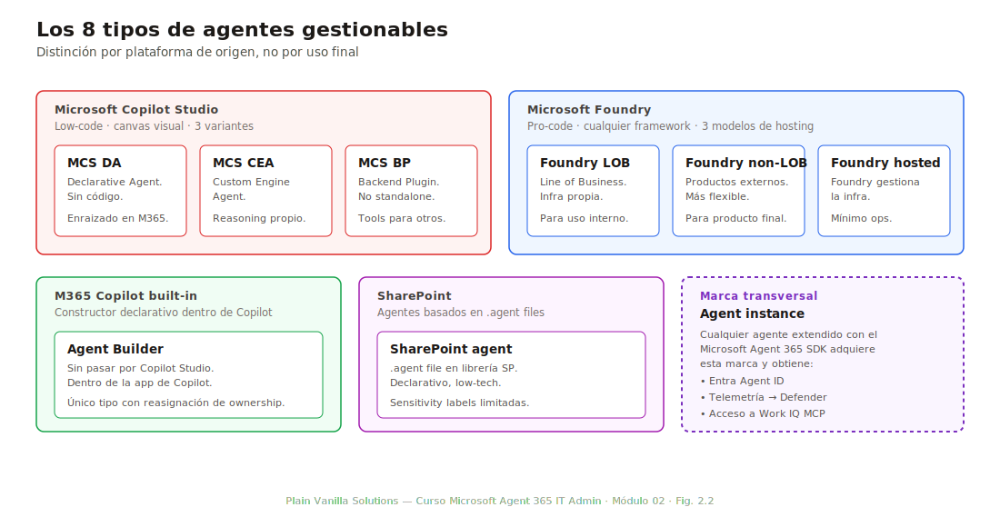
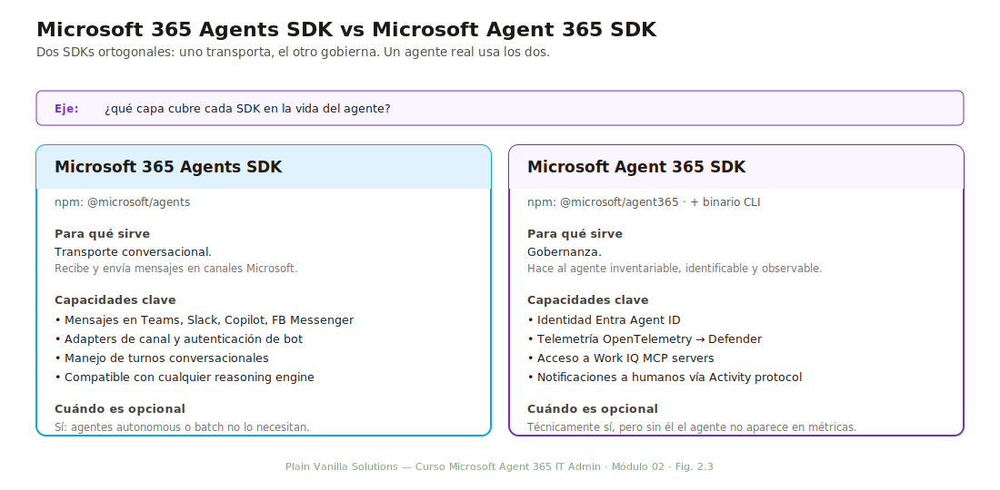

# Módulo 02 — Arquitectura y componentes

> **Duración:** 75 min · **Prerrequisito:** Módulo 01

El M01 explicó *qué* es Microsoft Agent 365 y *por qué* existe. Este módulo abre la caja: cuáles son los componentes técnicos, dónde vive cada uno, qué información almacena y cómo se relacionan. Al final del módulo el alumno puede dibujar la arquitectura del producto en una pizarra y explicar a un compañero qué pone en cada caja.

Es un módulo de fundamentos antes de entrar a operar. Los siguientes módulos (M03–M16) profundizan en cada componente; aquí se establece la base común.

## Conceptos clave

| Término | Definición |
|---|---|
| **Agent workload** | Apartado de Microsoft 365 admin center donde reside toda la gobernanza de agentes. Punto de entrada del administrador. |
| **Agent Registry** | Inventario central de todos los agentes del tenant: nombre, plataforma, owner, datasources, permisos, certificaciones, actividad. |
| **Agent Map** | Visualización de Registry agrupada por plataforma; muestra conexiones entre agentes en flujos multi-agente. |
| **Hero metric** | Indicadores principales del Overview (registry total, active users, run-time, registry sync). |
| **Agent instance** | Agente que ha sido extendido con Agent 365 SDK; tiene Entra Agent ID propia y observabilidad ampliada. |
| **MCS** | Microsoft Copilot Studio. Plataforma low-code de creación de agentes. |
| **Foundry** | Microsoft Foundry. Plataforma pro-code de creación de agentes. |
| **Agent Builder** | Herramienta dentro de Microsoft 365 Copilot para crear agentes declarativos sencillos sin salir de la app. |
| **SharePoint agent** | Agente declarativo basado en `.agent files` que vive en una librería de SharePoint. |
| **Agent Toolkit** | Microsoft 365 Agents Toolkit: extensión de Visual Studio Code para construir agentes pro-code. |
| **Work IQ MCP** | Conjunto de servidores MCP gestionados por Microsoft que dan a los agentes acceso gobernado a Outlook, Teams, SharePoint, etc. |
| **OBO (On-Behalf-Of)** | Flujo en el que el agente actúa con los permisos delegados del usuario que lo invoca. |
| **Service principal** | Objeto en Microsoft Entra que representa una identidad de aplicación (en Agent 365, también de un agente o blueprint). |
| **Blueprint** | Plantilla de configuración (políticas, controles, permisos) que se aplica a un grupo de agentes en lugar de configurar cada uno. |

---

## 2.1 Diagrama macro: Agent 365 como plano de control

*Duración: 15 minutos*

Microsoft Agent 365 no es una aplicación monolítica. Es un **plano de control distribuido** sobre cuatro admin centers que ya existían en Microsoft 365 antes del producto, más dos componentes nuevos. Cada admin center aporta un pilar de gobernanza, y Microsoft Agent 365 es la capa de coordinación que los alinea.

*Fig. 2.1 — Los seis bloques que componen Microsoft Agent 365. Los cuatro admin centers de la fila superior aportan gobernanza; los dos componentes inferiores son la integración runtime de los agentes con el control plane.*

### Los seis bloques

| Bloque | Vive en | Aporta | Módulo del curso |
|---|---|---|---|
| **Microsoft 365 admin center — Agent workload** | `admin.microsoft.com` → Agents | Agent Registry, Agent Map, hero metrics, wizard de publishing, 11 acciones de ciclo de vida. | M07, M08 |
| **Microsoft Entra Agent ID** | `entra.microsoft.com` → Identity → Agent ID | 4 tipos de objetos nuevos en directorio (blueprint, blueprint principal, agent identity, agent user), Conditional Access, Identity Protection, lifecycle workflows. | M06, M09 |
| **Microsoft Purview AI** | `purview.microsoft.com` | DSPM for AI, AI observability, DLP con `agent instance` como user, sensitivity labels para `.agent files`, Compliance Manager con templates regulatorios (EU AI Act, ISO 42001). | M10, M11 |
| **Microsoft Defender XDR** | `security.microsoft.com` | Tabla `CloudAppEvents` con 5 ActionTypes nuevas, real-time protection durante runtime, AI Agent Inventory, Shadow AI / agentes locales. | M12 |
| **Work IQ MCP servers** | Endpoints MCP gestionados por Microsoft | Acceso gobernado de los agentes a Outlook, Teams, SharePoint, OneDrive, User profile, Word, Dataverse / Dynamics, Copilot. | Esta sección 2.5 |
| **Agent 365 SDK + CLI** | npm + binario CLI | Librería que extiende un agente cualquiera con Entra Agent ID, telemetría OpenTelemetry y notificaciones via Activity protocol. | Esta sección 2.6 |

### Por qué esta distribución y no una consola única

Microsoft podría haber empaquetado todo bajo un único portal nuevo `agent365.microsoft.com`. No lo hizo a propósito: los cuatro admin centers ya tienen RBAC, auditoría, integración con Graph y un equipo administrativo familiarizado con su uso. Replicarlo todo en un portal nuevo habría implicado duplicar permisos, romper procesos existentes y forzar a los administradores a aprender otra interfaz.

La arquitectura distribuida tiene un coste: el administrador necesita saber **qué admin center usar para cada cosa**. Por eso este módulo es importante. Los siguientes módulos profundizan en cada admin center; aquí se aprenden las direcciones para no perderse.

---

## 2.2 Microsoft 365 admin center: Agent workload

*Duración: 15 minutos*

El Agent workload es el punto de entrada del administrador para el día a día de los agentes. Está en `admin.microsoft.com` → menú lateral **Agents**. El alumno con rol Global Reader ya puede entrar en modo lectura.

### Las cuatro páginas principales

| Página | Para qué sirve |
|---|---|
| **Overview** | Vista resumen con las 4 hero metrics, gráficas de tendencia y alertas activas. |
| **Registry** | Tabla filtrable de todos los agentes del tenant. Una fila por agente. |
| **Map** | Mismo registry pero como visualización de grafo, agrupado por plataforma y mostrando conexiones agente→agente en flujos multi-agente. |
| **Settings** | Configuración del Agent workload: activación, defaults de publishing, integraciones con Defender / Purview, override de templates. |

### Las cuatro hero metrics del Overview

Las hero metrics son los KPIs que ven todos los administradores al entrar al Agent workload. No son configurables: las define Microsoft. Conocerlas es la forma más rápida de demostrar literacia en el producto.

| Métrica | Qué mide | Fuente del dato |
|---|---|---|
| **Registry total** | Número de agentes registrados en el tenant, con desglose por estado (deployed, draft, blocked). | Agent Registry. |
| **Active users (last 28 days)** | Usuarios distintos que han invocado al menos un agente en los últimos 28 días. | Tabla `CloudAppEvents` de Defender, agregada por `AccountObjectId`. |
| **Run-time (last 28 days)** | Suma de tiempo de ejecución de agentes en los últimos 28 días, desglosado por plataforma. | Agent 365 SDK + telemetría OpenTelemetry. Solo cubre agentes con Agent 365 SDK integrado. |
| **Registry sync** | Estado de sincronización del registry con Entra Agent ID y con Defender. Verde si sincronizado, ámbar si retraso < 1h, rojo si > 1h. | Agent Registry health check. |

> **Limitación importante:** la métrica **Run-time** solo refleja agentes con Agent 365 SDK integrado. Un agente Copilot Studio que no haya pasado por el SDK aparecerá en Registry total pero no contribuirá a Run-time. Por eso el SDK es la puerta de entrada a la observabilidad ampliada.

> [CAPTURA PENDIENTE — `assets/02-overview-hero-metrics.png`] Página Overview del Agent workload mostrando las 4 hero metrics. Anotar con rectángulo rojo cada una de las cards de métrica. Numerar 1 a 4 en círculo correspondiente al orden de la tabla.

### Acceso a la página de un agente

Desde Registry o Map, al hacer clic en una fila o nodo se abre la **página de detalle del agente**. Esta página muestra:

- **Identity:** Entra Agent ID, blueprint del que deriva, sponsor, fecha de creación, fecha de la última publicación.
- **Permissions:** sources de datos a las que el agente tiene acceso (SharePoint sites, conectores, MCP servers).
- **Activity:** últimas invocaciones, usuarios que lo han usado, run-time acumulado, errores.
- **Risks:** solo aparece si el tenant tiene licencia M365 E7 (Frontier Suite). Lista detecciones de Identity Protection y CloudAppEvents asociadas al agente.
- **Settings:** templates aplicadas, certificaciones, ownership, lifecycle policy.

> [CAPTURA PENDIENTE — `assets/03-detalle-agente.png`] Página de detalle de un agente con las cinco pestañas (Identity / Permissions / Activity / Risks / Settings) visibles. Anotar las cinco pestañas con números en círculo.

---

## 2.3 Tipos de agentes gestionables

*Duración: 15 minutos*

Microsoft Agent 365 gobierna **8 tipos** distintos de agentes. La diferencia entre ellos es la plataforma de origen (dónde se construye y se ejecuta), no la lógica de negocio. Saberlos diferenciar es esencial para el examen y para conversaciones con desarrolladores.

*Fig. 2.2 — Los 8 tipos de agentes gestionables en el Agent Registry, agrupados por plataforma. La distinción es de origen, no de uso final.*

### Tabla de referencia rápida

| # | Tipo | Plataforma de origen | Cómo se construye |
|---|---|---|---|
| 1 | **MCS DA** (Declarative Agent) | Microsoft Copilot Studio | Canvas visual, sin código. Agente declarativo enraizado en datos M365. |
| 2 | **MCS CEA** (Custom Engine Agent) | Microsoft Copilot Studio | Canvas + código custom para reasoning engine propio. |
| 3 | **MCS BP** (Backend Plugin) | Microsoft Copilot Studio | Plugin que añade tools a otro agente; no es agente standalone. |
| 4 | **Foundry LOB** (Line of Business) | Microsoft Foundry | Pro-code, deployable en infra propia o hosted. Para casos de negocio internos. |
| 5 | **Foundry non-LOB** | Microsoft Foundry | Pro-code orientado a productos; más flexibilidad de framework. |
| 6 | **Foundry hosted** | Microsoft Foundry | Pro-code donde Foundry gestiona la infra de ejecución. |
| 7 | **Agent Builder** | Microsoft 365 Copilot (built-in) | Constructor declarativo dentro de la propia app de Copilot, sin pasar por Copilot Studio. |
| 8 | **SharePoint agent** | SharePoint | Declarativo basado en `.agent files` que vive en una librería documental. |

Hay un noveno tipo — el **Agent Toolkit** — que técnicamente no es un tipo de agente sino el SDK que se usa para construir un agente pro-code conversacional desde Visual Studio Code. Aparece en el registry como uno de los tipos anteriores según cómo se haya hecho el deploy.

### Agent instance: una marca aparte

Junto a los 8 tipos anteriores, el Registry tiene una columna que marca si el agente es además un **Agent instance**: un agente que ha sido extendido con el Agent 365 SDK. Un Agent instance:

- Tiene su propia **Entra Agent ID** en directorio.
- Emite telemetría a través del SDK que Defender consume.
- Tiene acceso a Work IQ MCP servers gobernados.
- Aparece en la métrica Run-time del Overview.

Un MCS DA puede ser un Agent instance si se ha extendido con el SDK; un Agent Builder simple no lo es.

---

## 2.4 Categorías por publisher

*Duración: 10 minutos*

Cada agente del Registry tiene un **publisher** que indica quién lo ha desarrollado. El publisher determina cuánta gobernanza adicional aplica y qué controles automáticos están disponibles.

| Publisher | Quién lo publica | Implicaciones de gobernanza |
|---|---|---|
| **Your organization** | Equipo IT o desarrolladores internos del tenant. Incluye también a *your users* (empleados que crean agentes con Agent Builder o Copilot Studio sin pasar por IT). | Gobernanza completa: el tenant decide políticas, blueprints, sensitivity labels, DLP. Mayor responsabilidad operativa. |
| **Third Party** | Partners, ISVs, aplicaciones del marketplace certificadas. | Gobernanza parcial: el tenant decide si se aprueban y qué permisos heredan, pero el código y el comportamiento dependen del partner. |
| **Microsoft** | Agentes proporcionados por Microsoft (Researcher, Analyst, Sales agent, etc.). | Gobernanza limitada: se pueden activar / desactivar / pin, pero el comportamiento interno lo gestiona Microsoft. |

### Implicaciones operativas

- **Visibilidad en Registry:** los tres publishers se ven igual en la lista; la columna **Publisher** los diferencia.
- **Aplicación de blueprints:** los blueprints solo se aplican a agentes con publisher *Your organization* (incluidos los de *your users*). Los Third Party y Microsoft se gobiernan con políticas a nivel de tenant.
- **Risks column:** disponible para los tres tipos si el tenant tiene licencia M365 E7.
- **Reasignación de ownership:** solo soportada para agentes Agent Builder; aplica únicamente a la categoría *Your organization*.

> En la práctica, la mayor parte del trabajo del administrador se concentra en *Your organization*. Los Third Party y Microsoft son revisión periódica más que gestión activa.

---

## 2.5 Work IQ MCP servers

*Duración: 5 minutos*

Los Work IQ MCP servers son **endpoints MCP gestionados por Microsoft** que dan a los agentes acceso gobernado a las herramientas de productividad del tenant. Cuando un agente necesita leer un correo de Outlook, buscar en SharePoint o consultar la presencia de un usuario en Teams, no llama a la API directamente: llama al MCP server correspondiente, que se encarga de aplicar permisos, sensitivity labels y auditoría antes de devolver la respuesta.

### Servidores disponibles

| Servidor MCP | Datos a los que da acceso |
|---|---|
| **Outlook MCP** | Mensajes de correo, calendario, contactos. |
| **Teams MCP** | Chats, canales, mensajes, presencia. |
| **SharePoint MCP** | Bibliotecas, sitios, archivos, búsqueda. |
| **OneDrive MCP** | Archivos personales del usuario. |
| **User MCP** | Perfil, organigrama, manager, miembros del equipo. |
| **Word MCP** | Documentos abiertos, lectura y comentarios. |
| **Dataverse / Dynamics MCP** | Tablas y entidades de Dataverse y Dynamics 365. |
| **Copilot MCP** | Datos del propio Copilot del usuario, conversaciones, mensajes. |

### Por qué importa

Los MCP servers son lo que hace que un agente sea **gobernable** sin escribir código de seguridad. Sin ellos, un desarrollador tendría que implementar cada control de acceso, cada filtro de sensitivity label y cada log de auditoría a mano. Con ellos:

- Las **sensitivity labels** se respetan automáticamente: si el usuario que invoca el agente no tiene acceso a un documento `Confidential`, el MCP server no lo devuelve.
- Los **DLP policies** se aplican: el agente no puede exfiltrar contenido protegido aunque el desarrollador no haya pensado en ello.
- Toda invocación queda registrada en `CloudAppEvents` con el `AccountObjectId` del usuario y el `AgentId` del agente.

### Requisito de licencia

Para que un agente pueda usar Work IQ MCP servers, **el usuario que lo invoca** necesita licencia Microsoft 365 Copilot. Sin esa licencia, el agente puede ejecutarse pero las llamadas MCP fallan con un error de licenciamiento.

---

## 2.6 Microsoft 365 Agents SDK vs Agent 365 SDK

*Duración: 10 minutos*

El M01 introdujo la distinción entre los dos SDKs. Esta sección la formaliza con casos de uso y reglas de decisión.

*Fig. 2.3 — Los dos SDKs son ortogonales: uno cubre el transporte conversacional y el otro la gobernanza. Un agente real puede usar ambos.*

### Tabla comparativa

| Aspecto | Microsoft 365 Agents SDK | Microsoft Agent 365 SDK |
|---|---|---|
| **Para qué sirve** | Transporte conversacional: recibir y enviar mensajes en Teams, Slack, Facebook Messenger, Copilot. | Gobernanza: identidad de directorio, observabilidad, acceso a Work IQ MCP, notificaciones a humanos. |
| **Qué hace gobernar a un agente** | No por sí solo. | Sí: el agente queda registrado, autenticado y observable. |
| **Cuándo usarlo** | Cuando el agente conversa con humanos a través de canales Microsoft. | Cuando el agente necesita ser inventariado, identificado en Entra y observado en Defender. |
| **Es opcional** | Sí. Hay agentes que no conversan (autonomous, batch). | Sí, pero sin él el agente no aparece en Run-time hero metric ni en `CloudAppEvents`. |
| **Compatibilidad** | Funciona con cualquier framework de reasoning (LangGraph, AutoGen, semantic kernel). | Funciona con cualquier framework, incluido el M365 Agents SDK. |
| **Distribución** | npm: `@microsoft/agents` | npm: `@microsoft/agent365` + binario CLI |

### Pueden y suelen usarse juntos

El caso típico de un agente bien construido para la empresa:

1. **M365 Agents SDK** maneja el chat en Teams: recibe el mensaje del usuario, lo pasa al engine de reasoning, devuelve la respuesta.
2. **Agent 365 SDK** envuelve el agente: le da identidad Entra, registra cada invocación con OpenTelemetry, llama a Work IQ MCP cuando hace falta acceder a SharePoint, y manda notificaciones al humano que lo sponsorea cuando algo requiere atención.

Los dos son complementarios. El error común es pensar que se elige uno o el otro.

### Frase de examen

Cuando un proveedor presente un agente y diga *«usa el Microsoft Agents SDK»*, la pregunta correcta es **cuál de los dos**. La respuesta cambia el modelo de gobernanza aplicable. La diferencia no es sutil: uno transporta, el otro gobierna.

---

## 2.7 Resumen y mapa mental

*Duración: 5 minutos*

Cierre del módulo con una vista compacta de los componentes y los módulos del curso que profundizan en cada uno.

### Mapa de los componentes y dónde se profundiza

| Componente | Módulo del curso |
|---|---|
| Agent workload (Overview, Registry, Map) | M07 — Agent Registry y Agent Map |
| Wizard de publishing y 11 acciones de ciclo de vida | M08 — Despliegue, distribución y ciclo de vida |
| Microsoft Entra Agent ID (4 tipos de objetos) | M06 — Microsoft Entra Agent ID e identidades |
| Conditional Access para agentes | M09 — Permisos, accesos y Conditional Access |
| Microsoft Purview AI (DSPM, DLP, Compliance Manager) | M10 y M11 |
| Microsoft Defender XDR (CloudAppEvents, real-time protection) | M12 — Monitorización, auditoría y reporting |
| Work IQ MCP servers | Esta sección 2.5 (no requieren un módulo aparte) |
| Microsoft Agent 365 SDK | M07 (uso para registrar agentes) y M12 (telemetría) |

### Tres ideas que el alumno debe poder repetir sin notas

1. **Agent 365 es distribuido en cuatro admin centers + dos componentes nuevos.** No hay un portal único; el administrador entra a M365 admin, Entra, Purview o Defender según la tarea.
2. **Los 8 tipos de agentes gestionables se diferencian por plataforma de origen.** MCS, Foundry, Agent Builder, SharePoint son las cuatro familias. Agent instance es una marca adicional, no un tipo distinto.
3. **Los dos SDKs son ortogonales: M365 Agents SDK transporta, Agent 365 SDK gobierna.** Un agente serio usa los dos.

Si el alumno puede explicar las tres en menos de un minuto cada una, está listo para el M03 (Licenciamiento, prerrequisitos y planificación).
