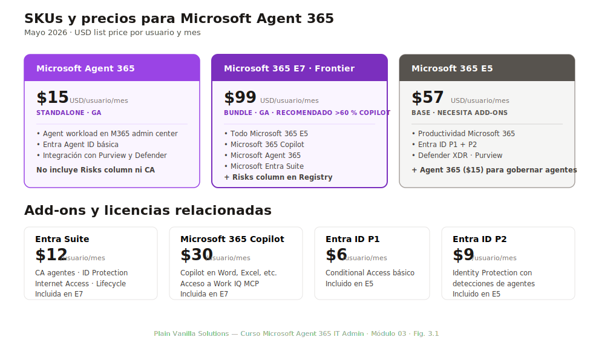
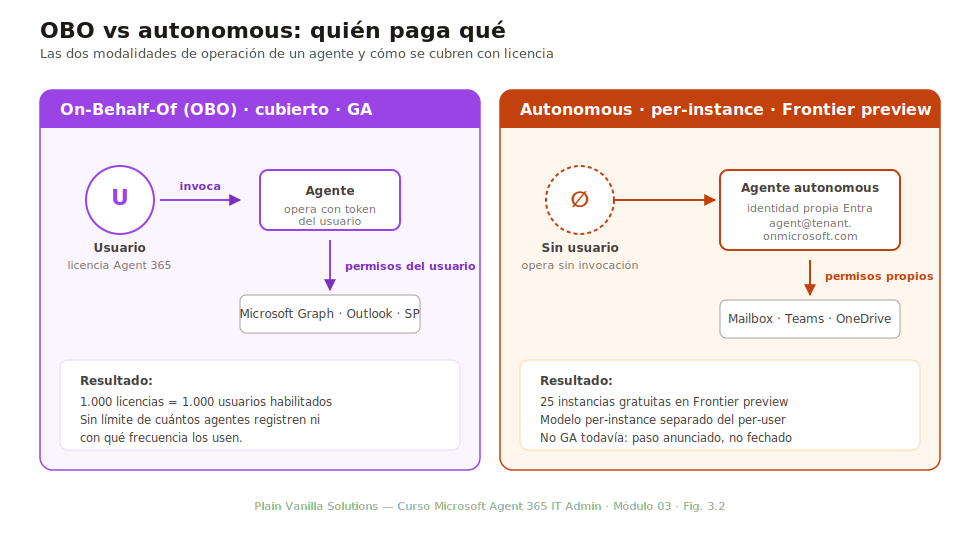
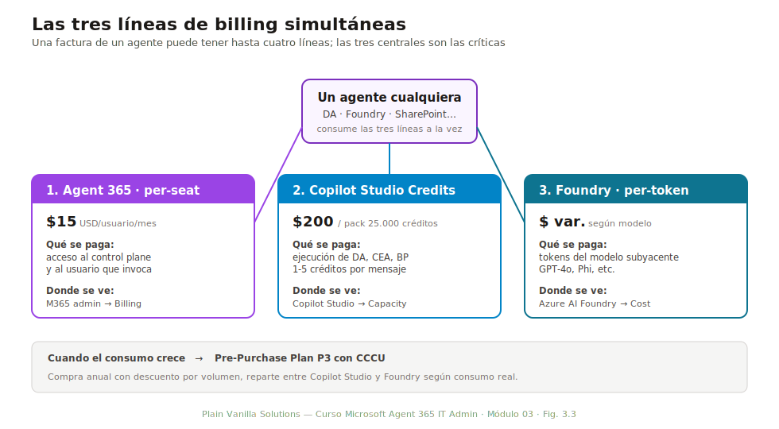
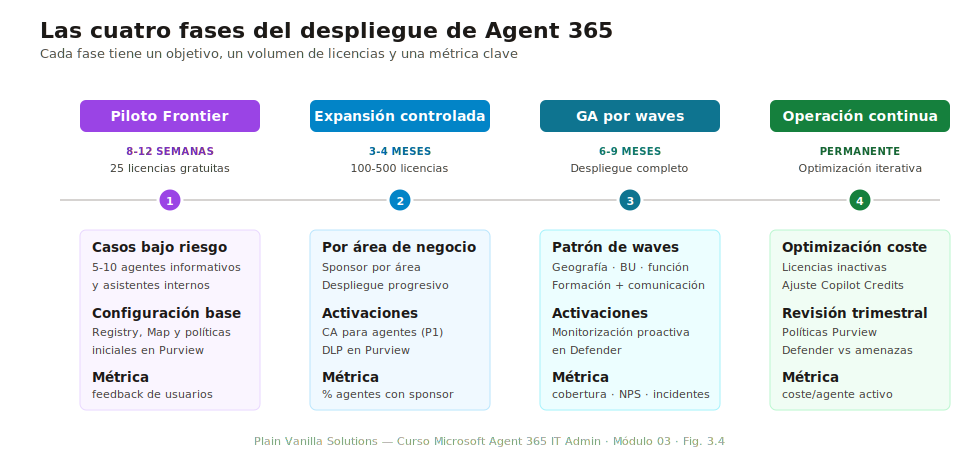

# Módulo 03 — Licenciamiento, prerrequisitos y planificación

> **Duración:** 60 min · **Prerrequisito:** Módulos 01 y 02

El M02 explicó la arquitectura del producto. Este módulo aterriza la arquitectura en dinero: qué se paga, a quién, con qué SKU y bajo qué reglas. Sin entender el modelo de licenciamiento, un IT admin no puede recomendar nada con criterio: ni cuándo basta el SKU standalone, ni cuándo se justifica el bundle Frontier, ni qué capacidades quedan fuera con licencias mínimas. Al final del módulo el alumno puede dimensionar y justificar el licenciamiento de una organización real.

## Conceptos clave

| Término | Definición |
|---|---|
| **Per-seat** | Modelo de billing en el que se paga por usuario asignado, independientemente de cuántos agentes use. Es el modelo GA de Agent 365: $15/usuario/mes. |
| **Per-instance** | Modelo en el que se paga por cada instancia de agente. Solo aplica al programa Frontier preview, no a GA. |
| **OBO (On-Behalf-Of)** | Flujo en el que el agente actúa con los permisos delegados del usuario que lo invoca. La licencia del usuario cubre al agente cuando opera en su nombre. |
| **Autonomous agent** | Agente con identidad propia (`agent@tenant.onmicrosoft.com`) que opera sin un usuario humano detrás. En mayo de 2026 sigue en Frontier preview. |
| **Frontier preview** | Programa de acceso anticipado a las capacidades nuevas de Agent 365. Incluye 25 licencias gratuitas y modelo per-instance. |
| **Copilot Credits** | Unidades de consumo de Copilot Studio. Se compran en packs ($200 = 25.000 créditos). Independientes de la licencia Agent 365. |
| **CCCU** | Copilot Consumption Credit Unit. Unidad estándar para medir consumo entre Copilot Studio, Foundry y otros productos cuando se usa el Pre-Purchase Plan P3. |
| **Risks column** | Columna del Agent Registry que muestra el nivel de riesgo de cada agente. Requiere licencia Microsoft 365 E7 (no incluida en Agent 365 standalone). |
| **Break-even** | Punto a partir del cual cambiar a un SKU bundle resulta más barato que sumar SKUs por separado. Para E7 vs E5+add-ons, suele estar en torno al 60-70 % de adopción de Copilot. |

---

## 3.1 SKUs disponibles y precios

*Duración: 10 minutos*

Microsoft Agent 365 se licencia en dos modos: como SKU **standalone** sobre un Microsoft 365 base, o incluido dentro del **bundle Frontier (M365 E7)**. Saber cuál cuesta más en bruto es trivial; saber cuál sale más rentable según el perfil de la organización es la decisión que este módulo prepara.

*Fig. 3.1 — SKUs y precios oficiales a mayo de 2026. Los precios son list price USD por usuario y mes; los precios EA contractuales suelen estar 10-25 % por debajo.*

### Precios y qué incluye cada SKU

| SKU | Precio list (USD/usuario/mes) | Qué incluye relevante para Agent 365 |
|---|---|---|
| **Microsoft Agent 365** (standalone) | $15 | Agent workload en M365 admin center, Entra Agent ID básica, integración con Purview y Defender existentes. **No incluye Risks column ni CA para agentes.** |
| **Microsoft 365 E7** (Frontier Suite) | $99 | Todo lo de E5 + Microsoft 365 Copilot + Agent 365 + Entra Suite + Risks column en Registry. **Recomendado a partir del 60-70 % de adopción Copilot.** |
| **Microsoft 365 E5** (base) | $57 | Sin Agent 365 ni Copilot. Necesita add-on Agent 365 ($15) y opcionalmente Entra Suite ($12). |
| **Microsoft Entra Suite** | $12 | Conditional Access para agentes, Identity Protection (6 detecciones nuevas para agentes), Internet Access, Lifecycle Workflows. |
| **Microsoft Entra ID P1** | $6 | Conditional Access básico (incluido en E5). Sin las detecciones de agentes de Identity Protection. |
| **Microsoft Entra ID P2** | $9 | Identity Protection con detecciones de agentes. Si la organización ya tiene E5, ya tiene P2. |

### Por qué Agent 365 cuesta tan poco aislado

$15 puede parecer bajo para un control plane completo. La explicación es estratégica: Microsoft quiere que la gobernanza de agentes sea adoptada masivamente para no perder control del ecosistema. Ofrece el SKU al precio mínimo viable y captura el margen real en los modelos de consumo (Copilot Credits, Foundry tokens) y en el bundle Frontier para cuentas grandes. Conocer esta lógica de pricing ayuda a anticipar futuras subidas: el SKU standalone es el ancla, y los add-ons son donde el coste se infla.

---

## 3.2 Reglas de cobertura: OBO vs autonomous

*Duración: 10 minutos*

La pregunta que más pierden los administradores en escenarios reales es: «si una organización compra 1.000 licencias Agent 365, ¿cuántos agentes pueden registrar?». La respuesta correcta es **«depende de cómo opere cada agente»**, y se resuelve aplicando las reglas de cobertura.

*Fig. 3.2 — Las dos modalidades de operación. La licencia Agent 365 del usuario cubre al agente solo en modo OBO. Los agentes autonomous requieren licencia per-instance, hoy disponible solo en Frontier preview.*

### Modo OBO: cubierto por la licencia del usuario

Cuando un agente actúa **en nombre del usuario** (flujo OBO), usa el token de acceso del propio usuario para llamar a Microsoft Graph, Outlook, SharePoint, etc. La licencia Agent 365 GA cubre este modo: una organización con 1.000 licencias asignadas tiene 1.000 usuarios habilitados para invocar agentes OBO, sin importar cuántos agentes registren.

Casos prácticos de OBO:
- Un agente declarativo de Copilot Studio que el usuario invoca desde Microsoft 365 Copilot.
- Un SharePoint agent al que el usuario hace una pregunta sobre documentos a los que ya tiene acceso.
- Un agente de Foundry consumido a través de un asistente conversacional.

En todos estos casos el agente «hereda» los permisos del usuario, no añade capacidad de acceso, y por tanto no genera consumo de licencia adicional.

### Modo autonomous: licencia per-instance, hoy solo Frontier

Un **agente autonomous** opera sin usuario humano detrás. Tiene su propia identidad Entra (`agent@tenant.onmicrosoft.com`), su propio mailbox, presencia en Teams, organigrama, y consume eventos en su propio nombre. Este modo es el que abre la posibilidad real de automatización 24/7 (vigilancia de buzones compartidos, monitorización proactiva, etc.).

En mayo de 2026, los agentes autonomous **siguen en Frontier preview**: solo organizaciones inscritas en el programa pueden desplegarlos, hasta el límite de 25 instancias gratuitas. El paso a GA está anunciado pero no fechado, y se hará con un modelo de pricing per-instance separado del per-user de los agentes OBO.

### Implicación para la planificación

Una organización con 5.000 usuarios E5 + 1.000 licencias Agent 365 puede:
- Habilitar agentes OBO para esos 1.000 usuarios. Sin límite de cuántos agentes registren ni con qué frecuencia los usen.
- Operar hasta 25 agentes autonomous si está en Frontier preview, sin coste adicional pero con visibilidad limitada al programa.
- **No puede** operar agentes autonomous a escala sin esperar a la GA del modelo per-instance.

---

## 3.3 Capacidades con licencia adicional

*Duración: 10 minutos*

Tres capacidades distintivas de Agent 365 **no están incluidas** en el SKU standalone de $15. Quedan tras una segunda licencia que el cliente puede o no tener. Ignorarlo lleva a propuestas que prometen capacidades que el cliente no podrá usar.

### Tabla de capacidades y su licencia mínima

| Capacidad | Licencia mínima | Notas |
|---|---|---|
| **Risks column en Agent Registry** | Microsoft 365 E7 | El score de riesgo combinado (Defender + Purview + Identity Protection) solo se renderiza con E7. Con SKU standalone se ven los agentes pero no el risk scoring agregado. |
| **Conditional Access para agentes** | Microsoft Entra ID P1 (incluido en E5) | Las políticas que aplican grant/block a sesiones de agentes consumen el motor de CA. La mayoría de tenants ya lo tienen vía E5. |
| **Identity Protection con detecciones de agentes** | Microsoft Entra ID P2 (incluido en E5) | Las 6 detecciones nuevas (anomalous agent behavior, suspicious agent sign-in, etc.) requieren P2. |
| **Internet Access para agentes** | Microsoft Internet Access (Entra Suite) | Si los agentes deben salir a internet con políticas de acceso (no usar X dominios), se necesita Internet Access. |
| **Work IQ MCP servers** | Microsoft 365 Copilot | Los 8 servidores MCP gestionados de Microsoft (Outlook, Teams, SharePoint, etc.) requieren Copilot. Sin Copilot, los agentes no pueden consumir Work IQ. |
| **Network protection en runtime de agentes** | Microsoft Defender XDR + Intune | Anunciado para junio de 2026: bloqueo en runtime de coding agents y context mapping. Requiere ambas suites. |

### Patrón: SKUs de Microsoft que ya cubren todo

Si la organización tiene **Microsoft 365 E5 + Microsoft 365 Copilot + Agent 365**, las únicas capacidades que faltan respecto a E7 son:
- Risks column en Registry.
- Internet Access para agentes (si se necesita).

Para todo lo demás (CA, Identity Protection, Lifecycle Workflows básicos, Defender XDR, Purview), E5 ya las aporta. Esta combinación es lo que hace que la decisión standalone vs E7 dependa del peso económico de Copilot, no de Agent 365.

---

## 3.4 Modelos de consumo paralelos

*Duración: 10 minutos*

Una factura de un cliente con Agent 365 no tiene una línea: tiene **tres** que conviven y crecen de forma independiente. Reconocerlas es lo que distingue al admin que sabe explicar el coste real al CFO del que «solo activa licencias».

### Las tres líneas de billing

*Fig. 3.3 — Las tres líneas de billing pueden aparecer en la misma factura del mismo agente. Saber atribuir consumo a cada una es la habilidad financiera básica del IT admin.*

| Línea | Qué se paga | Cómo se mide | Donde se ve |
|---|---|---|---|
| **Agent 365 (licencia)** | Acceso al control plane y al usuario que invoca agentes | Per-seat, factura mensual | M365 admin center → Billing |
| **Copilot Studio Credits** | Ejecución de agentes Copilot Studio (DA, CEA, BP) | Créditos por mensaje, por acción, por consulta a herramienta MCP | Copilot Studio → Capacity |
| **Foundry per-token** | Ejecución de agentes Foundry (LOB, non-LOB, hosted) | Tokens del modelo subyacente (GPT-4o, Phi, etc.) por interacción | Azure AI Foundry → Cost analysis |

### Copilot Credits en detalle

El modelo Copilot Studio se compra en **packs**: $200 list price = 25.000 créditos. Un mensaje normal consume entre 1 y 5 créditos según complejidad. Un pack rinde entre 5.000 y 25.000 mensajes. Las organizaciones con uso medio (un agente de RRHH respondiendo unas centenares de preguntas/mes) consumen 1-2 packs/mes. Las organizaciones con agentes-producto que reciben miles de interacciones consumen 10-20 packs/mes o más.

Cuando el consumo crece, conviene migrar al **Pre-Purchase Plan P3**, que opera con una unidad estándar llamada **CCCU** (Copilot Consumption Credit Unit). El P3 se compra anualmente con descuento por volumen y se reparte automáticamente entre Copilot Studio y Foundry según consumo real.

### Foundry per-token en detalle

Foundry no usa créditos: cobra por **token** del modelo subyacente. Un agente que usa GPT-4o paga al precio de GPT-4o; uno que usa Phi paga al precio de Phi. Esto da control granular pero fragmenta la previsión: un cambio de modelo (de Phi a GPT-4o por motivos de calidad) puede multiplicar el coste por 20.

### Reconciliación al final del mes

Una factura de un agente DA que extiende un Foundry hosted con Work IQ MCP tiene:
- Agent 365 per-seat para los usuarios que lo invocan.
- Copilot Credits por las invocaciones del DA.
- Foundry per-token por el modelo del Foundry hosted.
- Microsoft 365 Copilot por el consumo de Work IQ MCP (Outlook, SharePoint, etc.).

**Cuatro líneas para un solo agente.** El admin que solo mira una está subestimando el coste real entre 3× y 10×.

---

## 3.5 Frontier preview vs GA

*Duración: 5 minutos*

Microsoft mantiene dos pistas paralelas para Agent 365: **GA** (general availability, desde 1 de mayo de 2026) y **Frontier preview** (capacidades nuevas, acceso por invitación). Saber en cuál opera el cliente cambia las recomendaciones que el admin puede hacer.

### Diferencias clave

| Eje | GA (mayo 2026) | Frontier preview |
|---|---|---|
| **Precio** | $15/usuario/mes (per-seat) | Gratuito hasta 25 instancias (per-instance) |
| **Modelo de cobertura** | Per-user con OBO | Per-instance |
| **Agentes autonomous** | No disponibles | Disponibles hasta 25 |
| **Capacidades nuevas** | Las anunciadas como GA | Todas, incluyendo: Registry sync con AWS Bedrock y Google Gemini, Shadow AI page (OpenClaw), Windows 365 for Agents, agentic users / AI teammates |
| **Soporte** | Soporte estándar de Microsoft | Soporte best-effort, comunicación vía program manager |
| **Cuándo recomendarlo** | Operación normal, cumplimiento estricto | Pruebas de capacidades futuras, casos autonomous |

### Cómo se entra en Frontier preview

El acceso es por invitación de Microsoft o vía solicitud explícita a través del cuenta-manager. Los criterios típicos son: tenant productivo de M365 E5 o superior, contacto técnico designado, compromiso de feedback. La aceptación no es automática.

### Implicación práctica

Una organización en GA pura no puede operar agentes autonomous a escala. Si el cliente tiene un caso de uso 24/7 (monitorización de buzones, agentes de soporte sin operador), la única vía hoy es Frontier preview. Esto afecta a la propuesta de proyecto: si el éxito depende de autonomous, el roadmap debe contemplar la entrada en Frontier antes que el despliegue masivo.

---

## 3.6 Decisión: standalone vs E7

*Duración: 5 minutos*

La decisión más recurrente del módulo es: **¿conviene a este cliente Agent 365 standalone, o ya merece la pena el bundle E7?**. La respuesta correcta no depende de Agent 365 sino de **Copilot**.

### Tabla de decisión

| Variable | Standalone ($15) gana | E7 ($99) gana |
|---|---|---|
| Adopción Copilot | < 30 % de la plantilla | > 60 % de la plantilla |
| Necesidad de Risks column | No crítica | Crítica (compliance estricto) |
| Madurez de gobernanza | Inicial, exploración | Avanzada, con políticas |
| Volumen de licencias | < 1.000 usuarios | > 1.000 usuarios |
| Internet Access para agentes | No necesario | Necesario |
| Estrategia de adopción | Piloto controlado | Despliegue corporativo |

### Cálculo de break-even

Para una organización con **N** usuarios donde una fracción **c** adopta Copilot:

> **Coste E5 + Agent 365 + Copilot** = N × (57 + 15) + c × N × 30
> **Coste E7** = N × 99

Igualando: el bundle E7 es más barato cuando **c > 0,9** (es decir, el 90 % de los usuarios usan Copilot). En la práctica, las organizaciones empiezan a justificar E7 a partir del **60-70 %** de adopción Copilot, una vez se incluyen Risks column, Internet Access y la simplificación administrativa del bundle.

### Patrón de recomendación

| Perfil cliente | Recomendación |
|---|---|
| Pyme (< 200 empleados) explorando Copilot | E5 + Agent 365 standalone, sin Copilot inicial |
| Mediana empresa (1.000-3.000 empleados) con Copilot piloto | E5 + Agent 365 + Copilot por área piloto |
| Gran empresa (> 3.000 empleados) con Copilot consolidado | E7 corporativo |
| Sector regulado con compliance crítica | E7 desde el inicio (Risks column es no negociable) |

---

## 3.7 Planificación de despliegue

*Duración: 10 minutos*

Una vez decidido el modelo, queda el cómo. Microsoft documenta un patrón de despliegue de cuatro fases que el IT admin debe replicar y comunicar a la dirección.

### Fases del despliegue

*Fig. 3.4 — Las cuatro fases del despliegue. Cada fase tiene un objetivo distinto y métricas distintas. Saltar fases es la causa más común de pérdida de control.*

#### Fase 1 — Piloto Frontier preview (8-12 semanas)

- 25 licencias gratuitas, 5-10 agentes representativos.
- Casos de uso de bajo riesgo: agentes informativos, asistentes internos.
- Configuración básica de Registry, Map y políticas iniciales en Purview.
- Métrica clave: feedback de usuarios y comportamiento de los agentes en Defender.

#### Fase 2 — Expansión controlada (3-4 meses)

- Compra de 100-500 licencias Agent 365 standalone o E7 según decisión 3.6.
- Despliegue progresivo por área de negocio, con un sponsor por área.
- Activación de Conditional Access para agentes (requiere Entra ID P1).
- Activación de DLP en Purview para los datos accedidos por agentes.
- Métrica clave: % de agentes con sponsor identificado y políticas asignadas.

#### Fase 3 — GA por waves (6-9 meses)

- Despliegue completo siguiendo el patrón de waves del cliente (geografía, business unit, función).
- Cada wave incluye formación, comunicación, soporte específico.
- Activación de las capacidades de monitorización proactiva en Defender.
- Métrica clave: cobertura de licencias, NPS interno, incidentes detectados.

#### Fase 4 — Operación continua

- Optimización de coste (revisión de licencias inactivas, ajuste de Copilot Credits).
- Iteración del catálogo de agentes aprobados.
- Revisión trimestral de políticas Purview y Defender contra nuevas amenazas.
- Métrica clave: ratio coste/agente activo y reducción de incidentes mes a mes.

### Errores comunes en planificación

| Error | Consecuencia | Cómo evitarlo |
|---|---|---|
| Saltar el piloto y comprar 5.000 licencias E7 directamente | Resistencia interna, agentes desplegados sin sponsor, coste recurrente sin retorno medible | Imponer la fase 1 piloto aunque la dirección quiera ir rápido |
| Calcular solo la línea Agent 365 sin Copilot Credits ni Foundry | Sorpresa al recibir la primera factura completa | Modelar las tres líneas desde el principio (ver § 3.4) |
| Comprar E7 antes de tener Copilot adoptado | $99 que se aprovechan al 30 % | Ir con E5 + Agent 365 + Copilot piloto hasta que la adopción justifique E7 |
| No registrar a un sponsor por agente | Agentes huérfanos sin lifecycle automático | Requisito de Registry: sin sponsor el agente no se aprueba |

---

## Resumen y enlaces a otros módulos

Este módulo cierra los fundamentos económicos. A partir de aquí, el resto del curso opera asumiendo que el alumno sabe qué se paga, por qué se paga y cuándo se justifica cada SKU. Los temas tratados se profundizan en:

| Tema introducido aquí | Profundización |
|---|---|
| Roles necesarios para administrar Agent 365 | M04 — Roles administrativos y delegación |
| Configuración inicial del tenant tras comprar las licencias | M05 — Configuración inicial del tenant |
| Identidades y modos OBO/autonomous en detalle | M06 — Microsoft Entra Agent ID e identidades |
| Conditional Access para agentes | M09 — Permisos, accesos y Conditional Access |
| DLP y Purview para datos accedidos por agentes | M10 y M11 — Microsoft Purview y compliance |
| Optimización de coste y reducción de licencias | M16 — Costes y optimización |

### Tres ideas que el alumno debe poder repetir sin notas

1. **Standalone $15, Frontier $99, y la decisión depende de Copilot, no de Agent 365.** El SKU standalone cubre el control plane completo; lo que el bundle Frontier añade es Copilot y Risks column.
2. **OBO está cubierto por la licencia del usuario; autonomous requiere licencia per-instance todavía no GA.** Agentes autonomous a escala = Frontier preview, no GA.
3. **La factura tiene tres líneas, no una: Agent 365 per-seat, Copilot Credits, Foundry per-token.** Atribuir consumo a la línea correcta es la primera competencia financiera del IT admin.
