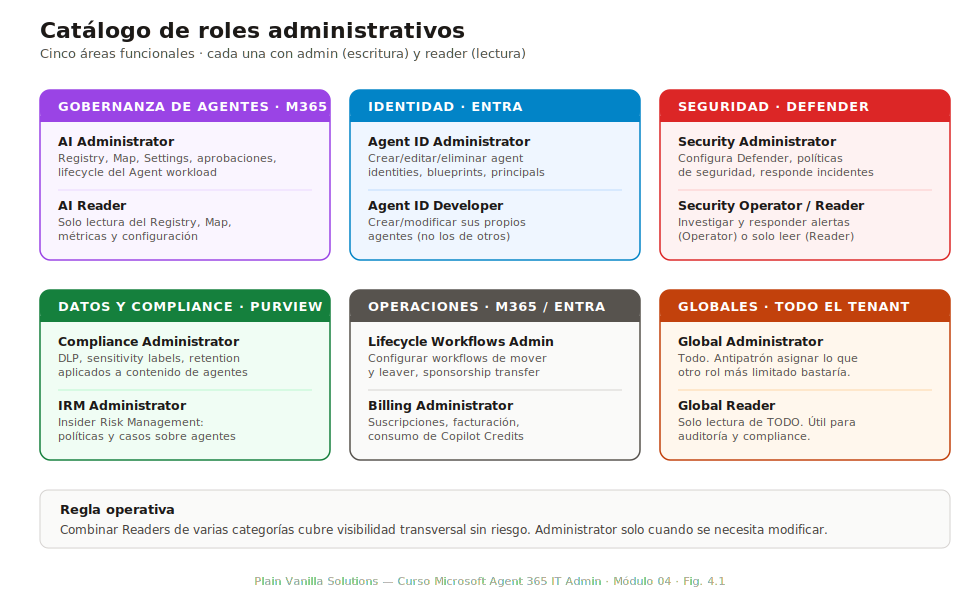
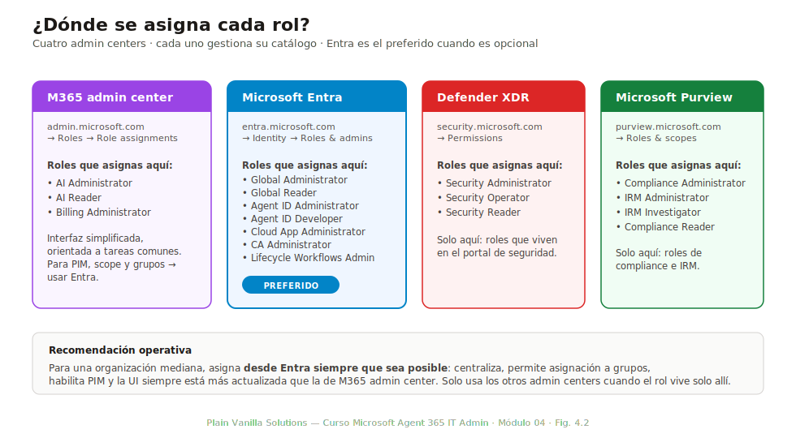
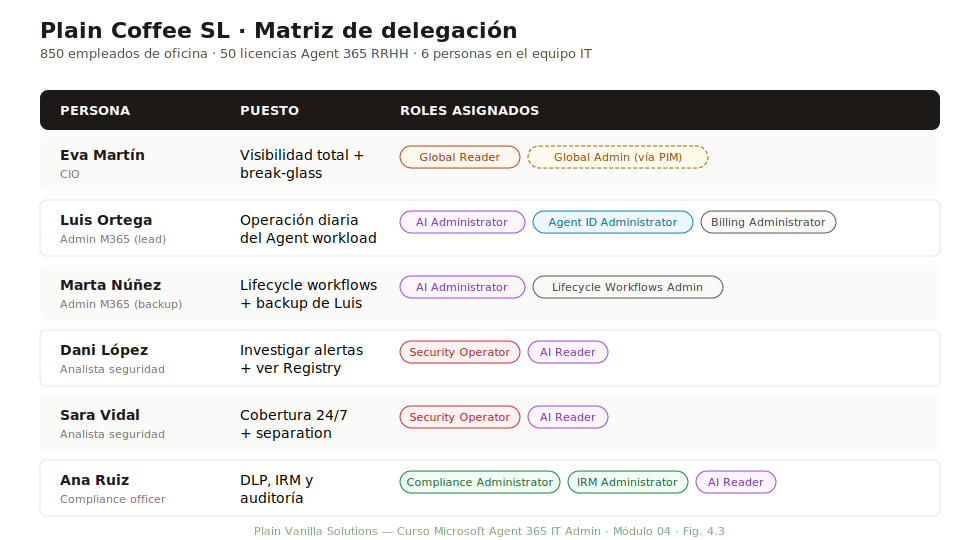

# Módulo 04 — Roles administrativos y delegación

> **Duración:** 45 min · **Prerrequisito:** Módulo 02

El M02 enseñó qué componentes existen. El M03 enseñó qué se paga. Este módulo enseña **quién puede hacer qué**: el catálogo de roles administrativos del ecosistema Microsoft Agent 365 y cómo combinarlos sin caer en el antipatrón más caro de toda la gobernanza, que es dar Global Administrator a quien solo necesita ver el Registry.

Al final del módulo el alumno puede diseñar la matriz de roles de una organización mediana de forma que ningún usuario tenga más permisos de los que necesita y, a la vez, todos puedan hacer su trabajo.

## Conceptos clave

| Término | Definición |
|---|---|
| **AI Administrator** | Rol con acceso completo al Agent workload (Registry, Map, Settings, lifecycle). Equivalente «funcional» de Global Administrator pero acotado a IA. |
| **AI Reader** | Rol de solo lectura del Agent workload. Permite ver Registry, Map y métricas pero no modificar nada. |
| **Agent ID Administrator** | Rol específico de Microsoft Entra para gestionar identidades de agentes (blueprints, blueprint principals, agent identities). |
| **Agent ID Developer** | Rol para desarrolladores: pueden crear y modificar agentes asignados a ellos, pero no actuar sobre los de otros. |
| **Global Administrator** | Rol con acceso total al tenant. **Antipatrón** asignarlo cuando otro rol más limitado bastaría. |
| **Global Reader** | Solo lectura global. Permite auditar cualquier cosa sin riesgo de modificación. Útil para auditores externos y compliance officers. |
| **Least-privilege** | Principio: cada usuario tiene el rol mínimo que le permite hacer su trabajo, ni más. Reduce superficie de ataque y errores humanos. |
| **Separation of duties** | Principio complementario: dividir tareas críticas entre roles distintos para que ningún individuo pueda completar un proceso completo solo. Ejemplo: quien crea agentes no debería poder aprobarlos. |
| **PIM (Privileged Identity Management)** | Servicio de Entra que permite asignar roles **temporalmente** con activación bajo demanda, justificación y aprobación. Recomendado para roles con privilegio elevado. |

---

## 4.1 Catálogo de roles

*Duración: 10 minutos*

El ecosistema Microsoft Agent 365 toca cuatro admin centers (M365, Entra, Purview, Defender), por lo que su catálogo de roles es necesariamente amplio. Lo agrupamos en cinco categorías según la función que cubren.

*Fig. 4.1 — Los roles agrupados por área funcional. Cada área tiene un rol «Administrator» con permisos de escritura y otro «Reader» con permisos de lectura. La buena delegación combina varios roles Reader y, como mucho, uno o dos Administrator por persona.*

### Tabla completa de roles

| Rol | Admin center | Qué puede hacer | Qué NO puede hacer |
|---|---|---|---|
| **Global Administrator** | Todos | Todo en el tenant | Nada (es el rol con permisos más amplios) |
| **Global Reader** | Todos | Ver todo, sin escritura | Modificar nada |
| **AI Administrator** | M365 admin | Gestionar Agent workload completo (Registry, Map, Settings, aprobaciones, lifecycle) | Crear identidades de agentes (eso es Agent ID Administrator), gestionar Conditional Access |
| **AI Reader** | M365 admin | Ver Registry, Map, hero metrics y configuración del workload | Modificar configuración, aprobar agentes, ver datos sensibles de Defender |
| **Agent ID Administrator** | Entra admin | Crear/editar/eliminar agent identities, blueprints y blueprint principals | Asignar Conditional Access (es CA Administrator), revisar Identity Protection |
| **Agent ID Developer** | Entra admin | Crear y modificar **sus propios** agentes; ver el catálogo | Modificar agentes ajenos, gestionar identidades a nivel tenant |
| **Cloud Application Administrator** | Entra admin | Gestionar service principals y aplicaciones (también las que respaldan agentes) | Asignar permisos de directorio, gestionar usuarios |
| **Conditional Access Administrator** | Entra admin | Crear y modificar políticas de Conditional Access (incluidas las de agentes) | Ejecutar agentes, modificar identidades |
| **Security Administrator** | Defender XDR + Entra | Configurar Defender, responder a incidentes, gestionar políticas de seguridad | Modificar configuración del Agent workload, leer correo de usuarios |
| **Security Operator** | Defender XDR | Investigar alertas y responder a incidentes; sin escritura en políticas | Modificar políticas de Defender ni de seguridad |
| **Security Reader** | Defender XDR + Entra | Solo lectura de incidentes, alertas, políticas | Modificar nada |
| **Lifecycle Workflows Administrator** | Entra admin | Configurar workflows de lifecycle (mover, leaver, sponsorship transfer) | Asignar roles, configurar identidades |
| **Billing Administrator** | M365 admin | Gestionar suscripciones, ver y cambiar facturación | Configurar agentes ni nada operativo |
| **Insider Risk Management Administrator** | Purview | Configurar políticas de insider risk, ver alertas y casos | Modificar Defender ni Conditional Access |
| **Compliance Administrator** | Purview | Configurar DLP, sensitivity labels, retention para agentes | Modificar configuración de Agent workload |

### Notas operativas

- El rol **AI Administrator** se introdujo con Agent 365 en mayo de 2026. En tenants migrados desde la fase preview puede aparecer también como `AI System Administrator` en algunos paneles. Es el mismo rol con renaming en curso.
- **Agent ID Developer** es el rol que se asigna a los desarrolladores que construyen agentes. **No** les permite ver lo que construyen otros, lo cual es una buena defensa contra el shadow IT.
- **Global Reader** es probablemente el rol más infrautilizado del catálogo. Para auditoría y compliance es la respuesta correcta el 90 % de las veces.

---

## 4.2 Principio de least-privilege aplicado

*Duración: 5 minutos*

El antipatrón clásico: «como esta persona necesita ver el Registry, le asigno Global Administrator». Es la receta de los grandes incidentes de seguridad. Si el día de mañana esa cuenta se compromete, el atacante hereda el privilegio Global. La regla es la opuesta: **el mínimo rol que permite hacer la tarea**.

### Tabla de aplicación

| Tarea | Rol mínimo correcto | Rol que muchos asignan por error |
|---|---|---|
| Ver el Registry y sus métricas | **AI Reader** | AI Administrator o Global Administrator |
| Auditar incidentes en Defender | **Security Reader** | Security Administrator |
| Aprobar nuevos agentes en el Registry | **AI Administrator** | Global Administrator |
| Investigar una alerta sin tocarla | **Security Operator** o **Reader** | Security Administrator |
| Ver el coste de las licencias del mes | **Billing Administrator** | Global Administrator |
| Auditar todo el tenant sin riesgo | **Global Reader** | Global Administrator |
| Configurar Conditional Access para agentes | **Conditional Access Administrator** | Global Administrator |

### Riesgos del privilegio excesivo

Asignar Global Administrator donde no se necesita produce tres riesgos concretos:

1. **Superficie de ataque.** Una cuenta comprometida con Global Administrator es un compromiso total del tenant. Una con AI Reader solo da visibilidad a agentes, sin capacidad de modificar nada.
2. **Cumplimiento.** Auditorías como ISO 27001, SOC 2 o regulación financiera (MIFID II, PCI-DSS) exigen evidencia documentada de least-privilege. Una matriz de roles llena de Global Administrator suspende la auditoría.
3. **Errores humanos.** Más privilegio = más posibilidad de borrar/modificar accidentalmente. Un AI Reader nunca puede tirar el Registry; un Global Administrator sí.

### PIM como mitigación

Cuando un rol de privilegio elevado es realmente necesario (por ejemplo, Global Administrator para ciertas operaciones de break-glass), la respuesta no es asignarlo permanentemente sino **vía Privileged Identity Management**: el usuario lo activa con justificación y aprobación cuando lo necesita, y se desactiva automáticamente al cabo de unas horas. Esto convierte un privilegio permanente (riesgo alto) en un privilegio temporal y auditado (riesgo controlado).

---

## 4.3 Delegación entre admin centers

*Duración: 10 minutos*

Una particularidad del catálogo es que los roles **no se asignan todos en el mismo sitio**. Saber dónde asignar cada rol es la primera fricción operativa que un IT admin nuevo en Agent 365 encuentra.

*Fig. 4.2 — Cada categoría de rol se asigna desde un admin center distinto. Los roles de identidad viven en Entra; los roles de seguridad viven en Defender; los de compliance en Purview. AI Administrator y AI Reader son los únicos que viven en M365 admin center.*

### Asignación desde M365 admin center

`admin.microsoft.com` → **Roles** → **Role assignments**

Roles que se asignan aquí:

- AI Administrator
- AI Reader
- Billing Administrator
- (Algunos roles globales también, pero por consistencia se prefiere asignarlos en Entra)

La interfaz es **simplificada y orientada a usuarios típicos**. Para configuraciones avanzadas (PIM, asignación a grupos, scope custom) se va a Entra.

### Asignación desde Microsoft Entra admin center

`entra.microsoft.com` → **Identity** → **Roles & administrators**

Aquí viven la mayoría de los roles relacionados con identidad y agentes:

- Global Administrator y Global Reader
- Agent ID Administrator y Agent ID Developer
- Cloud Application Administrator
- Conditional Access Administrator
- Lifecycle Workflows Administrator

La interfaz de Entra es **más rica**: filtros, búsqueda por nombre de rol, asignación a grupos, integración con PIM, scope a unidades administrativas.

### Asignación desde Defender y Purview

Algunos roles específicos viven en sus propios admin centers:

- **Defender XDR** (`security.microsoft.com`) → Permissions: Security Administrator, Security Operator, Security Reader.
- **Microsoft Purview** (`purview.microsoft.com`) → Roles & scopes: Compliance Administrator, Insider Risk Management roles.

### Patrón recomendado

Para una organización mediana, la regla es: **asignar todo desde Entra siempre que sea posible**. Razones:

- Centraliza la gestión y facilita auditoría.
- Permite asignación a grupos (un cambio en el grupo aplica a todos los miembros).
- Habilita PIM para los roles que lo necesiten.
- Evita el desfase de UI entre M365 y Entra (la página de Entra es siempre la más actualizada).

Las excepciones son roles que solo viven en sus admin centers especializados (Security, Compliance, IRM). En esos casos, asignarlos donde corresponde.

---

## 4.4 Diseño de delegación: caso práctico

*Duración: 15 minutos*

Aplicamos los principios anteriores a una organización mediana ficticia, **Plain Coffee SL**, una cadena de cafeterías con 850 empleados de oficina y un equipo IT formado por:

- 1 CIO (Eva Martín).
- 2 admins de M365 (Luis Ortega, Marta Núñez).
- 2 analistas de seguridad (Dani López, Sara Vidal).
- 1 compliance officer (Ana Ruiz).

Plain Coffee SL acaba de comprar Agent 365 standalone para su área de RRHH (50 licencias) y necesita repartir las responsabilidades de gobernanza de agentes entre el equipo IT.

*Fig. 4.3 — La matriz resultante para Plain Coffee SL. Ningún miembro tiene Global Administrator de forma permanente; los privilegios elevados se gestionan vía PIM con activación temporal.*

### Matriz Persona ↔ Roles

| Persona | Rol | Justificación |
|---|---|---|
| **Eva (CIO)** | Global Reader (permanente) + Global Administrator (vía PIM) | Necesita visibilidad total para reportar a la dirección. Operaciones globales solo bajo demanda y auditadas. |
| **Luis (Admin M365)** | AI Administrator + Agent ID Administrator + Billing Administrator | Operación diaria del Agent workload, gestión de identidades de agentes, control de licencias. |
| **Marta (Admin M365)** | AI Administrator + Lifecycle Workflows Administrator | Operación diaria del workload, configuración de workflows de mover/leaver para agentes. Backup de Luis. |
| **Dani (Analista seguridad)** | Security Operator + AI Reader | Investiga alertas en Defender; necesita ver Registry para correlacionar agentes con eventos pero no modificarlos. |
| **Sara (Analista seguridad)** | Security Operator + AI Reader | Mismo perfil que Dani. La separación entre dos analistas asegura cobertura 24/7 sin acumular privilegio. |
| **Ana (Compliance)** | Compliance Administrator + Insider Risk Management Administrator + AI Reader | Configura DLP y políticas de IRM para agentes; necesita ver Registry para auditar pero no modificar. |

### Validación de la matriz

Tres preguntas que valida la matriz al diseñarla:

1. **¿Puede cada persona hacer su trabajo?** Sí: cada uno tiene los permisos mínimos para sus tareas habituales.
2. **¿Hay redundancia?** Sí: Luis y Marta cubren operación M365; Dani y Sara cubren seguridad. Ninguna función queda en una sola persona.
3. **¿Hay separation of duties?** Sí: Luis y Marta crean y aprueban agentes; Dani y Sara los monitorizan; Ana audita el cumplimiento. Nadie acumula creación + monitorización + auditoría.

### Antipatrones evitados

- **Eva no tiene Global Administrator permanente.** Lo activa vía PIM cuando lo necesita; el resto del tiempo solo lee.
- **Dani y Sara no tienen Security Administrator.** Solo Operator: pueden investigar, pero no cambiar políticas. Las políticas las cambia el equipo de seguridad central de la organización vía aprobación.
- **Ana no tiene AI Administrator.** Necesita ver, no modificar. AI Reader basta.
- **Luis no tiene Compliance Administrator.** Aunque podría tener sentido por su rol, separar IT operations de compliance es un control fundamental.

---

## 4.5 Resumen y siguientes pasos

Este módulo cierra la trilogía organizativa: **qué se compra (M03), quién puede hacer qué (M04), cómo se enciende todo (M05)**. A partir de aquí entramos en la operación real del producto.

| Tema introducido aquí | Profundización |
|---|---|
| Configuración del tenant tras la asignación de roles | M05 — Configuración inicial del tenant |
| Modelo profundo de identidades de agentes | M06 — Microsoft Entra Agent ID e identidades |
| Conditional Access para agentes | M09 — Permisos, accesos y Conditional Access |
| Lifecycle workflows aplicados a agentes | M08 — Despliegue, distribución y ciclo de vida |

### Tres ideas que el alumno debe poder repetir sin notas

1. **Catálogo en cinco categorías: gobernanza, identidad, seguridad, datos y operaciones.** Cada categoría tiene Admin (escritura) y Reader (lectura). Combinar Readers de varias categorías suele bastar para visibilidad transversal.
2. **Cada categoría se asigna en su admin center.** AI Administrator y AI Reader en M365; identidad e IAM en Entra; Security en Defender; Compliance e IRM en Purview. La regla operativa: asignar desde Entra siempre que sea posible.
3. **Global Administrator es el último recurso, no el primero.** Cuando se necesite, vía PIM con activación temporal. La matriz de delegación bien diseñada reduce su uso a operaciones de break-glass.
