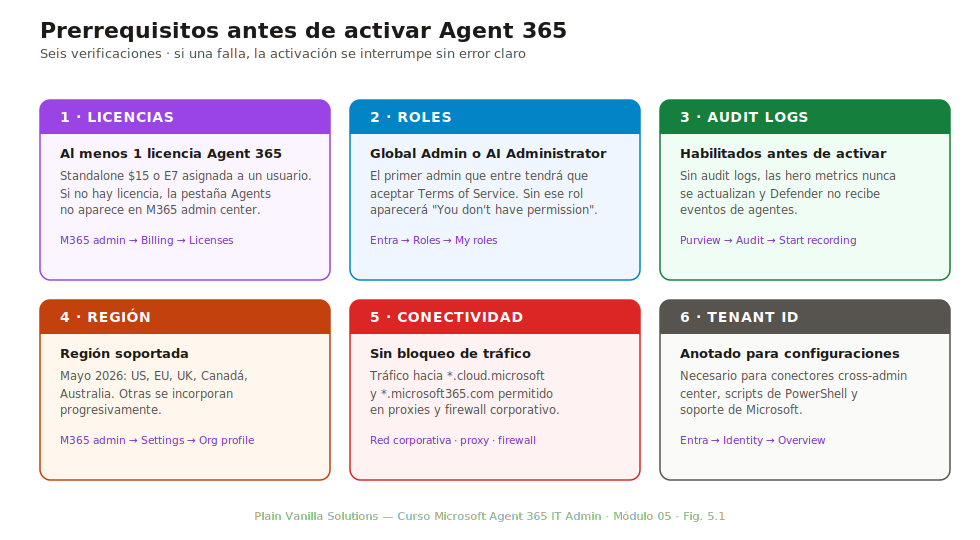
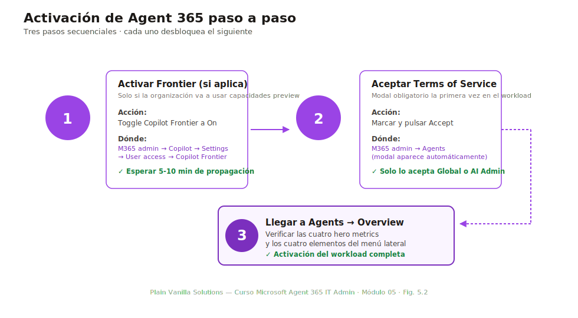
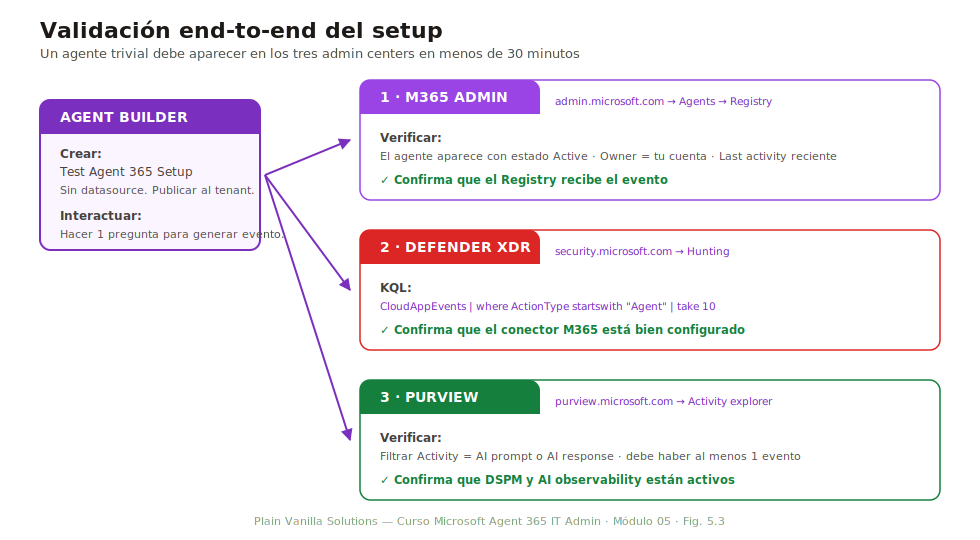

# Módulo 05 — Configuración inicial del tenant

> **Duración:** 75 min · **Prerrequisito:** Módulos 03 y 04

Los tres módulos anteriores cierran el «por qué» y el «con qué». Este módulo es el «cómo se enciende»: la primera vez que un IT admin abre el Agent workload tras comprar las licencias y asignar los roles, ¿qué tiene que tocar y en qué orden? El orden importa: saltarse un paso lleva a errores silenciosos donde el Registry parece funcionar pero los eventos no aparecen en Defender, o donde DSPM no etiqueta los datos accedidos por agentes.

Al final del módulo el alumno puede activar Agent 365 desde cero en un tenant productivo y verificar end-to-end que todo está operativo capturando un evento de prueba.

## Conceptos clave

| Término | Definición |
|---|---|
| **Frontier toggle** | Toggle en M365 admin center → Copilot → Settings → User access que activa el acceso al programa Frontier preview en el tenant. Independiente del Agent workload GA. |
| **Terms of Service** | Aceptación contractual obligatoria la primera vez que se navega al Agent workload. Sin aceptación, el workload no aparece. Solo lo puede aceptar Global Administrator o AI Administrator. |
| **Audit log** | Registro de actividad de M365. Debe estar habilitado **antes** de activar Agent 365 para que los eventos de agentes se capturen desde el primer momento. |
| **Microsoft 365 connector** | Conector de Microsoft Defender for Cloud Apps que ingiere los eventos de M365 (incluidos los de agentes) en Defender. Sin este conector, no hay AI Agent Inventory ni Risks column poblados. |
| **DSPM (Data Security Posture Management)** | Capacidad de Microsoft Purview que mapea qué datos sensibles son accedidos por agentes. Su habilitación es el paso que activa AI observability en Purview. |
| **AI observability** | Conjunto de métricas y eventos en Purview específicos de uso de IA: prompts, respuestas, datos accedidos, sensitivity labels aplicadas. |
| **Power Platform connector** | Integración entre Agent 365 y Power Platform admin center que sincroniza el inventario de agentes Copilot Studio con el Registry. |

---

## 5.1 Prerrequisitos del tenant

*Duración: 10 minutos*

Antes de pulsar el primer botón, verifica esta lista. La mayoría de los problemas de activación que se presentan en soporte vienen de saltar uno de estos puntos.



*Fig. 5.1 — Los seis bloques de prerrequisitos. Si alguno falla, la activación se interrumpe sin error claro: la página de Agents simplemente no aparece o aparece vacía.*

### Checklist completa

| Bloque | Qué verificar | Dónde |
|---|---|---|
| **Licencias** | Al menos una licencia Agent 365 standalone o un E7 asignado a un usuario | M365 admin center → Billing → Licenses |
| **Roles** | Tu cuenta tiene Global Administrator o AI Administrator | Entra admin center → Roles & administrators → My roles |
| **Audit logs** | Habilitados en Microsoft Purview o ya activos por defecto en tenants creados después de 2023 | Purview → Audit → si aparece banner «Start recording», pulsarlo |
| **Región** | Tenant en una región soportada (a mayo de 2026: US, EU, UK, Canada, Australia; otras se incorporan progresivamente) | M365 admin → Settings → Org settings → Organization profile |
| **Conectividad** | Sin políticas de bloqueo de tráfico hacia `*.cloud.microsoft` o `*.microsoft365.com` | Red corporativa, proxies, firewall |
| **Tenant ID** | Anotado para futuras configuraciones cross-admin center | Entra → Identity → Overview |

### Errores típicos cuando algún prerrequisito falla

- **Sin licencias:** la pestaña «Agents» no aparece en M365 admin center. Solución: comprar al menos una licencia y asignarla a un usuario antes de continuar.
- **Sin rol adecuado:** la pestaña aparece pero pulsar entra a una página vacía con mensaje «You don't have permission». Solución: pedir Global Administrator o AI Administrator al admin del tenant.
- **Audit logs no habilitados:** la activación parece funcionar, pero las hero metrics del Overview no se actualizan y Defender no muestra eventos de agentes. Solución: habilitar audit logs y esperar 30 minutos para que la indexación retroactiva se complete.
- **Región no soportada:** Frontier toggle aparece atenuado. Solución: comprobar la región y, si no está soportada, esperar al rollout o solicitar excepción a Microsoft vía cuenta-manager.

---

## 5.2 Activación: paso a paso

*Duración: 20 minutos*

La activación de Agent 365 toca tres admin centers en orden. Saltar el orden no rompe el sistema de inmediato pero puede dejar configuraciones inconsistentes que aparecen como errores días después.



*Fig. 5.2 — La activación tiene tres pasos secuenciales. Cada paso desbloquea el siguiente: sin Frontier toggle no aparece la opción de activar Agents; sin Terms of Service no se puede entrar al workload; sin entrada al Overview, la integración cross-admin center queda dormida.*

### Paso 1 — Activar Frontier (si aplica)

Si la organización va a usar Frontier preview (capacidades nuevas, autonomous agents):

1. M365 admin center → **Copilot** → **Settings** → **User access**.
2. Toggle **Copilot Frontier** a `On`.
3. Aceptar el aviso sobre el carácter preview de las capacidades.
4. Esperar 5-10 minutos para que el cambio se propague.

Si la organización solo va a usar Agent 365 GA (sin Frontier), este paso se salta.

### Paso 2 — Aceptar Terms of Service

La primera persona con rol Global Administrator o AI Administrator que navega al Agent workload tiene que aceptar los Terms of Service:

1. M365 admin center → **Agents** (la nueva entrada del menú lateral, visible tras la activación de Frontier o tras tener al menos una licencia GA asignada).
2. Aparece un modal con los Terms of Service específicos de Agent 365.
3. Marcar la aceptación y pulsar **Accept**.
4. La aceptación se guarda a nivel tenant: ningún otro admin tendrá que volver a aceptarla.

Esta aceptación queda **registrada en el audit log** con la cuenta del aceptante, fecha y hora. Es relevante para auditoría interna y externa.

### Paso 3 — Llegar a Agents → Overview

Tras aceptar Terms of Service, el flujo aterriza en la página Overview del Agent workload:

1. Verificar que se ven las **cuatro hero metrics**: Agent Registry total, Active users (últimos 30 días), Agent run-time, Registry sync.
2. Inicialmente todas estarán a `0` o vacías. Es normal.
3. Verificar que el menú lateral del workload muestra: **Overview**, **Registry**, **Map**, **Settings**.
4. Sin error visible: la activación del Agent workload está completa.

### Errores frecuentes en este flujo

- **«Agents» no aparece en el menú lateral.** Causa más común: el rol asignado no es Global Administrator ni AI Administrator. Otra causa: aún no han pasado los 5-10 minutos de propagación tras Frontier toggle.
- **Modal de Terms of Service no aparece.** Ya fue aceptado por otra persona (es a nivel tenant). Comprobar el audit log con `Search-UnifiedAuditLog -Operations "AgentTOSAccepted"`.
- **Hero metrics vacías 30 minutos después.** Audit logs no habilitados o conector M365 en Defender no configurado (siguiente sección).

---

## 5.3 Configuración de Defender

*Duración: 10 minutos*

Tras activar el Agent workload en M365, **Defender no sabe nada todavía**. Hay que conectarlos explícitamente para que los eventos de agentes lleguen a Defender for Cloud Apps y se rendericen en AI Agent Inventory, CloudAppEvents y la Risks column del Registry.

### Pasos en Defender XDR

1. **Defender XDR** (`security.microsoft.com`) → **Settings** → **Cloud Apps** → **App connectors**.
2. **Add app connector** → buscar **Microsoft 365** → **Connect**.
3. Elegir las áreas a conectar: como mínimo SharePoint Online, OneDrive, Teams. Para cobertura completa de Agent 365 también Exchange Online y Microsoft Entra.
4. Tipo de autenticación: **OAuth** (recomendado) que usa la identidad del tenant sin necesidad de credenciales adicionales.
5. Aceptar permisos. La conexión se completa en pocos minutos.
6. Verificar en **Cloud apps** → **Connected apps** que Microsoft 365 aparece con estado **Connected** y que el último «scan» es reciente.

### Verificación

Tras la conexión:

- En **Defender XDR** → **Hunting** → **Advanced hunting**, ejecutar una consulta KQL básica:
  ```
  CloudAppEvents
  | where Application == "Microsoft 365 Agent"
  | take 10
  ```
- Si la conexión funciona, aparecen filas (aunque sean pocas en un tenant nuevo).
- Si vuelve vacío, esperar 30 minutos a que Defender indexe los primeros eventos.

### Lo que esto activa en el Registry de M365 admin center

- **Risks column** empieza a poblarse con score por agente (requiere E7).
- **AI Agent Inventory** en Defender muestra la lista completa de agentes detectados.
- **5 nuevas ActionTypes** específicas de agentes en CloudAppEvents.
- **Real-time protection** lista para definir políticas de bloqueo.

---

## 5.4 Configuración de Purview

*Duración: 10 minutos*

Purview es el segundo admin center que conectar. Sin Purview, los datos accedidos por los agentes no se etiquetan, DLP no se aplica y la auditoría de compliance queda incompleta.

### Pasos en Microsoft Purview

1. **Purview** (`purview.microsoft.com`) → **Solutions** → **Data Security Posture Management for AI**.
2. **Activate DSPM for AI** (si no está activo). Espera de 10-15 minutos para el primer escaneo.
3. **Audit policies** → comprobar que están activas las políticas predefinidas:
   - `AI usage by users`
   - `Sensitivity labels accessed by agents`
   - `DLP matches in agent prompts`
4. **Sensitivity labels** → asegurarse de que las labels más usadas por la organización están publicadas para SharePoint Online y OneDrive (sin esto, los agentes no las heredan).

### Activación de AI observability

Dentro de DSPM:

1. **AI observability** → **Activate**.
2. Configurar el alcance: por defecto, todo el tenant. Si se quiere acotar a unidades administrativas concretas, configurarlo aquí.
3. Aceptar el coste implícito (compute para análisis de prompts y respuestas; suele ser marginal).

### Verificación

Tras 30 minutos:

- **Purview** → **Activity explorer** → filtrar por **Activity = AI usage** debe mostrar al menos algunas entradas si hay actividad en el tenant.
- **DSPM dashboard** debe mostrar el panel «AI agents» con número de agentes detectados, datos sensibles accedidos por ellos y top sensitivity labels.

### Conexión con Agent 365

Una vez Purview está conectado, el Agent workload empieza a renderizar:

- **DLP matches** por agente en la página de detalle.
- **Sensitivity labels accedidas** en la columna correspondiente.
- **Compliance score** agregado en la Risks column (si E7).

---

## 5.5 Validación end-to-end

*Duración: 15 minutos*

Llegados a este punto, los tres admin centers están conectados. La validación end-to-end consiste en lanzar un agente trivial y verificar que aparece en los tres admin centers en menos de 30 minutos.



*Fig. 5.3 — La validación end-to-end recorre los tres admin centers. Si el agente de prueba no aparece en uno de ellos en 30 minutos, la conexión correspondiente no está bien configurada y hay que volver a §5.3 o §5.4.*

### Procedimiento

1. **Crear un agente de prueba** desde Microsoft 365 Copilot → **Create agent**.
   - Nombre: `Test Agent 365 Setup`.
   - Descripción: `Agente trivial para validar setup`.
   - Datasource: ninguno.
   - Publicar al propio tenant.

2. **Interactuar con el agente** una vez para generar al menos un evento (por ejemplo, hacerle una pregunta de prueba).

3. **Verificar en M365 admin center** → **Agents** → **Registry**:
   - El agente aparece con estado **Active**.
   - El owner es tu cuenta.
   - La columna **Last activity** muestra una fecha reciente.

4. **Verificar en Defender XDR** → **Hunting** → **Advanced hunting**:
   ```
   CloudAppEvents
   | where AccountObjectId == "<tu-id>"
   | where ActionType startswith "Agent"
   | take 10
   ```
   Debe haber al menos un evento con tu interacción.

5. **Verificar en Purview** → **Activity explorer**:
   - Filtrar por **Activity = AI prompt** o **AI response**.
   - Debe aparecer al menos un evento con timestamp reciente.

### Tiempo objetivo

Con todo bien configurado, el agente aparece en los tres admin centers en **menos de 30 minutos**. Si tarda más:

- El audit log puede tener latencia inicial de hasta 90 minutos en tenants nuevos.
- La sincronización Power Platform suele ser la más lenta (próxima sección).

---

## 5.6 Resumen y troubleshooting básico

*Duración: 10 minutos*

### Tabla de errores frecuentes

| Síntoma | Causa probable | Solución |
|---|---|---|
| «Agents» no aparece en M365 admin center | Sin licencia o sin rol adecuado | Verificar licencia asignada y rol Global Administrator o AI Administrator |
| Hero metrics vacías 30 min tras activación | Audit logs no habilitados | Habilitar en Purview → Audit. Esperar 60 min para indexación retroactiva |
| Risks column vacía con licencia E7 | Conector Microsoft 365 en Defender no configurado | Configurar conector vía § 5.3 |
| AI Agent Inventory en Defender vacío | Conector M365 desconectado o latencia | Verificar estado «Connected» del conector y esperar |
| DSPM dashboard «No data available» | DSPM for AI no activado o aún en primer escaneo | Activar DSPM (§ 5.4) y esperar 30 minutos |
| Agente de prueba no aparece en Activity explorer | Sensitivity labels no publicadas o AI observability desactivada | Publicar labels relevantes y activar AI observability (§ 5.4) |
| Agentes Copilot Studio no se ven en el Registry | Power Platform connector no configurado | Configurar el conector en Power Platform admin center → Integrations |

### Tres ideas que el alumno debe poder repetir sin notas

1. **El orden importa.** Frontier toggle (si aplica) → Terms of Service → entrar al Overview → Defender connector → DSPM en Purview → validación con agente de prueba. Saltar pasos no rompe nada visible inmediatamente, pero deja huecos que aparecen como errores días después.
2. **Cada admin center se conecta una sola vez.** Tras la activación, los tres admin centers comparten datos automáticamente. Si algo no aparece, el problema es del conector específico, no del Agent workload.
3. **La validación end-to-end es obligatoria.** Lanzar un agente de prueba y verificar que aparece en los tres admin centers en 30 minutos es la única forma de confirmar que el setup es funcional. Sin esta verificación, el cliente puede pasar semanas creyendo que está cubierto cuando no lo está.

### Enlaces a otros módulos

| Tema introducido aquí | Profundización |
|---|---|
| Modelo de identidades de agentes que se ven en Registry | M06 — Microsoft Entra Agent ID e identidades |
| Filtrado, columnas y operación del Registry | M07 — Agent Registry y Agent Map |
| Eventos de Defender y AI Agent Inventory en profundidad | M12 — Monitorización, auditoría y reporting |
| DLP y sensitivity labels aplicados a agentes | M10 y M11 — Microsoft Purview y compliance |
