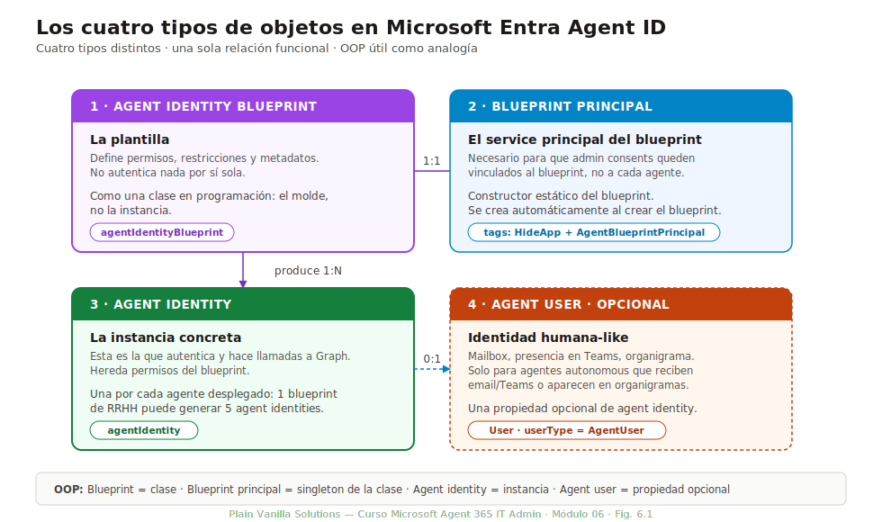
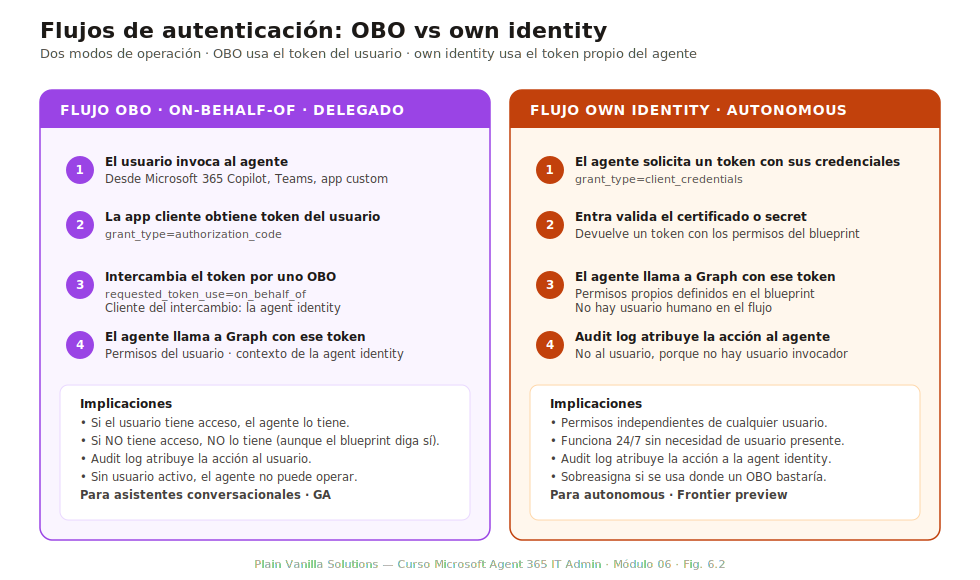
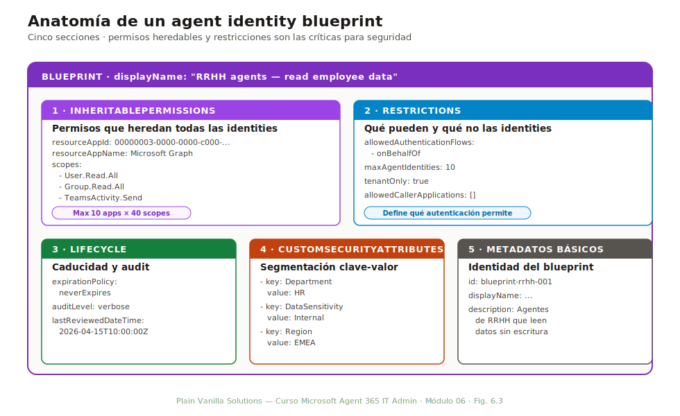

# Módulo 06 — Microsoft Entra Agent ID e identidades de agentes

> **Duración:** 105 min · **Prerrequisito:** Módulos 02 y 04

Es el módulo más denso del curso y el que más preguntas aporta a la evaluación final (11 sobre 60). Con razón: la identidad de los agentes es el corazón conceptual de Microsoft Agent 365. Sin entender los cuatro tipos de objetos nuevos del directorio, los dos flujos de autenticación, las capacidades del blueprint y la dinámica del sponsorship, todo lo que sigue (Registry, Conditional Access, lifecycle, Defender, Purview) son operaciones que el alumno ejecuta sin saber qué está pasando por debajo.

Al final del módulo el alumno puede explicar la relación entre los cuatro tipos de objetos en una pizarra, decidir entre OBO y own identity para un caso real, diseñar un blueprint ajustado a least-privilege y operar el ciclo de vida con sponsorship y lifecycle workflows.

## Conceptos clave

| Término | Definición |
|---|---|
| **Agent identity blueprint** | Plantilla reutilizable que define los permisos heredables, restricciones y metadata para agentes que se construyan a partir de ella. Es el equivalente de una «clase» de la que se instancian agentes. |
| **Agent identity blueprint principal** | Instancia configurada del blueprint en el tenant. Es el `service principal` (app registration) que materializa el blueprint y al que se asocian las identidades concretas. |
| **Agent identity** | Identidad individual de un agente concreto en el directorio. Hereda los permisos del blueprint, tiene su propio identificador y puede tener un sponsor humano asignado. |
| **Agent user** | Manifestación del agente como participante visible en Microsoft 365: aparece en Teams, recibe correos, puede tener foto y firma. Solo aparece para agentes autonomous con identidad propia. |
| **OBO (On-Behalf-Of)** | Flujo de autenticación en el que el agente actúa con el token del usuario que lo invoca. Hereda permisos del usuario, no añade. |
| **Own identity** | Flujo en el que el agente actúa con su propia identidad (su `agent identity`), independiente de cualquier usuario. Necesario para autonomous. |
| **Sponsor** | Usuario humano del directorio responsable de un agente concreto. Si el sponsor cambia de manager o sale de la organización, los lifecycle workflows reasignan o deshabilitan el agente automáticamente. |
| **Inheritable permission** | Permiso definido en el blueprint que se hereda automáticamente por todas las agent identities creadas a partir de él. Reduce la administración individual de permisos. |
| **Custom security attribute** | Atributo personalizado que se puede aplicar a una agent identity (departamento, nivel de confidencialidad, propósito) para segmentar políticas y reportes. |
| **Lifecycle workflow** | Flujo automatizado en Entra que se dispara ante eventos del sponsor (`mover`, `leaver`) y ejecuta acciones predefinidas: notificar al manager, transferir sponsorship, deshabilitar. |
| **Access package** | Paquete de permisos (security groups, OAuth API permissions, Entra roles) asignable a una agent identity. Equivalente a un grupo de roles para humanos. |
| **Multi-select disable** | Operación en bulk para deshabilitar múltiples agent identities a la vez. Útil ante incidentes de seguridad o limpieza masiva. |

---

## 6.1 Los cuatro tipos de objetos

*Duración: 20 minutos*

La primera competencia es saber distinguir los cuatro tipos de objetos nuevos que Entra Agent ID introduce en el directorio. La confusión más frecuente: tratar a todos como «el agente» cuando son cuatro cosas distintas con relaciones precisas entre ellas.



*Fig. 6.1 — Los cuatro tipos de objetos y sus relaciones. El blueprint es la plantilla; el blueprint principal es la instancia configurada en el tenant; las agent identities son las identidades concretas que se invocan; el agent user es la manifestación visible (solo para autonomous).*

### Agent identity blueprint

Es la **plantilla** que define cómo se comportarán las agent identities creadas a partir de ella. Vive en el tenant pero no es ejecutable: define permisos, restricciones y metadata. Una organización suele tener entre 5 y 30 blueprints distintos, cada uno para un patrón de agente recurrente.

**Atributos clave:**
- **ID y nombre** descriptivos (ej: `bp-rrhh-asistente-internal`).
- **Inheritable permissions:** lista de permisos OAuth (delegated o application) que heredan los agentes creados con este blueprint. Máximo **10 resource apps × 40 scopes**.
- **Restricciones:** dominios permitidos, sensitivity labels máximas accesibles, regiones admitidas.
- **Audit metadata:** quién creó el blueprint, cuándo, versión, sponsor del propio blueprint.

### Agent identity blueprint principal

Cuando un blueprint se instancia en el tenant, se crea un `service principal` que lo representa. Este service principal es el **blueprint principal**: el objeto del directorio sobre el que se asignan permisos y al que las agent identities concretas se asocian.

Es similar a una `app registration` en Entra, pero con propósito específico para agentes. Puede asignar permisos vía:
- Permisos OAuth (heredados del blueprint).
- Membresía en security groups.
- Roles Entra (excepcionalmente).

### Agent identity

Es la **identidad individual** de un agente concreto en el directorio. Por ejemplo, si el blueprint es `bp-rrhh-asistente-internal`, las agent identities son:
- `agent-rrhh-onboarding`
- `agent-rrhh-faqs`
- `agent-rrhh-leave-tracker`

Cada una tiene su propio ID, hereda los permisos del blueprint y puede tener:
- **Sponsor:** un usuario humano del directorio responsable.
- **Custom security attributes:** segmentación adicional.
- **Estado:** activa, deshabilitada, en revisión.

Es la unidad sobre la que actúan **Conditional Access**, **Identity Protection** y **lifecycle workflows**.

### Agent user

Solo aparece para **agentes autonomous con identidad propia**. Es la manifestación del agent identity en superficies M365: aparece en Teams como participante, puede recibir correos en Outlook, tener foto, firma, presencia. Es lo que hace que un compañero humano pueda interactuar con el agente como si fuera otra persona.

Los agentes que solo operan en modo OBO **no tienen agent user**: nunca aparecen como participantes con identidad propia, siempre actúan en nombre del usuario que los invoca.

### Tabla resumen

| Tipo de objeto | Qué es | Cuántos hay típicamente | Cuándo se crea |
|---|---|---|---|
| Blueprint | Plantilla de configuración | 5-30 por tenant | Diseño inicial + cuando aparece patrón nuevo |
| Blueprint principal | Service principal que instancia el blueprint | 1 por blueprint activo | Al ejecutar `a365 setup blueprint` |
| Agent identity | Identidad individual del agente concreto | 100-10.000+ por tenant | Al ejecutar `a365 create-instance identity` |
| Agent user | Manifestación visible en M365 (solo autonomous) | Subconjunto del agent identity | Automático al activar own identity |

---

## 6.2 Flujos de autenticación: OBO vs own identity

*Duración: 15 minutos*

Una agent identity puede operar en dos modos de autenticación. La elección no es libre: depende de qué hace el agente. Equivocarse en la elección lleva a que el agente no pueda hacer su trabajo o, peor, que pueda hacer cosas que no debería.



*Fig. 6.2 — Los dos flujos paralelos. OBO es el flujo por defecto y el más común en GA. Own identity desbloquea autonomous y agent users, pero está sujeto a Frontier preview en mayo de 2026.*

### Flujo OBO (On-Behalf-Of)

Es el flujo **por defecto** para la mayoría de agentes en GA.

1. El usuario abre Microsoft 365 Copilot o el cliente que aloja al agente.
2. El cliente solicita un token con el alcance del agente.
3. El servicio de identidad emite un token **delegado**: el agente actúa con permisos del usuario.
4. El agente llama a Microsoft Graph, Outlook, SharePoint con ese token.
5. Cualquier dato accedido es dato al que el usuario ya tiene acceso. Sensitivity labels, DLP y auditoría aplican como si lo hubiera hecho el propio usuario.

**Cuándo aplica OBO:**
- Agente declarativo de Copilot Studio invocado por un usuario.
- SharePoint agent que responde a preguntas del usuario.
- Foundry agent consumido vía interfaz conversacional.

**Limitaciones:**
- El agente solo puede ver lo que el usuario ve. No puede escanear todo el tenant.
- Cuando el usuario cierra la sesión, el agente pierde el token. No opera 24/7.
- No tiene presencia propia: nunca aparece como participante en Teams.

### Flujo Own identity

Necesario para agentes que operan **sin un usuario detrás**.

1. El cliente (a menudo, un trigger de tiempo o de evento) lanza al agente.
2. El agente solicita un token con su propia identidad (`agent-rrhh-monitoring@tenant.onmicrosoft.com`).
3. El servicio de identidad emite un token **de aplicación**: el agente actúa con permisos heredados del blueprint.
4. El agente llama a Graph con ese token. Los datos accedidos son datos a los que la **agent identity** tiene permisos, no un usuario humano.
5. Auditoría e Identity Protection ven al agent identity como originador.

**Cuándo aplica Own identity:**
- Monitorización 24/7 de buzones compartidos.
- Triage automático de tickets sin operador humano.
- Agente que ejecuta tareas programadas (cron-like).
- Cualquier agente que necesita aparecer como participante propio en Teams.

**Implicaciones:**
- El agente puede operar siempre, no depende de sesiones de usuario.
- Necesita su propio set de permisos en el blueprint.
- En mayo de 2026, los agentes con own identity siguen sujetos al programa **Frontier preview** (límite 25 instancias gratuitas, modelo per-instance, no GA).

### Comparativa de tokens

| Aspecto | OBO | Own identity |
|---|---|---|
| Tipo de token | Delegated | Application (a veces «daemon») |
| Identidad activa | El usuario que invocó | La agent identity |
| Permisos | Los del usuario (intersección con scope solicitado) | Los del blueprint (heredables + asignados) |
| Auditoría | El usuario aparece como actor | La agent identity aparece como actor |
| 24/7 | No (sesiones de usuario) | Sí |
| Presencia M365 | No | Sí (agent user) |
| Disponibilidad | GA | Frontier preview (mayo 2026) |

### Cómo se decide el flujo

La decisión la hace el desarrollador del agente al construirlo. El IT admin la valida revisando el blueprint y la agent identity:

- En el **blueprint**, el flag `allowOwnIdentity` controla si las agent identities derivadas pueden operar en own identity.
- En la **agent identity**, el modo activo se ve en Entra admin center → Agent ID → seleccionar agent → **Authentication**.

Cambiar de OBO a own identity tras desplegar el agente es **disruptivo**: afecta auditoría, permisos efectivos y comportamiento. La elección debe ser correcta desde el diseño.

---

## 6.3 Agent identity blueprints

*Duración: 20 minutos*

El blueprint es **el** objeto que un IT admin diseña con más cuidado. Un blueprint mal pensado afecta a todos los agentes derivados de él durante meses. Un blueprint bien pensado convierte la administración individual de agentes en un trabajo de copia y pegado.

### Anatomía de un blueprint



*Fig. 6.3 — Las cinco secciones clave de un blueprint. Las restricciones (max 10 × 40) son el límite duro: si la organización necesita más, hay que diseñar varios blueprints especializados.*

#### Metadata

- `displayName`: nombre humano (`bp-rrhh-asistente-internal`).
- `description`: propósito del blueprint.
- `version`: incrementa al cambiar permisos heredables.
- `creator`: usuario que lo creó (suele ser AI Administrator).
- `tags`: etiquetas para filtrar (ej: `area=rrhh`, `riesgo=bajo`).

#### Inheritable permissions

Lista de permisos OAuth que heredan **todas** las agent identities creadas con este blueprint:

```
"inheritablePermissions": [
  {
    "resourceAppId": "00000003-0000-0000-c000-000000000046", // Microsoft Graph
    "delegatedScopes": ["User.Read.All", "Group.Read.All"],
    "applicationScopes": []
  },
  {
    "resourceAppId": "00000002-0000-0ff1-ce00-000000000000", // Exchange Online
    "delegatedScopes": ["Mail.Read"],
    "applicationScopes": []
  }
]
```

**Restricciones duras:**
- Máximo **10 resource apps** por blueprint.
- Máximo **40 scopes en total** sumando todos los resource apps.
- Si la organización supera estos límites, debe **partir el caso de uso en varios blueprints**.

#### Restricciones funcionales

- `allowedDomains`: dominios externos a los que el agente puede salir (si Internet Access está activo).
- `maxSensitivityLabel`: nivel máximo de sensitivity label que el agente puede acceder.
- `regions`: regiones soportadas (sigue las regiones del tenant).
- `allowOwnIdentity`: si true, las agent identities derivadas pueden operar en own identity.

#### Sponsorship por defecto

- `defaultSponsor`: usuario sponsor por defecto si la agent identity no especifica uno.
- `requireSponsor`: si true, ninguna agent identity puede crearse sin sponsor (recomendado).
- `transferOnLeaver`: si true, al salir el sponsor el lifecycle workflow se dispara.

#### Audit

- `lastModifiedDateTime`: fecha del último cambio.
- `lastModifiedBy`: usuario que modificó por última vez.
- `auditPolicy`: nivel de auditoría (`standard`, `verbose`).
- `relatedAgentIdentities`: lista de agent identities derivadas (para impacto de cambios).

### Patrones recomendados

- **Un blueprint por área funcional:** `bp-rrhh`, `bp-finanzas`, `bp-it`, `bp-ventas`. Mejor varios blueprints especializados que uno gigante con muchos permisos.
- **Versionado explícito:** al cambiar permisos heredables, incrementar `version`. Nunca borrar y recrear: rompe agent identities derivadas.
- **Permisos delegados primero:** dar primero permisos delegados (menos riesgo); solo añadir application si el agente lo necesita.
- **Naming consistente:** `bp-{area}-{caso}` para blueprints, `agent-{area}-{instancia}` para agent identities.

### Errores comunes en blueprints

| Error | Síntoma | Solución |
|---|---|---|
| Superar 10 resource apps × 40 scopes | API devuelve `400 Bad Request` al crear el blueprint | Partir en varios blueprints especializados |
| Mezclar permisos delegated y application sin criterio | Agent funciona en OBO pero falla en own identity (o viceversa) | Decidir desde diseño qué flujo usará y dar el tipo correcto |
| No establecer `requireSponsor: true` | Aparecen agent identities huérfanas que ningún humano controla | Imponer `requireSponsor: true` en todos los blueprints corporativos |
| Versión sin incrementar tras cambio | Agent identities con permisos inconsistentes según fecha de creación | Incrementar siempre version al modificar inheritable permissions |

---

## 6.4 Sponsorship y lifecycle

*Duración: 15 minutos*

Una agent identity sin sponsor es **deuda técnica**: nadie sabe quién es responsable de ella, qué hace, si sigue siendo necesaria. La sponsorship + lifecycle workflows convierte esa deuda en un proceso automático.

### Qué es el sponsor

Un usuario humano del directorio que figura como **responsable** de una agent identity concreta. Sus deberes:

- Aprobar cambios en la agent identity.
- Recibir notificaciones cuando el agente genera alertas en Defender.
- Decidir el lifecycle del agente cuando se queda sin uso.

El sponsor no es el creador (el creador suele ser un developer o IT admin); es el dueño funcional. Por ejemplo, en `agent-rrhh-onboarding`, el sponsor sería el manager de RRHH, no el desarrollador del agente.

### Lifecycle workflows aplicables a agent identities

Microsoft Entra incluye lifecycle workflows preconfigurados para agentes:

| Trigger | Evento que lo dispara | Acción por defecto |
|---|---|---|
| **`onSponsorJoiner`** | El sponsor se incorpora a la organización (raro para agentes, común para usuarios) | No aplica |
| **`onSponsorMover`** | El sponsor cambia de manager o department | Notificar al nuevo manager + transferir sponsorship + opcional pause del agent |
| **`onSponsorLeaver`** | El sponsor sale de la organización | Notificar al manager + transferir sponsorship + opcional disable del agent en X días |
| **`onAgentInactivity`** | El agente lleva N días sin actividad | Notificar al sponsor + opcional disable tras X días adicionales |

Los workflows son **configurables** desde Entra → Identity Governance → Lifecycle workflows.

### Configurar sponsorship transfer al manager

El patrón más común: si un sponsor sale de la organización, el lifecycle workflow transfiere automáticamente la sponsorship al manager directo del sponsor saliente.

1. Entra admin → **Identity Governance** → **Lifecycle workflows** → **Create workflow**.
2. Plantilla: **Real-time leaver for agent sponsor**.
3. Trigger: cuando el atributo `accountEnabled` de un sponsor pasa a `false`.
4. Tareas:
   - **Notify manager** (el manager directo del sponsor) por email.
   - **Reassign agent sponsorship** al manager (si el manager está disponible).
   - **Pause agent identity** durante 7 días (suspensión preventiva).
   - **Disable agent identity** si tras 30 días el manager no acepta la transferencia.
5. Guardar y activar.

### Multi-select disable

Operación bulk para deshabilitar múltiples agent identities a la vez. Útil en:

- **Incidente de seguridad:** todos los agentes de un blueprint sospechoso se deshabilitan en un click.
- **Limpieza periódica:** deshabilitar todos los agentes inactivos de los últimos 90 días.
- **Reorganización:** un departamento entero pasa a otro tenant; sus agents se deshabilitan en bulk.

Acceso desde Entra admin → Agent ID → multi-select de filas → **Disable selected**.

---

## 6.5 Access packages

*Duración: 10 minutos*

Más allá de los permisos heredados del blueprint, una agent identity puede recibir **permisos extra** vía access packages. Es el equivalente de los grupos de roles para humanos.

### Tipos de permiso asignable

| Vía | Qué se asigna | Ejemplo |
|---|---|---|
| **Security groups** | Membresía en grupos para acceder a recursos | Añadir agent al grupo `RRHH-Documents-Reader` |
| **OAuth API permissions** | Permisos OAuth adicionales sobre el blueprint base | `Sites.Read.All` adicional para acceder a SharePoint corporativo |
| **Entra roles** | Roles administrativos (excepcional) | `AI Reader` para que un agente de monitoring pueda leer el Registry |

### Ciclo de vida del access package

1. Un AI Administrator define un access package que incluye los permisos.
2. El sponsor del agente solicita el package para su agent identity.
3. Aprobación opcional según política (auto-aprobado, requiere review, etc.).
4. Asignación con duración: permanente, temporal con fecha fin, o sujeta a Access Review.
5. Al vencer, los permisos se revocan automáticamente.

### Patrón recomendado

- **Agent base permissions** vía blueprint (heredables, comunes a todos los agentes del tipo).
- **Agent extra permissions** vía access package (específicas de un agente concreto, con duración acotada).

---

## 6.6 Custom security attributes

*Duración: 5 minutos*

Atributos personalizados que el tenant define y aplica a agent identities para segmentar políticas, reportes y auditoría.

### Casos de uso

| Atributo | Valores posibles | Para qué sirve |
|---|---|---|
| `Department` | `RRHH`, `Finanzas`, `IT`, `Ventas` | Filtrar agentes en Registry por área |
| `ConfidentialityLevel` | `Public`, `Internal`, `Confidential`, `Restricted` | Aplicar Conditional Access según nivel |
| `BusinessOwner` | Email del manager funcional | Trazar responsabilidad funcional separada del sponsor técnico |
| `AgentPurpose` | `Productivity`, `Monitoring`, `CustomerFacing`, `Compliance` | Reportes diferenciados |

### Aplicación

1. Entra admin → **Custom security attributes** → **Add attribute set** → definir atributo y valores permitidos.
2. Sobre una agent identity → **Custom security attributes** → asignar atributo y valor.
3. Las políticas (Conditional Access, alertas Defender) pueden filtrar por atributo.

---

## 6.7 Convergencia M365 admin center ↔ Entra (mayo 2026)

*Duración: 10 minutos*

El 1 de mayo de 2026, coincidiendo con la GA de Agent 365, Microsoft retiró tres páginas legacy de Entra admin center. Esto cambia los workflows de los administradores que ya conocían el producto desde la fase preview.


*Fig. 6.4 — La convergencia simplifica la administración: Registry y collections solo se gestionan desde M365 admin center; Entra mantiene únicamente la gestión de identidades. Las APIs Graph cambian de path.*

### Qué se retira de Entra admin center

- **Agent registry page** (Identity → Applications → Agent registry): ahora solo en M365 admin → Agents → Registry.
- **Agent collections page** (Identity → Applications → Agent collections): se elimina; las colecciones pasan a ser un concepto del Registry en M365.

### Qué permanece en Entra admin center

- **Agent ID:** todo el modelo de identidades sigue en Entra (es identidad, no agent management).
- **Agent identity blueprints:** se diseñan y gestionan desde Entra.
- **Lifecycle workflows:** siguen en Identity Governance.
- **Conditional Access** para agentes: sigue en Entra Security.

### Cambio en APIs Graph

Las APIs Graph para agent management se han reubicado:

| API antigua (deprecated en mayo 2026) | API nueva (current) |
|---|---|
| `GET /beta/agentRegistry/agents` | `GET /beta/copilot/admin/agents` |
| `GET /beta/agentRegistry/agents/{id}/sponsor` | `GET /beta/copilot/admin/agents/{id}/sponsor` |
| `POST /beta/agentRegistry/agents/{id}/disable` | `POST /beta/copilot/admin/agents/{id}/disable` |

Las APIs antiguas siguen funcionando con redirección hasta noviembre de 2026 (sunset). Después devolverán `410 Gone`.

### Patrón de migración

Si la organización tiene scripts o herramientas que usan las APIs antiguas:

1. Inventariar todos los usos de `/beta/agentRegistry/...`.
2. Sustituir por `/beta/copilot/admin/...`.
3. Probar en un tenant de desarrollo.
4. Desplegar antes de noviembre de 2026.

---

## 6.8 APIs Graph para identidades

*Duración: 5 minutos*

Microsoft Graph expone endpoints específicos para identidades de agentes. Los más relevantes para un IT admin:

### `riskyAgents`

Lista de agent identities con score de riesgo elevado.

```
GET /beta/identityProtection/riskyAgents
  ?$filter=riskLevel eq 'high'
  &$top=20
```

Devuelve agent identities con `riskLevel`, `riskState`, `lastUpdatedDateTime`. Equivalente al `riskyUsers` para humanos.

### `agentRiskDetections`

Detecciones específicas de Identity Protection sobre agentes.

```
GET /beta/identityProtection/agentRiskDetections
  ?$filter=detectedDateTime ge 2026-05-01
  &$select=id,riskType,riskState,agentId
```

Tipos de detección: `anomalousAgentBehavior`, `suspiciousAgentSignIn`, `agentTokenAnomaly`, etc.

### `signInEventTypes` con eventos de agent

Los eventos de inicio de sesión incluyen un campo `signInEventType` con valores específicos de agente:

- `agentInteractive`
- `agentNonInteractive`
- `agentServicePrincipal`
- `agentBlueprintActivation`

Filtrar por estos valores aísla la actividad de agentes en logs masivos.

### Listar agent identities con filtros

```
GET /beta/agents
  ?$filter=agentBlueprintId eq 'bp-rrhh-asistente'
  &$select=id,displayName,sponsor,accountEnabled
```

Útil para auditoría: «todos los agentes activos del blueprint X», «todos los agentes sin sponsor», «agentes inactivos > 90 días».

---

## 6.9 Resumen y siguientes pasos

Este módulo ha cubierto el modelo de identidad completo de Agent 365. Es el más largo del curso porque sin él, los siguientes módulos son operación a ciegas.

### Tres ideas que el alumno debe poder repetir sin notas

1. **Cuatro tipos de objetos: blueprint, blueprint principal, agent identity, agent user.** El blueprint es la plantilla, el principal es la instancia configurada, la agent identity es el agente concreto, el agent user es la manifestación visible (solo autonomous).
2. **Dos flujos de autenticación: OBO y own identity.** OBO usa el token del usuario y es el flujo por defecto en GA. Own identity usa la identidad propia del agente, necesario para autonomous, sigue en Frontier preview.
3. **Sponsorship + lifecycle workflows automatizan el ciclo de vida.** Cada agent identity tiene un sponsor humano; cuando ese sponsor cambia o se va, el lifecycle workflow notifica al manager y reasigna o deshabilita automáticamente.

### Enlaces a otros módulos

| Tema introducido aquí | Profundización |
|---|---|
| Cómo se ven las agent identities en Registry | M07 — Agent Registry y Agent Map |
| Lifecycle workflows operados día a día | M08 — Despliegue, distribución y ciclo de vida |
| Conditional Access aplicado a agent identities | M09 — Permisos, accesos y Conditional Access |
| Identity Protection y `riskyAgents` en profundidad | M12 — Monitorización, auditoría y reporting |
