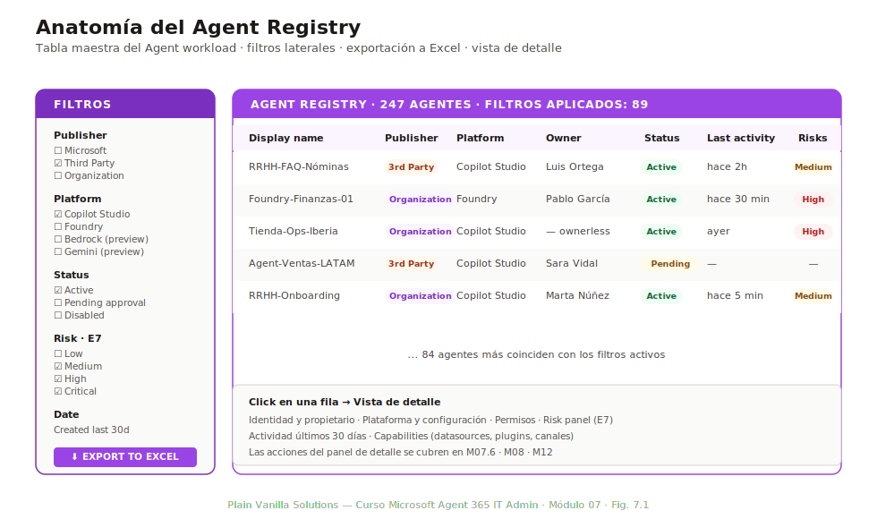
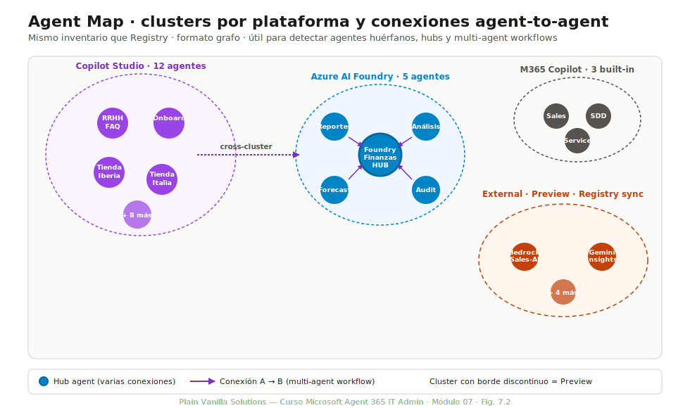
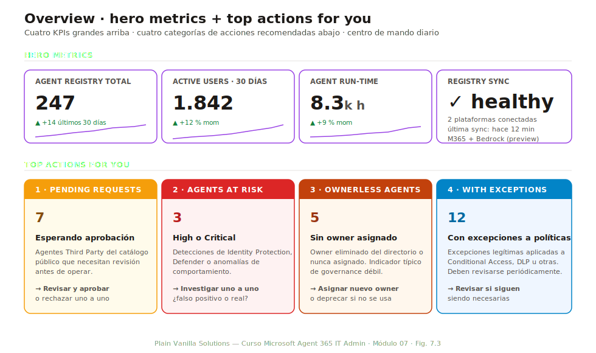

# Módulo 07 — Agent Registry y Agent Map

> **Duración:** 75 min · **Prerrequisitos:** Módulos 02 y 05

Este es el primer módulo puramente operativo del curso. Tras los cinco anteriores que cubren el **qué**, el **por qué** y el **cómo se enciende**, aquí entramos en el **cómo se opera el día a día**. El Agent Registry es la pantalla que un IT admin abre primero por la mañana: lista de todos los agentes del tenant, su estado, sus owners, sus riesgos. El Agent Map es la misma información en formato visual, útil para detectar agentes huérfanos, clusters de plataforma o multi-agent workflows.

Al final del módulo el alumno puede recorrer fluidamente Registry y Map, aplicar filtros, exportar inventarios para análisis offline y dar respuesta a preguntas operativas concretas: «¿qué agentes están en riesgo?», «¿quién es owner de cada uno?», «¿cuántos agentes vienen de Power Platform vs Foundry?».

## Conceptos clave

| Término | Definición |
|---|---|
| **Agent Registry** | Tabla maestra del Agent workload: una fila por agente con metadata, owner, plataforma, estado, riesgo y métricas. Es el pivot operativo del producto. |
| **Agent Map** | Visualización gráfica del Registry. Cada agente es un nodo; las conexiones entre nodos representan multi-agent workflows. Clusters por plataforma. |
| **Hero metric** | Métrica destacada en la página Overview del Agent workload. Hay cuatro: Agent Registry total, Active users, Agent run-time, Registry sync. |
| **Ownerless agent** | Agente cuyo owner técnico ha sido eliminado del directorio o nunca fue asignado. Aparece en la sección «Top actions for you» del Overview. |
| **Pending request** | Solicitud de aprobación pendiente: un agente que necesita ser revisado y aprobado antes de operar en el tenant. Suele ser para agentes de terceros o de fuera del catálogo aprobado. |
| **Registry sync** | Conector que añade agentes registrados en otras plataformas (AWS Bedrock, Google Gemini Enterprise) al Registry de Agent 365. En preview a mayo de 2026. |
| **Risks column** | Columna del Registry que muestra el risk score por agente. Calculado por Defender + Identity Protection. **Requiere licencia E7**. |
| **Top actions for you** | Sección del Overview que destaca acciones que el admin debería hacer hoy: aprobar pending requests, asignar owners a ownerless agents, revisar agentes at risk, atender exceptions. |

---

## 7.1 Agent Registry: estructura

*Duración: 15 minutos*

El Agent Registry es la primera pantalla útil tras la activación. Vive en `M365 admin center → Agents → Registry`. Su diseño es deliberadamente similar a otras tablas de inventario del ecosistema Microsoft 365 (Apps catalog, Teams admin) para minimizar la curva de aprendizaje.

*Fig. 7.1 — La estructura del Registry. Columnas configurables, filtros laterales por publisher/plataforma/estado/riesgo, búsqueda por nombre, exportación a Excel y vista de detalle por agente.*

### Columnas estándar

Por defecto, el Registry muestra estas columnas:

| Columna | Contenido | Ordenable |
|---|---|---|
| **Display name** | Nombre del agente | Sí |
| **Publisher** | `Microsoft`, `Third Party` u `Organization` | Sí |
| **Platform** | Copilot Studio, Foundry, Bedrock, Gemini, etc. | Sí |
| **Owner** | Usuario o grupo propietario; vacío para ownerless | Sí |
| **Status** | `Active`, `Pending approval`, `Disabled`, `Deprecated` | Sí |
| **Last activity** | Timestamp de la última invocación | Sí |
| **Active users (30d)** | Usuarios únicos que invocaron al agente en los últimos 30 días | Sí |
| **Risks** *(requiere E7)* | Risk score: `Low` / `Medium` / `High` / `Critical` | Sí |

Columnas adicionales disponibles desde el botón **Customize columns**:

- Created date.
- Last updated.
- Tags.
- Sponsor (si aplica).
- Capabilities (datasources, plugins, channels).
- Department (si custom security attribute aplicado).
- Region (si custom security attribute aplicado).

### Filtros laterales

Los filtros son acumulativos (AND entre filtros distintos, OR dentro del mismo filtro):

- **By publisher**: Microsoft, Third Party, Organization.
- **By platform**: Copilot Studio, Microsoft 365 Copilot, Foundry, Bedrock, Gemini Enterprise, Other.
- **By status**: Active, Pending approval, Disabled, Deprecated.
- **By risk** *(con E7)*: Low, Medium, High, Critical.
- **By owner**: typeahead con autocompletado por usuario o grupo.
- **By date**: created/last updated en los últimos 7/30/90 días.

### Búsqueda

Búsqueda full-text por nombre del agente, descripción y tags. Es case-insensitive. No soporta operadores avanzados (AND, OR explícitos): para consultas complejas, usar la exportación a Excel.

### Vista de detalle

Click sobre un agente abre un panel lateral con:

1. **Identidad y propietario.** Nombre, descripción, owner, sponsor.
2. **Plataforma y configuración.** Plataforma origen, ID en Entra Agent ID, blueprint vinculado (si aplica).
3. **Permisos.** Scopes de Microsoft Graph y otros resource apps.
4. **Risk panel** *(con E7)*: detecciones individuales recientes, score histórico.
5. **Actividad.** Gráfica de invocaciones últimos 30 días, top usuarios.
6. **Capabilities.** Datasources conectados, plugins activos, canales (Teams, Web, etc.).

### Exportación

Botón **Export** arriba a la derecha. Formatos:

- **Excel (.xlsx)**: el más útil para análisis. Incluye todas las columnas (no solo las visibles).
- **CSV**: para procesamiento automatizado o ingesta en herramientas de BI.

La exportación respeta los filtros activos: si filtras por «Third Party only», el archivo exportado contiene solo esos agentes.

---

## 7.2 Agent Map: visualización

*Duración: 15 minutos*

El Agent Map es la misma información que el Registry, pero en formato grafo. Cada agente es un nodo; las conexiones entre nodos representan **multi-agent workflows**: un agente que invoca a otro como parte de su lógica.

*Fig. 7.2 — El Agent Map agrupa agentes por plataforma (Copilot Studio, Foundry, etc.) y resalta las conexiones donde un agente invoca a otro. Útil para detectar dependencias críticas y agentes huérfanos.*

### Clusters por plataforma

Por defecto, el Map agrupa agentes en clusters según su plataforma:

- **Copilot Studio cluster**: agentes desarrollados con la plataforma low-code.
- **Microsoft 365 Copilot cluster**: agentes built-in de Microsoft.
- **Foundry cluster**: agentes pro-code (Azure AI Foundry).
- **External clusters**: AWS Bedrock, Google Gemini Enterprise (vía registry sync, preview).

Los clusters se pueden colapsar y expandir. Útil cuando hay muchos agentes: colapsar Copilot Studio para enfocarse en Foundry, por ejemplo.

### Conexiones agent-to-agent

Cuando un agente A invoca a otro agente B como parte de su lógica (multi-agent workflow), el Map dibuja una arista de A → B. Esto permite ver:

- **Agentes hub**: nodos con muchas conexiones entrantes. Si fallan, varios workflows se rompen.
- **Cadenas largas**: A → B → C → D. Cuanto más larga, mayor el riesgo de fallo en cascada.
- **Ciclos**: A → B → A. Generalmente un antipatrón; conviene revisar.

### Controles del Map

- **Fit to view**: encaja todo el grafo en la pantalla. Útil al abrir el Map por primera vez.
- **Full screen**: ocupa toda la pantalla, sin sidebar de admin center.
- **Max agents**: por defecto, 200 agentes visibles. Si el tenant tiene más, hay que aplicar filtros antes de cargar el Map.
- **Search**: typeahead que centra el grafo en el nodo correspondiente.
- **Zoom**: scroll del ratón o botones +/-.

### Limitaciones

- Cuando el tenant tiene **más de 200 agentes**, el Map muestra solo los primeros 200 ordenados por last activity. Filtrar antes de abrirlo.
- Las **conexiones agent-to-agent** solo se detectan si el agente A invoca a B usando la API oficial de cross-agent invocation. Llamadas indirectas (vía pipelines o eventos) no se reflejan.
- El Map **no muestra usuarios humanos** (solo agentes). Para ver qué usuarios invocan cada agente, ir al detalle del agente en Registry.

---

## 7.3 Hero metrics y Top actions for you

*Duración: 15 minutos*

La página `M365 admin → Agents → Overview` es la portada del Agent workload. Su contenido se divide en dos bloques: **hero metrics** (cuatro KPIs grandes arriba) y **Top actions for you** (acciones que el admin debería hacer hoy).

*Fig. 7.3 — Las 4 hero metrics y las 4 categorías de Top actions. Diseñadas para que en una sola pantalla el admin sepa el estado del workload y qué hacer hoy.*

### Las 4 hero metrics

| Hero metric | Qué mide | Cómo se interpreta |
|---|---|---|
| **Agent Registry total** | Número total de agentes registrados en el tenant | Crecimiento mes a mes; pico = adopción acelerada o shadow IT que aflora |
| **Active users (last 30 days)** | Usuarios únicos que invocaron a algún agente en los últimos 30 días | Métrica de adopción. Crecer 10-20 % mensual es saludable; estancamiento = problema de adopción |
| **Agent run-time** | Tiempo agregado de ejecución de agentes en horas | Útil para correlacionar con costes (Copilot Credits) |
| **Registry sync** | Estado de la sincronización: timestamp de la última actualización + número de plataformas conectadas | Si lleva > 2 horas sin sincronizar, hay un problema con uno de los conectores |

Cada hero metric tiene un sparkline (mini-gráfica de tendencia 30 días) que ayuda a detectar de un vistazo si la métrica está subiendo, bajando o estable.

### Las 4 «Top actions for you»

Categorías de acciones que el Overview destaca según el estado del tenant:

#### 1. Pending requests

Agentes que necesitan aprobación antes de operar en el tenant. Suelen ser:

- Agentes de terceros (Third Party) descargados desde el catálogo público.
- Agentes que han cambiado capabilities (nuevo datasource, nuevo plugin) y requieren re-aprobación.
- Agentes que un desarrollador junior ha publicado y que el admin debe validar.

**Acción recomendada**: revisar cada uno y aprobar/rechazar. Si hay backlog (>10), considerar mejorar el proceso de pre-validación.

#### 2. Agents at risk

Agentes con risk score `High` o `Critical`. Causas frecuentes:

- Detecciones de Identity Protection (sign-in desde IPs sospechosas).
- Permisos excesivos detectados por Defender.
- Anomalías de comportamiento (volumen de llamadas inusual).

**Acción recomendada**: investigar uno a uno. Para cada uno: ¿es falso positivo, problema real o agente desconocido? Decidir y actuar.

#### 3. Ownerless agents

Agentes cuyo owner ya no existe (usuario eliminado del directorio) o nunca fue asignado. Es el indicador típico de governance débil:

- Un empleado se va y nadie se ocupa de sus agentes.
- Un agente se creó vía API sin owner explícito.

**Acción recomendada**: asignar nuevo owner para cada uno (idealmente, el manager del antiguo owner) o deprecar/eliminar si ya no son necesarios.

#### 4. With exceptions

Agentes con **exceptions a políticas**: por ejemplo, un agente que tiene una excepción de Conditional Access aplicada explícitamente. Las excepciones son legítimas pero deben documentarse y revisarse periódicamente.

**Acción recomendada**: revisar si la excepción sigue siendo necesaria. Si no, retirarla.

### Cómo usar el Overview en el día a día

Patrón recomendado para un IT admin:

1. **Cada mañana**, abrir Overview. Mirar las 4 hero metrics: ¿hay sorpresas?
2. **Revisar Top actions for you**. Si hay pending requests urgentes, atenderlas.
3. **Una vez por semana**, profundizar en agents at risk. Investigar y resolver.
4. **Una vez al mes**, revisar ownerless y exceptions. Limpieza activa.

---

## 7.4 Agent analytics

*Duración: 10 minutos*

`M365 admin → Agents → Analytics` (a veces aparece dentro de Overview con scroll). Aporta visualizaciones agregadas:

### Métricas principales

- **Creators by category**: cuántos agentes creó cada categoría.
  - **Organization** (creados internamente): suele ser la mayoría en organizaciones maduras.
  - **Third Party** (catálogo público o partners): variable según política de la empresa.
  - **Microsoft** (built-in): pocos pero muy usados.
- **Top platforms**: distribución por plataforma. Útil para ver si hay shadow IT en una plataforma concreta.
- **Top agents by usage**: los 10 agentes más invocados. Si uno crece de forma anómala, puede ser un caso de éxito o un loop.
- **Top users**: usuarios que más invocan agentes. Útil para identificar early adopters y casos de uso reales.

### Limitación: agentes V1 vs V2

Las analíticas Foundry **solo soportan agentes V2** (versión de la plataforma post-marzo 2026). Los agentes Foundry creados antes con la versión V1 **no aparecen en analytics**, aunque sí están en Registry y Map. Esto puede generar confusión:

- En Registry: 50 agentes Foundry.
- En Analytics: 35 agentes Foundry contados.
- Diferencia: los 15 V1 históricos.

**Recomendación**: si la diferencia es grande, planificar migración de los V1 a V2 (ver M08 para el procedimiento).

### Exportación

Igual que Registry: botón Export → Excel/CSV. Las analíticas exportadas son agregadas (resumen, no fila por agente).

---

## 7.5 Registry sync multicloud (Preview)

*Duración: 10 minutos*

A mayo de 2026, en Frontier preview, Microsoft permite sincronizar el Registry con plataformas externas para tener inventario unificado:

### Plataformas soportadas

| Plataforma | Estado | Capacidades sincronizadas |
|---|---|---|
| **AWS Bedrock** | Preview | Inventario de agentes Bedrock, propietarios, modelos usados. |
| **Google Gemini Enterprise** | Preview | Inventario de agentes Gemini Enterprise, propietarios. |
| **Otros (Anthropic Claude API, OpenAI Assistants)** | Roadmap | Sin fecha confirmada de mayo 2026. |

### Configuración

1. `M365 admin → Agents → Settings → Registry sync`.
2. **Add platform connector** → seleccionar AWS Bedrock o Google Gemini Enterprise.
3. Autenticarse contra la plataforma externa (con credenciales de admin de esa plataforma).
4. Definir scope: cuentas/proyectos a sincronizar.
5. Esperar primera sincronización (15-60 minutos).

### Limitaciones

- **Solo lectura**: el Registry sync **no permite modificar** agentes externos desde Agent 365. Para modificarlos, ir al admin center de la plataforma origen.
- **Agentes externos no tienen Risks column ni Identity Protection**: solo aparecen en inventario.
- **Latencia de sincronización**: refresco cada 1 hora; los cambios no aparecen instantáneamente.
- **Frontier preview**: la organización debe estar inscrita en Copilot Frontier (M05).

### Por qué importa

Sin Registry sync, los agentes en AWS Bedrock o Gemini Enterprise son invisibles para el equipo de governance de M365. Esto rompe la promesa de single pane of glass: el IT admin tendría que abrir tres consolas distintas para tener visibilidad. Con Registry sync, una sola pantalla cubre el inventario completo.

---

## 7.6 Risks column

*Duración: 10 minutos*

La Risks column es una de las capacidades más visibles del licenciamiento E7. Aparece como una columna adicional en el Registry y como un panel en la vista de detalle del agente.

### Qué muestra

- **Risk level**: `Low`, `Medium`, `High`, `Critical`.
- **Risk score numérico**: 0-100.
- **Top risk causes**: las 3 causas principales del score (por ejemplo: «Excessive permissions», «Suspicious sign-in», «Anomalous activity volume»).
- **Trend**: subida/bajada/estable últimos 7 días.

### Cómo se calcula

El score combina señales de:

- **Microsoft Defender XDR**: alertas de seguridad sobre el agente.
- **Microsoft Identity Protection**: detecciones de comportamiento anómalo en sign-ins.
- **DSPM for AI** (Purview): exposición a datos sensibles.
- **Heurísticas internas**: permisos excesivos, ownerless, falta de blueprint, etc.

Cada señal contribuye un peso al score final. El cálculo se actualiza **cada hora**: cuando un agente entra en riesgo, el cambio puede tardar hasta 60 minutos en reflejarse.

### Requisitos

- **Licencia E7 o equivalente**: la Risks column NO está disponible con Agent 365 standalone ni con E5 + Copilot. Es una capacidad premium.
- **Conector M365 en Defender configurado** (M05 § 5.3): sin él, no llega telemetría a calcular.
- **DSPM for AI activo en Purview** (M05 § 5.4): aporta señales adicionales.

### Acciones desde la Risks column

Click sobre el risk level abre el risk panel con:

- Detalle de cada señal contribuyente.
- Acción recomendada por Microsoft.
- Botones: **Mark as false positive** (recalibra el score), **Investigate in Defender** (deep link al incidente), **Disable agent** (acción inmediata).

### Patrón operativo

Para tenants con Risks column activa, el patrón recomendado:

1. **Diariamente**: revisar agentes en `High` o `Critical`.
2. **Weekly**: revisar agentes que han subido de `Low` a `Medium`.
3. **Monthly**: tendencia general — si la fracción de agentes en riesgo crece, es un indicador de problema sistémico (probablemente sobreasignación de permisos en blueprints).

---

## 7.7 Resumen y siguientes pasos

Este módulo cierra la primera capa operativa: el IT admin sabe ahora **qué pantallas mirar** todos los días y qué información esperar de cada una.

### Tres ideas que el alumno debe poder repetir sin notas

1. **Registry y Map son la misma información en formatos distintos.** Registry para análisis tabular y exportación; Map para detectar agentes huérfanos, hubs y multi-agent workflows. Filtros y búsqueda funcionan en ambos.
2. **Top actions for you es el centro de mando diario.** Pending requests, agents at risk, ownerless, with exceptions. Una rutina semanal sobre estas 4 categorías es suficiente para mantener el tenant gobernado.
3. **Risks column requiere E7 y la cadena de conectores funcionando.** Sin E7 no aparece. Con E7 pero sin conectores Defender/Purview, aparece vacía. La Risks column llena es síntoma de que toda la cadena está activa.

### Enlaces a otros módulos

| Tema introducido aquí | Profundización |
|---|---|
| Aprobación de pending requests | M08 — Despliegue, distribución y ciclo de vida |
| Acciones sobre agents at risk | M12 — Monitorización, auditoría y reporting |
| Ownerless agents y reasignación | M06 — Sponsorship y M08 — Lifecycle |
| Excepciones de Conditional Access | M09 — Permisos, accesos y Conditional Access |
| Migración de agentes Foundry V1 a V2 | M08 — Despliegue y ciclo de vida |
