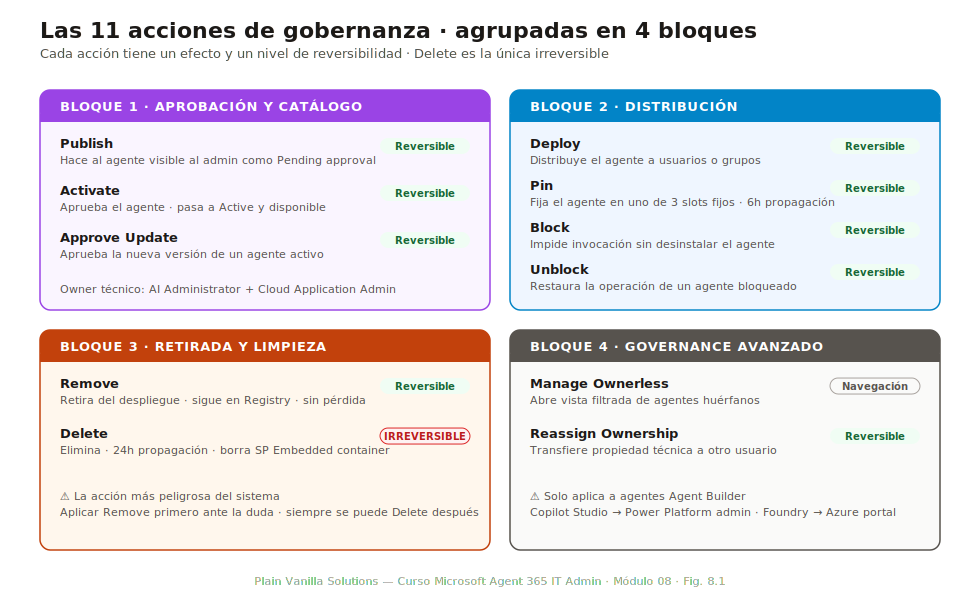
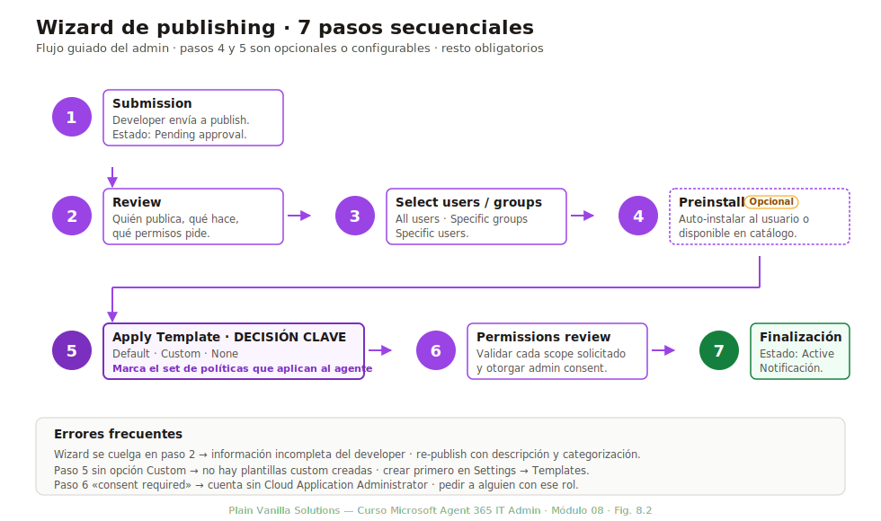
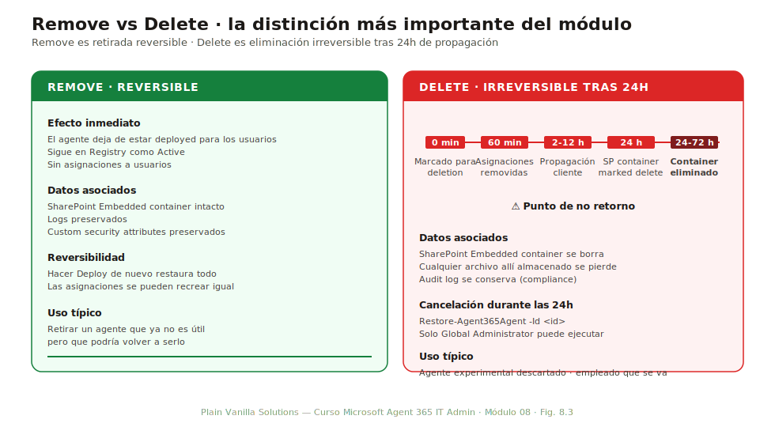

# Módulo 08 — Despliegue, distribución y ciclo de vida

> **Duración:** 90 min · **Prerrequisito:** Módulo 07

Si el M07 enseñó **dónde mirar** en el día a día, el M08 enseña **qué hacer**. Las 11 acciones de gobernanza disponibles desde Microsoft 365 admin center cubren todo el ciclo de vida de un agente: publicar, activar, desplegar, fijar, bloquear, retirar, eliminar, aprobar actualizaciones, gestionar huérfanos, reasignar propiedad. Este módulo las explica una a una y luego las combina en un proceso operativo aplicable a cualquier organización.

Al final del módulo el alumno puede ejecutar las 11 acciones desde la UI con seguridad, decidir cuándo usar plantilla Default vs Custom, distinguir Remove de Delete con sus implicaciones, y diseñar un ciclo de vida formal para su organización.

## Conceptos clave

| Término | Definición |
|---|---|
| **Publish** | Hacer disponible un agente en el catálogo del tenant para que el admin pueda revisarlo. Estado inicial: `Pending approval`. |
| **Activate** | Aprobar un agente publicado. El agente pasa a estado `Active`, pero todavía no se distribuye automáticamente a usuarios. |
| **Deploy** | Distribuir un agente activo a un conjunto de usuarios o grupos. Crea las asignaciones en Entra y notifica a los usuarios. |
| **Pin** | Fijar un agente en uno de los 3 slots fijos de la UI de Microsoft 365 Copilot, Teams o SharePoint para visibilidad alta. |
| **Block** | Impedir que los usuarios invoquen un agente sin retirarlo del catálogo. Reversible vía Unblock. |
| **Remove** | Retirar un agente del despliegue: deja de estar disponible para los usuarios pero se conserva en el Registry. Reversible. |
| **Delete** | Eliminar un agente y todos sus datos asociados de forma **irreversible**. Propagación de 24 horas. |
| **Approve Update** | Aprobar la nueva versión de un agente que ya estaba activo. Aplica si las capabilities cambian. |
| **Ownerless** | Categoría de agentes cuyo owner ya no existe o nunca se asignó (ver M07 § 7.3). |
| **Reassign Ownership** | Transferir la propiedad técnica de un agente de un usuario a otro. **Solo disponible para agentes Agent Builder.** |
| **Default Template** | Conjunto estándar de políticas que Microsoft sugiere al hacer Activate. Buena base para empezar. |
| **Custom Template** | Plantilla creada por el admin con restricciones específicas (sharing, Conditional Access, etc.). Ver § 8.3. |
| **SharePoint Embedded container** | Contenedor donde se almacenan los archivos generados por un agente. Implicaciones para Delete: se borra también el contenedor. |

---

## 8.1 Las 11 acciones de gobernanza

*Duración: 20 minutos*

El menú contextual de un agente en el Registry expone hasta 11 acciones según el estado actual del agente. Conocer cuál hace cada una y cuáles son reversibles es la base del módulo.



*Fig. 8.1 — Las 11 acciones del ciclo de vida agrupadas por bloque funcional. Cada una tiene un efecto inmediato distinto y un nivel de reversibilidad: las acciones del bloque «Distribución» son siempre reversibles; las del bloque «Retirada» van de reversible (Remove) a irreversible (Delete).*

### Bloque 1 — Aprobación y catálogo

| Acción | Efecto | Reversible | Estado origen | Estado destino |
|---|---|---|---|---|
| **Publish** | Hace al agente visible al admin como «Pending approval» | Sí (rechazo) | Borrador en Copilot Studio / Foundry | `Pending approval` |
| **Activate** | El agente pasa a aprobado y disponible | Sí (Block) | `Pending approval` | `Active` |
| **Approve Update** | Aprueba una nueva versión de un agente ya activo | Sí (rechazo de la actualización) | `Active` con update pending | `Active` con la nueva versión |

### Bloque 2 — Distribución

| Acción | Efecto | Reversible | Notas |
|---|---|---|---|
| **Deploy** | Distribuye el agente a usuarios/grupos definidos | Sí (Remove) | Crea asignaciones en Entra, notifica al usuario |
| **Pin** | Fija el agente en uno de los 3 slots de la UI | Sí (Unpin) | Hasta 6h de propagación; solo agentes deployed |
| **Block** | Impide invocación sin desinstalar | Sí (Unblock) | El agente sigue en Registry pero no operable |
| **Unblock** | Restaura la operación de un agente bloqueado | Sí (volver a Block) | Estado Active vuelve a aplicar |

### Bloque 3 — Retirada y limpieza

| Acción | Efecto | Reversible | Notas |
|---|---|---|---|
| **Remove** | Retira del despliegue; sigue en Registry | Sí (Deploy de nuevo) | Los usuarios dejan de verlo |
| **Delete** | **Elimina permanentemente** | **NO** | 24 h de propagación; SharePoint Embedded container también se borra |

### Bloque 4 — Governance avanzado

| Acción | Efecto | Reversible | Notas |
|---|---|---|---|
| **Manage Ownerless** | Abre vista filtrada de ownerless desde Top actions | N/A (es navegación) | Acceso al panel de gestión |
| **Reassign Ownership** | Transfiere propiedad técnica a otro usuario | Sí (volver a reasignar) | **Solo Agent Builder**, no Copilot Studio ni Foundry |

### Tabla resumen de reversibilidad

| Acción | Reversibilidad | Si te equivocas... |
|---|---|---|
| Publish | Reversible | Rechazar el publish |
| Activate | Reversible | Block o Remove |
| Approve Update | Reversible | Rechazar la próxima actualización |
| Deploy | Reversible | Remove |
| Pin | Reversible | Unpin |
| Block | Reversible | Unblock |
| Unblock | Reversible | Block de nuevo |
| Remove | Reversible | Deploy de nuevo |
| **Delete** | **IRREVERSIBLE** | Recrear desde cero (con su agent identity nueva) |
| Manage Ownerless | N/A | — |
| Reassign Ownership | Reversible | Reasignar de nuevo |

**La acción más peligrosa es Delete.** Su propagación de 24 horas significa que durante ese día las cosas pueden seguir funcionando aparentemente; pasado el día, el agente desaparece del directorio, sus archivos del SharePoint Embedded container se borran y ya no hay vuelta atrás.

---

## 8.2 Wizard de publishing

*Duración: 20 minutos*

Cuando un agente nuevo se publica, el admin lanza el **publishing wizard**: un flujo guiado de 6-7 pasos que aplica una plantilla, revisa permisos y formaliza el deployment. Este wizard es el patrón estándar que aplica al 90 % de los publishings del día a día.



*Fig. 8.2 — Los 7 pasos del wizard. El admin puede saltarse pasos opcionales (preinstall, permissions review extendida) según el agente, pero el orden de los obligatorios es estricto.*

### Los 7 pasos

#### Paso 1 — Submission

El developer del agente lo envía a publish desde Copilot Studio, Foundry o Agent Builder. El agente entra en estado `Pending approval` con la metadata enviada por el developer:

- Display name, descripción.
- Capabilities (datasources, plugins, channels).
- Permisos solicitados.
- Tags y categorización.

El IT admin recibe notificación (email + Top actions for you en Overview).

#### Paso 2 — Review

El admin abre el agente desde Pending requests. Revisa:

- **Quién lo publica**: developer + sponsor.
- **Qué hace**: descripción, datasources, capabilities.
- **Qué permisos pide**: scopes de Microsoft Graph y otros resource apps.

Decisión:
- **Approve**: continúa al paso 3.
- **Reject**: el agente vuelve al developer con feedback.
- **Request changes**: el admin puede pedir modificaciones específicas antes de aprobar.

#### Paso 3 — Select users / groups

Si el admin va a hacer Deploy a la vez que Activate (lo más común), selecciona aquí los destinatarios:

- **All users** del tenant.
- **Specific groups** (Security Groups o Microsoft 365 Groups).
- **Specific users** (lista manual).

Si se quiere Activate sin Deploy todavía (caso menos común: pruebas internas), saltar este paso.

#### Paso 4 — Preinstall (opcional)

Decisión: ¿se instala automáticamente para los usuarios destinatarios o solo aparece como disponible?

- **Preinstall**: el agente aparece en la UI de los usuarios sin que ellos hagan nada. Buena para herramientas críticas.
- **Available on demand**: aparece en el catálogo del usuario; el usuario decide si instalarlo. Buena para herramientas opcionales.

#### Paso 5 — Apply Template

**Decisión clave del wizard.** Aplicar plantilla:

- **Default Template**: las políticas estándar de Microsoft. Buen punto de partida.
- **Custom Template**: una plantilla creada previamente por el admin con políticas específicas (ver § 8.3).
- **None**: aplicar políticas individualmente; raro pero posible para casos muy especiales.

#### Paso 6 — Permissions review

El admin valida cada permiso solicitado por el agente. Para cada uno:

- ¿El permiso es coherente con lo que hace el agente?
- ¿Coincide con las políticas tenant?
- ¿Necesita admin consent explícito?

Si hay scopes que requieren admin consent y el admin tiene rol AI Administrator + Cloud Application Administrator, puede otorgarlo aquí mismo.

#### Paso 7 — Admin consent y finalización

Si el agente requiere consent que solo el Global Administrator puede otorgar, este último paso lleva al modal de admin consent estándar de Entra. Tras la aceptación:

- El agente pasa a estado `Active`.
- Si Deploy estaba activo, las asignaciones se crean automáticamente.
- Notificación a developer + sponsor + usuarios destinatarios.

### Errores frecuentes en el wizard

| Síntoma | Causa | Solución |
|---|---|---|
| Wizard se cuelga en paso 2 | Información incompleta del developer | Pedir al developer que añada descripción y categorización antes de re-publish |
| Paso 5 sin opción Custom Template | No hay plantillas custom creadas en el tenant | Crear primero una en Settings → Templates → New |
| Paso 6 muestra «consent required» y no se puede continuar | Cuenta sin Cloud Application Administrator | Pedir a alguien con ese rol que termine el wizard, o hacerlo con cuenta Global Admin |
| Activate completado pero los usuarios no ven el agente | Preinstall no marcado, agente solo en catálogo | El usuario puede instalarlo desde el catálogo, o re-deploy con preinstall = true |

---

## 8.3 Plantillas Default vs Custom

*Duración: 10 minutos*

Las plantillas son colecciones de políticas pre-configuradas que se aplican como conjunto al activar un agente. Resuelven el problema de tener que aplicar manualmente las mismas 5-10 políticas a cada agente nuevo.

### Default Template

La plantilla estándar de Microsoft incluye políticas conservadoras:

| Política | Default value |
|---|---|
| Sharing externo de respuestas | Disabled |
| Acceso a SharePoint cross-site | Limited to user's sites |
| Logging | Standard |
| Conditional Access aplicable | Tenant-wide policies |
| Sensitivity label heredada | From user |
| DLP | Tenant-wide policies |

Cuándo usarla: agentes internos sin requisitos especiales. Cubre 80 % de los casos de uso.

### Custom Template

Plantillas creadas por el admin desde `Agents → Settings → Templates → New`. Permiten definir conjuntos específicos:

```yaml
name: HighlySensitiveDataTemplate
description: Para agentes que acceden a datos confidenciales (Finanzas, RRHH)
policies:
  - Sharing externo: Blocked completely
  - Cross-site SharePoint: Blocked
  - Logging: Verbose
  - Conditional Access: Require MFA + Compliant device
  - Sensitivity label heredada: Confidential or higher
  - DLP: Block on Confidential content
  - Custom security attributes: DataSensitivity = Confidential
```

```yaml
name: PublicFacingTemplate
description: Para agentes orientados a clientes externos
policies:
  - Sharing externo: Allowed within partner orgs
  - Cross-site SharePoint: Allowed
  - Logging: Standard
  - Conditional Access: Tenant-wide policies
  - Sensitivity label heredada: Public
  - DLP: Allow with audit
```

### Cuándo crear Custom

- Cuando hay 3+ agentes que comparten un conjunto de restricciones específico.
- Cuando políticas de compliance exigen restricciones que la Default Template no cubre.
- Cuando el equipo de Seguridad pide aplicar las mismas políticas a varias familias de agentes (por ejemplo, todos los de Finanzas).

### Patrón recomendado

Mantener **3-5 plantillas custom** que cubran los casos típicos de la organización:

- `Standard` (= Default + 2-3 ajustes).
- `HighlySensitive` (datos confidenciales).
- `PublicFacing` (cliente externo).
- `Internal-Read-Only` (agentes que solo leen).
- `External-Partner` (B2B).

Más de 5 suelen ser sobrearquitectura: añade complejidad sin claridad. Menos de 3 suele ser insuficiente: los matices de los agentes obligan al admin a aplicar políticas individualmente.

---

## 8.4 Pinning y propagación

*Duración: 5 minutos*

**Pin** es la acción de fijar un agente en uno de los 3 slots prominentes de la UI:

| Slot | Quién lo controla | Visibilidad |
|---|---|---|
| **Microsoft** | Microsoft | Pre-fijado por Microsoft (ej: Sales Copilot built-in) |
| **Administrator** | El IT admin | Aparece a todos los usuarios del scope deployed |
| **User** | El propio usuario | Aparece solo al usuario que lo pinea |

### Cómo pinear

1. Registry → click en el agente → **Pin** → seleccionar slot **Administrator**.
2. Si el agente no está deployed, el botón Pin está atenuado: **pinear requiere Deploy previo**.
3. Confirmar.
4. Esperar la propagación: hasta **6 horas** para que aparezca en todas las UIs (Microsoft 365 Copilot, Teams, SharePoint Online).

### Limitaciones

- Solo **un agente por slot Administrator**: si pineas otro, el anterior se despinea automáticamente.
- Solo **agentes deployed**: si haces Remove de un agente pineado, el pin se cae automáticamente.
- La propagación de 6h es del lado del cliente: en realidad, el cambio en el directorio es inmediato, pero las apps cliente (Teams, Outlook) cachean.

### Cuándo usar Pin

- Para agentes corporativos críticos (un asistente de soporte interno, por ejemplo).
- Para promocionar la adopción de un agente nuevo durante 1-2 meses.
- NO para agentes de prueba: el Pin es para producción establecida.

---

## 8.5 Remove vs Delete

*Duración: 10 minutos*

La distinción más importante del módulo. Confundirlas tiene consecuencias graves.



*Fig. 8.3 — Remove es retirada reversible: el agente sigue en el Registry y puede volver a deployearse. Delete es eliminación irreversible: tras 24h de propagación, el agente y sus datos asociados desaparecen del directorio y del SharePoint Embedded container.*

### Remove

- **Efecto**: el agente deja de estar deployed para los usuarios. Sigue en Registry como `Active` (pero sin asignaciones).
- **Reversibilidad**: total. Hacer Deploy de nuevo restaura el estado anterior.
- **Datos**: ninguna pérdida. Los archivos en SharePoint Embedded permanecen.
- **Uso típico**: retirar un agente que ya no es útil pero que podría volver a serlo.

### Delete

- **Efecto**: el agente se elimina del directorio. El SharePoint Embedded container se marca para eliminación.
- **Reversibilidad**: **NINGUNA** después de las 24h de propagación.
- **Datos**: el SharePoint Embedded container se borra después de 24h. **Cualquier archivo allí almacenado se pierde**.
- **Uso típico**: agente experimental que se descarta definitivamente; agente de un empleado que se va.

### Timeline de Delete

| Tiempo desde el click | Estado |
|---|---|
| **0 min** | Agente marcado para deletion. Estado en Registry: `Pending deletion`. |
| **Primeros 60 min** | Asignaciones en Entra empiezan a removerse. Usuarios pierden acceso. |
| **2-12 h** | Propagación a todos los servicios (Teams, Outlook, SharePoint). |
| **24 h** | SharePoint Embedded container marcado para eliminación. |
| **24-72 h** | Container eliminado físicamente. Punto de no retorno. |

**Durante las primeras 24 horas**, un Global Administrator puede cancelar la deletion vía PowerShell:

```powershell
Restore-Agent365Agent -Id <agent-id>
```

Después de las 24h, la operación devuelve `404 Not Found`.

### Antipatrones

- **Delete cuando se quería Remove**: el más común. Si dudas, haz Remove primero. Siempre puedes Delete después.
- **Delete sin notificar al sponsor**: el sponsor pierde el agente sin previo aviso. Política tenant: requerir notificación 7 días antes de Delete.
- **Delete sin export del SharePoint Embedded container**: si había archivos relevantes (logs, salidas, datos de entrenamiento), se pierden. Hacer export antes.

---

## 8.6 Ownerless y Reassign Ownership

*Duración: 10 minutos*

Vimos en M07 que los **ownerless agents** son una de las 4 categorías de Top actions for you. Aquí entramos en cómo gestionarlos.

### Cómo aparece un ownerless

Un agente queda ownerless cuando:

1. El usuario que era owner se elimina del directorio (hard-delete en Entra).
2. El usuario era owner pero no estaba configurado como sponsor con `transferOnLeaver: true` (ver M06 § 6.4).
3. El agente se creó vía API sin owner explícito (raro pero ocurre con scripts).

### Vista Manage Ownerless

`Agents → Overview → Top actions for you → Ownerless agents → Manage`. Abre vista filtrada con los ownerless ordenados por:

- Last activity (los más activos primero).
- Created date.
- Risk level (si E7).

Cada fila muestra:
- Nombre del agente.
- Plataforma.
- Quién era el owner (UPN del usuario eliminado, conservado para auditoría).
- Última actividad.

### Reassign Ownership

Acción que asigna un nuevo owner a un agente:

1. Click sobre el agente ownerless → **Reassign ownership**.
2. **Seleccionar nuevo owner**: usuario o grupo. Si se asigna grupo, todos los miembros del grupo son co-owners.
3. **Confirmar y notificar**: el nuevo owner recibe email.

### Limitación crítica: solo Agent Builder

**Reassign Ownership solo está disponible para agentes creados con Agent Builder.** No aplica a:

- Copilot Studio agents (la propiedad se gestiona en Power Platform admin center).
- Foundry agents (la propiedad se gestiona en Azure portal).
- Externos vía Registry sync (la propiedad vive en la plataforma origen).

Para agentes Copilot Studio ownerless, hay que ir a Power Platform admin center → Environments → seleccionar el environment → Apps → reasignar.

Para agentes Foundry ownerless, ir a Azure portal → AI Foundry resource → Access control (IAM) → asignar Owner.

Esta limitación es la fuente de mucha confusión: el admin asume que Reassign está disponible para todos y se sorprende cuando el botón no aparece.

### Patrón recomendado

Antes de cualquier hard-delete de un usuario en Entra, ejecutar:

```powershell
# Buscar agentes con ese usuario como owner
Get-Agent365Agents -OwnerUpn <usuario-a-borrar>@tenant.onmicrosoft.com

# Si hay agentes, reasignar ANTES de borrar el usuario
foreach ($agent in $agents) {
    Reassign-Agent365Ownership -AgentId $agent.Id -NewOwnerUpn manager@tenant.onmicrosoft.com
}

# Solo entonces, borrar el usuario
Remove-MgUser -UserId <usuario-a-borrar>
```

Política tenant ideal: bloquear el hard-delete de usuarios con agentes activos hasta que se reasignen explícitamente.

---

## 8.7 Diseño del ciclo de vida

*Duración: 10 minutos*

Las acciones individuales son la herramienta. El ciclo de vida es el proceso. Una organización madura tiene formalizado **cuándo**, **quién** y **cómo** ejecuta cada acción.

### Plantilla de ciclo de vida (90 días)

Un proceso típico para un agente desde la idea hasta su retirement:

| Día | Estado | Acción | Responsable |
|---|---|---|---|
| Día 0 | Idea | Developer crea borrador en Copilot Studio | Developer |
| Día 5 | Borrador completo | Submit a publish | Developer |
| Día 6 | Pending approval | Review por IT admin | AI Administrator |
| Día 7 | Active | Activate + Apply Custom Template | AI Administrator |
| Día 8 | Active deployed | Deploy a grupo piloto (10 usuarios) | AI Administrator |
| Día 8-21 | Pilot | Monitorización; feedback recogido | Sponsor |
| Día 22 | Decisión | Go/no-go al rollout completo | Sponsor + AI Admin |
| Día 22 (si Go) | Active deployed broader | Re-Deploy a todos los users | AI Administrator |
| Día 22 (si Pin) | Pinned | Pin al slot Administrator | AI Administrator |
| Día 22 - 60 | Production | Operación normal | Sponsor |
| Día 60 | Review | Re-evaluación trimestral | Sponsor + AI Admin |
| Día 90+ | Mature production | O retirement si no útil | Sponsor |

### Ciclo de retirement

Cuando un agente deja de ser útil:

1. **Anuncio interno** (4 semanas antes): notificar a usuarios actuales.
2. **Remove del Pin** (3 semanas antes): el agente deja de tener visibilidad alta.
3. **Block** (2 semanas antes): los usuarios actuales pueden seguir invocando, pero los nuevos no.
4. **Remove** (1 semana antes): el agente deja de estar deployed. Los usuarios pierden acceso.
5. **Export del SharePoint Embedded container** (día -1): preservar archivos relevantes.
6. **Delete**: deletion definitiva.

Este ciclo de 4 semanas evita la sorpresa para los usuarios y permite preservar artefactos. Saltarse pasos es la fuente del 80 % de las quejas a IT por agentes desaparecidos.

### Roles típicos en el ciclo

- **Developer**: crea el agente y lo publica.
- **AI Administrator**: revisa y activa. Punto único de control técnico.
- **Sponsor**: decide cuándo deploy, cuándo retirement.
- **Compliance Administrator**: audita periódicamente (M11 lo cubre).
- **Cloud Application Administrator**: otorga admin consents necesarios.

---

## 8.8 Resumen y siguientes pasos

### Tres ideas que el alumno debe poder repetir sin notas

1. **Las 11 acciones se agrupan en 4 bloques.** Aprobación (Publish, Activate, Approve Update), Distribución (Deploy, Pin, Block, Unblock), Retirada (Remove, Delete) y Governance avanzado (Manage Ownerless, Reassign). Conocer el bloque ayuda a no equivocarse.
2. **Remove ≠ Delete.** Remove es reversible y conserva todo. Delete es irreversible tras 24h y borra el SharePoint Embedded container. Si dudas, Remove primero.
3. **Reassign Ownership solo aplica a Agent Builder.** Para Copilot Studio y Foundry, la reasignación se hace en Power Platform admin center y Azure portal respectivamente.

### Enlaces a otros módulos

| Tema introducido aquí | Profundización |
|---|---|
| Conditional Access policies aplicadas en plantillas | M09 — Permisos, accesos y Conditional Access |
| DLP en Custom Templates | M10 y M11 — Microsoft Purview |
| Audit log de todas las acciones del ciclo | M12 — Monitorización, auditoría y reporting |
| Sponsorship y lifecycle workflows del owner | M06 — Microsoft Entra Agent ID |
