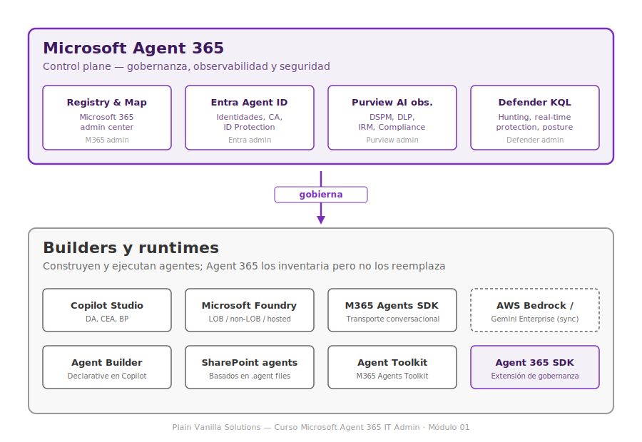
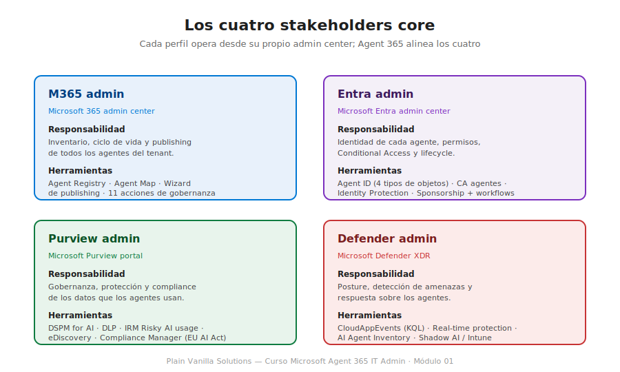

# Módulo 01 — Fundamentos: ¿Qué es Microsoft Agent 365?

**Duración estimada:** 60 minutos
**Prerrequisitos:** ninguno (módulo de apertura del curso)
**Fase del curso:** F2 (módulo prototipo)

---

## Objetivos de aprendizaje

Al finalizar este módulo, el alumno será capaz de:

- **OA-01.1** Explicar en una frase el propósito de Microsoft Agent 365 y por qué se diferencia de un agent builder. *(Comprender)*
- **OA-01.2** Identificar los cuatro stakeholders core que Microsoft Agent 365 alinea y la responsabilidad de cada uno. *(Recordar)*
- **OA-01.3** Distinguir Microsoft Agent 365 de Copilot Control System, Microsoft 365 Agents SDK, Microsoft Agent 365 SDK y Copilot Studio. *(Analizar)*
- **OA-01.4** Reconocer los principales hitos cronológicos del producto (Ignite 2025, GA 1 mayo 2026, capacidades en preview). *(Recordar)*
- **OA-01.5** Argumentar la necesidad de gobernar agentes de IA citando casos concretos de agent sprawl, shadow AI y agentes locales. *(Evaluar)*

---

## Conceptos clave

| Término | Definición operativa |
|---|---|
| **Agente** | Sistema software que percibe un entorno, razona sobre un objetivo y actúa autónomamente para conseguirlo, normalmente apoyado por un modelo de lenguaje grande. En el ecosistema Microsoft incluye desde un Copilot Studio Declarative Agent hasta un agente Foundry custom o un Agent Builder declarativo dentro de Copilot. |
| **Agent instance** | Instancia desplegada de un agente concreto en el tenant. Un mismo blueprint o agente puede tener varias instances (por ejemplo, una por equipo). |
| **Agent identity** | Identidad de directorio (Microsoft Entra) que representa al agente y le permite autenticarse, mantener permisos y dejar rastro auditable. |
| **Control plane** | Capa de software que **gobierna** otra capa, sin operar dentro de ella. Agent 365 es un control plane sobre los builders y runtimes de agentes; no construye agentes ni los ejecuta. |
| **Agent sprawl** | Multiplicación descontrolada de agentes en una organización: usuarios crean Copilot Studio agents, equipos despliegan Foundry agents, IT no tiene visibilidad ni inventario. Es uno de los dos problemas que Agent 365 resuelve. |
| **Shadow AI** | Uso de herramientas y agentes de IA fuera del control corporativo: agentes locales en el portátil del empleado (GitHub Copilot CLI, Claude Code), prompts en ChatGPT consumer, plugins de navegador, agentes en cuentas personales. Es el otro problema que Agent 365 ataca, junto con Microsoft Defender e Intune. |
| **Stakeholder core** | Cada uno de los cuatro perfiles administrativos a los que Agent 365 da herramientas: M365 admin, Entra admin, Purview admin y Defender admin. |
| **Frontier preview** | Programa de acceso anticipado de Microsoft. Da acceso a capacidades aún no GA mediante un toggle en el tenant y 25 licencias gratuitas. |
| **GA (General Availability)** | Disponibilidad general — el producto o capacidad está soportado para uso en producción con SLA. Agent 365 alcanzó GA el 1 de mayo de 2026. |
| **Copilot Control System (CCS)** | Capa de gobernanza para los **humanos** que usan Microsoft 365 Copilot: foundational + optimized, mide adopción, controla licencias y datos accedidos por humanos vía Copilot. Distinto de Agent 365 (gobierna agentes, no humanos). |

---

## 1.1 El problema que resuelve Agent 365

*Duración: 10 minutos*

El despliegue masivo de agentes de IA dentro de las organizaciones ha producido dos patologías que ningún producto previo resolvía bien.

### Agent sprawl

Cualquier empleado con licencia Microsoft 365 Copilot puede, hoy, crear un agente declarativo en menos de cinco minutos desde Copilot. Otro empleado puede publicar un agente en Copilot Studio sin pasar por IT. Un tercer equipo puede desplegar un agente Foundry custom que consulta una base de datos interna. Un cuarto empleado puede instalar un agente Third Party desde el Marketplace.

A los seis meses, el resultado es predecible: la organización tiene **decenas o cientos de agentes activos**, cada uno con sus propios permisos, sus propias fuentes de datos, sus propios canales de despliegue, y nadie los inventaria. Cuando alguien pregunta *«¿cuántos agentes tenemos?»*, la respuesta es *«no lo sabemos»*. Cuando pregunta *«¿qué datos sensibles ven?»*, la respuesta también.

Tres consecuencias inmediatas:

1. **Riesgo de oversharing.** Un agente de un equipo puede acceder a documentos de SharePoint que su creador no debería poder ver, simplemente porque la herencia de permisos de M365 no se diseñó pensando en agentes consultando todo a la vez.
2. **Coste invisible.** Cada agente Copilot Studio consume Copilot Credits; cada agente Foundry consume tokens; nadie atribuye consumo a equipos ni a casos de uso.
3. **Imposibilidad de cumplimiento.** Si llega una auditoría sobre la EU AI Act o una solicitud de información en un litigio (eDiscovery), no hay forma de responder *«qué hacen estos agentes con datos personales»* sin un inventario y sin telemetría.

### Shadow AI

El problema gemelo es el uso no controlado de herramientas de IA **fuera** del ecosistema Microsoft. Cuatro vectores típicos en mayo de 2026:

- **Agentes locales en el equipo del empleado.** GitHub Copilot CLI, Claude Code, OpenClaw y otros agentes de línea de comandos que se instalan vía paquetes y operan con las credenciales del usuario o con tokens propios. No aparecen en ningún admin center.
- **Prompts a ChatGPT consumer u otras webs de IA generativa.** Empleados copiando datos confidenciales en una pestaña de navegador.
- **Plugins de navegador con IA.** Resumidores, traductores, asistentes de email que mandan contenido a APIs externas.
- **Agentes Bedrock o Gemini Enterprise.** En organizaciones multicloud, agentes construidos sobre AWS Bedrock o Google Gemini Enterprise que operan sobre datos de M365 vía conectores.

Sin un punto de visibilidad central, IT no puede ni siquiera medir el problema, y mucho menos contenerlo.

### La promesa de Agent 365

Microsoft Agent 365 ataca los dos problemas de forma simultánea:

- Para el **agent sprawl**, ofrece un Agent Registry centralizado en M365 admin center que recoge metadatos de **todos los agentes que operan en el tenant** —Microsoft, Third Party y de la organización— y permite gobernarlos con las mismas herramientas que ya se usan para usuarios y aplicaciones.
- Para el **shadow AI**, integra con Microsoft Defender (que detecta tráfico hacia servicios de IA no autorizados) e Intune (que aplica políticas de bloqueo en endpoints) para detectar agentes locales y herramientas no aprobadas.

> Agent 365 no inventa una capa nueva: extiende el modelo de gobernanza que ya existe en Microsoft 365 (admin center, Entra, Purview, Defender) para que cubra también a los agentes. Esa es su tesis.

---

## 1.2 Posicionamiento: control plane, no builder

*Duración: 15 minutos*

La confusión más común al ver Agent 365 por primera vez es asumir que es *otro* producto para construir agentes — competidor de Copilot Studio o de Foundry. **No lo es.**

Agent 365 es un **control plane**: una capa que se coloca *encima* de los builders y runtimes existentes, y se ocupa exclusivamente de **gobernarlos, observarlos y asegurarlos**. No tiene un canvas para diseñar conversaciones, no tiene un IDE para definir flujos, no compila ni despliega agentes. Lo que hace es **inventariar**, **identificar**, **proteger los datos** que los agentes usan, y **detectar amenazas** sobre ellos.

### El mapa de capas

```
┌────────────────────────────────────────────────────────────────────┐
│                                                                    │
│   Microsoft Agent 365  (control plane)                             │
│   ┌──────────┬──────────┬──────────┬──────────┐                   │
│   │ Registry │  Entra   │ Purview  │ Defender │                   │
│   │  & Map   │ Agent ID │  AI obs. │  KQL     │                   │
│   └──────────┴──────────┴──────────┴──────────┘                   │
│                          ▲                                         │
│                          │ gobierna                                │
│                          │                                         │
│   ┌──────────────────────┴────────────────────────────┐           │
│   │                                                    │           │
│   │  Builders y runtimes (lo que ejecuta)             │           │
│   │                                                    │           │
│   │  ┌─────────────┐  ┌──────────────┐  ┌──────────┐ │           │
│   │  │  Copilot    │  │  Microsoft   │  │ M365     │ │           │
│   │  │  Studio     │  │  Foundry     │  │ Agents   │ │           │
│   │  │             │  │              │  │ SDK      │ │           │
│   │  └─────────────┘  └──────────────┘  └──────────┘ │           │
│   │  ┌─────────────┐  ┌──────────────┐  ┌──────────┐ │           │
│   │  │ Agent       │  │  SharePoint  │  │ Agent    │ │           │
│   │  │ Builder     │  │  agents      │  │ 365 SDK  │ │           │
│   │  └─────────────┘  └──────────────┘  └──────────┘ │           │
│   │                                                    │           │
│   └────────────────────────────────────────────────────┘           │
│                                                                    │
└────────────────────────────────────────────────────────────────────┘
```

*Fig. 1.1 — Microsoft Agent 365 se sitúa por encima de los builders y runtimes. Es complementario, no competidor.*



### Los seis productos que se confunden con Agent 365

Vale la pena fijarlos uno por uno porque la confusión entre ellos es la fuente del 80% de los errores en proyectos reales:

| Producto | Para qué sirve | Relación con Agent 365 |
|---|---|---|
| **Microsoft Copilot Studio** | Plataforma low-code para crear agentes declarativos y custom engine. Tiene canvas visual, conectores, Power Fx, etc. | Agent 365 **gobierna** los agentes que se crean con Copilot Studio. No los reemplaza. |
| **Microsoft Foundry** | Plataforma para crear agentes pro-code con cualquier framework (LangGraph, AutoGen, semantic kernel, etc.). | Agent 365 **gobierna** los agentes Foundry registrados en el tenant. |
| **Microsoft 365 Agents SDK** | Framework de desarrollo para agentes conversacionales: maneja transporte de mensajes en Teams, Copilot, Slack, Facebook Messenger. Es el *plumbing* que recibe y envía mensajes. | Es **complementario** a Agent 365. Un agente puede usar M365 Agents SDK para el transporte y registrarse en Agent 365 para la gobernanza. |
| **Microsoft Agent 365 SDK** | Librería que **extiende** un agente ya construido (en cualquier framework) con identidad Entra-backed, acceso a Work IQ MCP servers, observabilidad OpenTelemetry, notificaciones vía Activity protocol y gobernanza vía Agent ID. | Es la **puerta de entrada** del agente al control plane Agent 365. |
| **Copilot Control System (CCS)** | Conjunto de capacidades para gobernar a los **humanos** que usan Microsoft 365 Copilot. Cubre licensing, message capacity, Copilot Analytics, Copilot Dashboard. | **Distinto** de Agent 365 (que gobierna a los agentes). Se complementan, no se solapan. Más detalle en sección 1.4 y en el Módulo 13. |
| **Microsoft Agent 365** | Control plane de gobernanza, observabilidad y seguridad sobre todos los agentes del tenant. | Es lo que se enseña en este curso. |

### La distinción crítica: dos SDKs distintos

Cuando un desarrollador escucha *«Microsoft tiene un SDK para agentes»*, suele pensar en uno solo. Hay **dos**:

- **Microsoft 365 Agents SDK** — el transporte. Te ayuda a recibir mensajes en Teams, conectar tu agente a Copilot, manejar adapters, autenticación de bot, etc. **Sirve para construir agentes conversacionales.**
- **Microsoft Agent 365 SDK** — la gobernanza. Te ayuda a darle a tu agente una identidad de directorio, telemetría OpenTelemetry, acceso gobernado a Work IQ MCP servers (Outlook, Teams, SharePoint, etc.), notificaciones para humanos. **Sirve para hacer tu agente gobernable.**

Un agente real puede usar ambos: el primero para hablar con los usuarios, el segundo para ser inventariado, identificado y protegido. La elección no es excluyente.

> Si un proveedor o partner te dice que su agente *«usa el Microsoft Agents SDK»*, vale la pena preguntar **cuál de los dos**. La respuesta cambia el modelo de gobernanza aplicable.

---

## 1.3 Los cuatro stakeholders core

*Duración: 10 minutos*

Microsoft Agent 365 está pensado para alinear a cuatro perfiles administrativos que históricamente han operado por separado en una organización Microsoft 365.

### M365 admin

**Responsabilidad:** vista comprensiva de todos los agentes en el tenant. Decide qué agentes están activos, quién puede acceder, qué se publica al usuario final, qué se bloquea.

**Herramientas Agent 365 que utiliza:**

- **Agent Registry** (Microsoft 365 admin center → Agents) — inventario centralizado de todos los agentes con metadata (nombre, descripción, publisher, plataforma, ownership, permissions, datasources, certifications, activity).
- **Agent Map** — visualización del registry agrupada por plataforma; permite ver conexiones entre agentes en multi-agent workflows.
- **Wizard de publishing** — flujo controlado de aprobación con plantillas Default y Custom.
- **11 acciones de gobernanza** — Publish, Activate, Deploy, Pin, Block, Unblock, Remove, Delete, Approve Updates, Manage Ownerless, Reassign Ownership.

**Roles típicos:** AI Administrator (operativo), AI Reader (auditoría), Global Administrator (acciones críticas).

### Entra admin

**Responsabilidad:** identidad de cada agente y sus permisos sobre apps, recursos, internet y otros agentes. Diseña los blueprints, gestiona el ciclo de vida de las identidades, aplica Conditional Access.

**Herramientas Agent 365 que utiliza:**

- **Microsoft Entra Agent ID** — los cuatro tipos de objetos nuevos en el directorio: agent identity blueprint, blueprint principal, agent identity, agent user.
- **Conditional Access para agentes** [GA] — políticas con scope `All agent identities` o `All agent users`, condiciones por agent risk, grant Block.
- **Identity Protection para agentes** [Preview] (P2) — 6 detecciones offline, Risky Agents report con 90 días de histórico, acciones Confirm compromise / safe / Dismiss / Disable.
- **Lifecycle workflows** — sponsorship con transferencia automática al manager si el sponsor sale; mover/leaver tasks.

**Roles típicos:** Agent ID Administrator, Cloud Application Administrator, Conditional Access Administrator, Agent ID Developer.

### Purview admin

**Responsabilidad:** gobernanza, protección y compliance de los datos que los agentes usan o crean. DSPM, sensitivity labels, DLP, IRM, eDiscovery, Compliance Manager.

**Herramientas Agent 365 que utiliza:**

- **DSPM y DSPM for AI** (classic) — visión agregada del riesgo de datos asociado a agentes.
- **AI observability page** — agent instances activos, riesgos IRM, uso por agente.
- **Auditing** — agent-to-human, human-to-agent, agent-to-tools, agent-to-agent en el unified audit log.
- **DLP** — políticas que tratan al `agent instance` como user/security group; bloquean compartir SITs específicos vía un agente.
- **Insider Risk Management** — Risky AI usage policy template con detecciones de prompt injection y protected materials.
- **Compliance Manager** — assessments con templates regulatorios (EU AI Act, NIST AI RMF, ISO 42001, ISO 23894, DORA).

**Roles típicos:** Compliance Administrator, Microsoft Purview Compliance Administrator, IRM Reviewer.

### Defender admin

**Responsabilidad:** posture management y protección frente a amenazas sobre los agentes. Detección, hunting, respuesta a incidentes, real-time protection en runtime.

**Herramientas Agent 365 que utiliza:**

- **Centralized monitoring** en Defender XDR.
- **Out-of-the-box threat detections** — alertas en risky agent activities.
- **Advanced hunting con KQL** sobre la tabla `CloudAppEvents`, filtrando por las cinco `ActionTypes` específicas de agentes (`InvokeAgent`, `InferenceCall`, `ExecuteToolBySDK`, `ExecuteToolByGateway`, `ExecuteToolByMCPServer`).
- **Real-time protection durante runtime** [Preview] — inspecciona invocaciones de tools antes de ejecutarlas; bloquea XPIA (Indirect Prompt Injection) y UPIA (Direct Prompt Injection); fail-open si Defender no responde en 1 segundo.
- **Defender for Cloud Apps AI Agent Inventory** — inventario adicional para agentes Copilot Studio, posture, attack paths.
- **Detección de agentes locales / Shadow AI** — coordinada con Intune para bloquear OpenClaw, GitHub Copilot CLI, Claude Code y similares.

**Roles típicos:** Security Administrator, Security Operator, Security Reader.



*Fig. 1.2 — Los cuatro perfiles administrativos que Microsoft Agent 365 alinea, con sus admin centers y herramientas principales.*

### Por qué importa esta alineación

Antes de Agent 365, los cuatro perfiles trabajaban con productos distintos sin un modelo común sobre agentes. El M365 admin no veía las identidades de los agentes; el Entra admin no sabía qué hacían los agentes con datos; el Purview admin no podía aplicar DLP sobre conversaciones con agentes; el Defender admin no tenía telemetría específica de tools invocados por agentes.

Agent 365 hace que los cuatro vean **el mismo objeto** (el agente) desde sus respectivos admin centers, con metadatos comunes y referencias cruzadas. Es lo que en jerga de gobernanza se llama una *single source of truth* para agentes.

---

## 1.4 Agent 365 vs Copilot Control System (CCS)

*Duración: 10 minutos*

CCS y Agent 365 son ambos productos de gobernanza de Microsoft sobre el ecosistema Copilot/AI. La diferencia es **qué gobiernan**:

> **CCS gobierna a las personas que usan IA. Agent 365 gobierna a los agentes mismos.**

Esa frase resume la distinción operativa. Veamos cómo se materializa.

### Lo que CCS hace y Agent 365 no

CCS está pensado para resolver preguntas como:

- *¿Cuántos empleados están usando activamente Microsoft 365 Copilot?*
- *¿Qué departamentos generan más mensajes con Copilot?*
- *¿Estamos viendo retorno medible en productividad?*
- *¿Estamos sobre-compartiendo SharePoint y Copilot está descubriendo documentos que no debería ver?*

Sus tres pilares (que se desarrollan en el Módulo 13):

1. **Security & Governance** — capacidades para evitar que humanos usando Copilot accedan a datos que no deberían. Incluye SharePoint Advanced Management para detectar oversharing, Endpoint DLP, DSPM for AI, sensitivity labels, Adaptive Protection con IRM.
2. **Management Controls** — licensing per-user, message capacity en Power Platform admin center, ALM, deployment, Copilot Search, Copilot Settings.
3. **Measurement & Reporting** — Copilot Analytics y Copilot Dashboard en Microsoft Viva Insights.

Todo esto trata sobre **humanos**: cuántos hay, qué hacen con Copilot, cuánto cuesta su uso, qué datos ven cuando lo usan.

### Lo que Agent 365 hace y CCS no

Agent 365 está pensado para resolver preguntas como:

- *¿Cuántos agentes operan en mi tenant y de qué plataforma vienen?*
- *¿Quién es el owner de cada agente y qué hace si ese empleado se va?*
- *¿Ese agente Foundry tiene una identidad gestionada en Entra? ¿Qué permisos tiene?*
- *¿Qué tools está invocando ese agente y con qué frecuencia? ¿Hay actividad anómala?*
- *¿La política DLP que tengo aplicada a humanos también aplica a agentes?*
- *¿Algún agente está accediendo a documentos que tienen sensitivity label «Confidential»?*

Todo esto trata sobre **agentes**: cuántos hay, qué identidad tienen, qué hacen con datos, cómo se comportan en runtime.

### La complementariedad real

En una organización madura, los dos productos se usan a la vez:

- CCS asegura que **los humanos** no extraen información sensible vía Copilot Chat ni vía agentes que ellos mismos usan.
- Agent 365 asegura que **los agentes**, además, no acceden a datos que no deberían ni operan fuera de un perímetro auditado.

Un mismo evento puede tener relevancia en los dos productos: si un usuario le pasa a un agente un documento confidencial, CCS detectará la acción humana y Agent 365 detectará la actividad del agente. Las telemetrías son distintas pero correlacionables.

### Cuándo elegir uno u otro

| Pregunta | Producto |
|---|---|
| *Necesito medir adopción de Copilot por departamento.* | CCS (Copilot Analytics) |
| *Necesito ver cuántos agentes hay en mi tenant.* | Agent 365 (Agent Registry) |
| *Necesito que cuando un empleado se vaya, sus agentes pasen automáticamente al manager.* | Agent 365 (lifecycle workflows + sponsorship) |
| *Necesito reducir oversharing en SharePoint para que Copilot no descubra cosas indebidas.* | CCS (SharePoint Advanced Management) |
| *Necesito bloquear que un agente Foundry invoque ciertas tools en runtime.* | Agent 365 (Defender real-time protection) |
| *Necesito calcular cuánto está costando Copilot por equipo.* | CCS (Copilot Dashboard) |
| *Necesito investigar si un agente comprometido ha exfiltrado datos.* | Agent 365 (Defender + Purview) |

> Si un caso encaja con CCS y otro con Agent 365, no se elige uno: se contratan los dos. Son herramientas distintas para problemas distintos.

---

## 1.5 Cronología del producto

*Duración: 5 minutos*

| Fecha | Hito |
|---|---|
| **Noviembre 2025 (Ignite)** | Anuncio de Microsoft Agent 365. Acceso inicial vía Frontier preview program. Cobertura: capacidades core de registry, Entra Agent ID, primeras integraciones con Defender y Purview. |
| **9 marzo 2026** | Anuncio formal de Microsoft 365 E7 (Frontier Suite). Confirmación de precios: Agent 365 standalone a 15 USD/usuario/mes; M365 E7 a 99 USD/usuario/mes. |
| **1 mayo 2026** | **GA de Agent 365** (segmento comercial, modelo per-usuario). GA simultánea de M365 E7. Retiro de los blades *Agent registry* y *Agent collections* en Microsoft Entra admin center; integración consolidada en Microsoft 365 admin center. APIs `/beta/agentRegistry/...` reemplazadas por `/beta/copilot/admin/...`. |
| **Mayo 2026 (preview pública)** | Registry sync con AWS Bedrock y Google Gemini Enterprise. Página Shadow AI con detección de OpenClaw. Windows 365 for Agents (solo EE. UU. inicialmente). Identidades de agentes autónomas (own identity) y AI teammates en preview. |
| **Junio 2026 (anunciado)** | Bloqueo en runtime de coding agents y context mapping vía Defender + Intune. |

### Capacidades por estado en mayo de 2026

A lo largo del curso se etiquetan las capacidades con badges:

- **GA** — disponible para producción con SLA. Ejemplo: Conditional Access para agentes, Risks column (con E7), Compliance Manager para AI.
- **Preview pública** — disponible para todos los tenants pero con caveats explícitos. Ejemplo: Real-time protection durante runtime, Identity Protection para agentes, Registry sync multicloud, Shadow AI page.
- **Frontier preview** — solo para tenants en el programa preview de Microsoft. Ejemplo: agentic users autónomos con propio mailbox, Windows 365 for Agents fuera de EE. UU.

Cuando el curso describe una capacidad, indica explícitamente su estado para que el alumno sepa qué puede usar hoy en producción y qué requiere prudencia operativa adicional.

---

## 1.6 Resumen y próximos pasos

*Duración: 10 minutos*

### Mapa mental del curso

El resto de los 16 módulos del curso se construyen sobre las distinciones presentadas aquí:

- **Módulos 02 a 05** desarrollan la arquitectura, el licenciamiento, los roles administrativos y la configuración inicial. Son los pasos para tener Agent 365 en marcha en un tenant.
- **Módulos 06 a 09** profundizan en la pieza más distintiva del producto: Microsoft Entra Agent ID. Si Agent 365 es el control plane, Entra Agent ID es su corazón.
- **Módulos 10 a 12** cubren las dos disciplinas operativas que viven en otros admin centers pero forman parte del control plane: protección de datos en Purview y monitorización en Defender.
- **Módulo 13** sitúa Copilot Control System frente a Agent 365 (la distinción que ya se ha introducido aquí, profundizada).
- **Módulos 14 a 16** cubren gobernanza avanzada, troubleshooting y costes — los temas que diferencian a un admin que sabe operar Agent 365 de uno que solo lo ha activado.
- **Módulo 17** es la evaluación final.

### Lo que un admin debe saber al salir de este módulo

Si una persona te detiene en un pasillo y te pregunta *«oye, ¿qué es eso de Agent 365?»*, deberías poder responder en treinta segundos algo así:

> *«Es el plano de control de Microsoft para gobernar todos los agentes de IA que operan en un tenant de Microsoft 365. No construye agentes —eso sigue siendo Copilot Studio o Foundry— sino que los inventaria, les da identidad en Entra, protege los datos que ven con Purview y los monitoriza con Defender. Resuelve dos problemas: que los agentes se multiplican sin control y que hay agentes locales en los equipos que IT no ve. Lleva GA desde mayo de 2026, cuesta 15 dólares por usuario al mes standalone o viene en M365 E7 a 99 dólares.»*

Si esa respuesta sale fluida, el módulo ha hecho su trabajo.

---

## Resumen

- Microsoft Agent 365 es un **control plane** de gobernanza, no un agent builder. Se sitúa encima de Copilot Studio, Foundry, M365 Agents SDK, SharePoint agents y demás builders.
- Resuelve dos problemas: **agent sprawl** (multiplicación descontrolada de agentes) y **shadow AI** (agentes y herramientas de IA fuera del control corporativo).
- Alinea a **cuatro stakeholders core**: M365 admin (registry, lifecycle), Entra admin (identidad, CA), Purview admin (datos, compliance), Defender admin (monitorización, respuesta).
- Hay que distinguir **seis productos** que se confunden: Copilot Studio, Foundry, M365 Agents SDK, Agent 365 SDK, CCS y Agent 365.
- **CCS gobierna a personas usando IA; Agent 365 gobierna a los agentes mismos.** Son complementarios.
- Hay **dos SDKs distintos** que comparten *«Agents»* en el nombre: M365 Agents SDK (transporte conversacional) y Agent 365 SDK (gobernanza). Un agente puede usar los dos.
- Llegó a **GA el 1 de mayo de 2026** tras pasar por Frontier preview desde Ignite 2025. Múltiples capacidades clave siguen en preview pública: real-time protection en runtime, ID Protection para agentes, registry sync multicloud, Shadow AI page, agentic users autónomos.
- Precio: **15 USD/usuario/mes standalone** o incluido en **M365 E7 (Frontier Suite) a 99 USD/usuario/mes**.

---

## Próximo módulo

[Módulo 02 — Arquitectura y componentes](../modulo-02-arquitectura/) profundiza en el diagrama de bloques completo de Agent 365: cómo se conectan los cuatro admin centers, qué hace cada hero metric del Overview, qué tipos de agentes son gestionables (los ocho de la taxonomía oficial), cómo se categorizan por publisher y el rol de Work IQ MCP servers en runtime de agentes.

---

> **Fuentes oficiales utilizadas en este módulo:**
> - [Microsoft Agent 365 — overview (es-es)](https://learn.microsoft.com/es-es/microsoft-agent-365/overview)
> - [Microsoft Security Blog: Microsoft Agent 365, now generally available, expands capabilities and integrations (1 mayo 2026)](https://www.microsoft.com/security/blog/)
> - [Microsoft 365 admin center: Agent 365 overview](https://learn.microsoft.com/microsoft-365/admin/manage/agent-365-overview)
> - [Copilot Control System: overview](https://learn.microsoft.com/copilot/microsoft-365/copilot-control-system/overview)
> - [Microsoft Entra Agent ID: what is Agent ID](https://learn.microsoft.com/entra/agent-id/identity-platform/what-is-agent-id)
