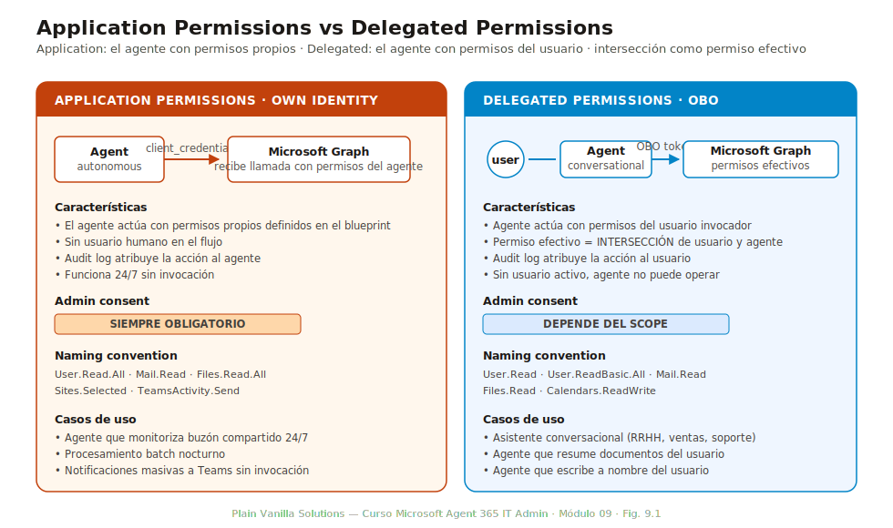
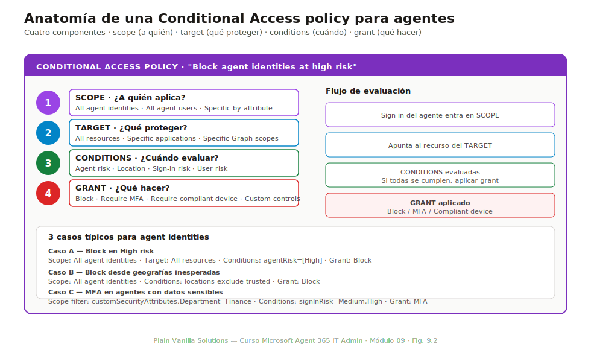
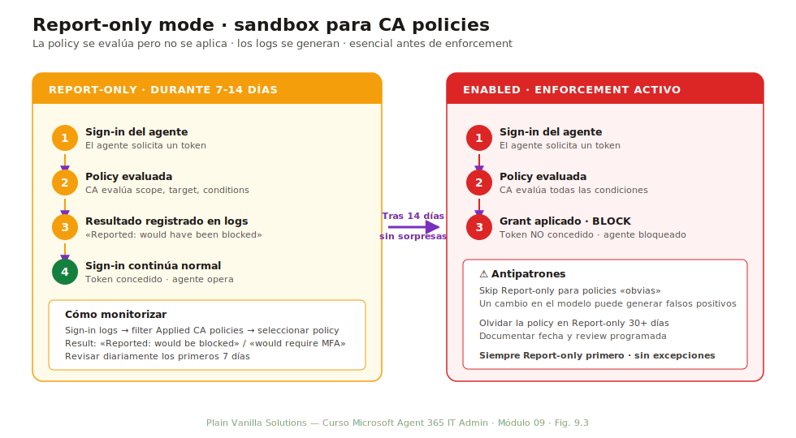
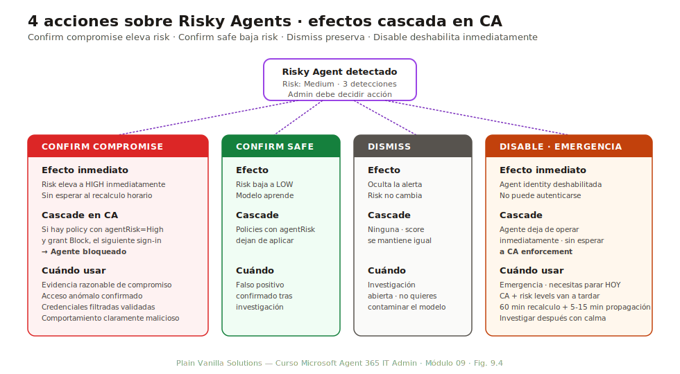

# Módulo 09 — Permisos, accesos y Conditional Access

> **Duración:** 75 min · **Prerrequisitos:** Módulos 06 y 08

Este módulo cierra la Fase 4 (administración de identidades de agentes) con la capa de control de acceso. Si el M06 enseñó **qué identidad tiene cada agente** y el M08 enseñó **cómo se distribuye al usuario**, el M09 enseña **qué puede hacer cada agente cuándo y desde dónde**. Tres bloques: permisos OAuth (Application vs Delegated), Conditional Access aplicado a agent identities, e Identity Protection para detectar comportamiento sospechoso.

Al final del módulo el alumno puede diferenciar Application de Delegated permissions con criterio, conceder admin consent correctamente, diseñar una CA policy específica para agentes, monitorizar en Report-only antes de enforcement y reaccionar al Risky Agents report con la acción correcta.

## Conceptos clave

| Término | Definición |
|---|---|
| **Application Permission** | Permiso que se otorga al **agente como aplicación**, independiente de cualquier usuario. Aplica a flujos `client_credentials` (own identity). Requiere admin consent. |
| **Delegated Permission** | Permiso que el agente recibe **en nombre del usuario** que lo invoca. Aplica a flujos OBO. El permiso efectivo es la intersección del permiso del usuario y del agente. |
| **Admin consent** | Aprobación explícita de un Global Administrator (o Cloud Application Administrator) que activa permisos que requieren consent organizacional. |
| **Conditional Access (CA)** | Motor de políticas de Microsoft Entra que evalúa señales (usuario, dispositivo, ubicación, riesgo) para decidir si conceder, bloquear o requerir MFA. Para agentes, evalúa señales específicas como agent risk. |
| **Agent risk** | Señal de Identity Protection sobre un agent identity. Niveles: `Low`, `Medium`, `High`. Disparado por las 6 detecciones para agentes. |
| **Report-only mode** | Modo de una CA policy donde se evalúa pero **no se aplica**. Permite monitorizar el impacto antes de enforcement. |
| **Identity Protection** | Servicio de Microsoft Entra que detecta sign-ins anómalos. La extensión para agentes tiene 6 detecciones específicas (Preview, requiere P2). |
| **Risky Agents report** | Vista de Identity Protection que lista agent identities con riesgo elevado. Conserva 90 días. |
| **Confirm compromise** | Acción manual desde Risky Agents report que **eleva el risk a `High`** y dispara CA policies que filtren por agent risk. |
| **Confirm safe** | Acción opuesta: marca un riesgo como falso positivo, **baja el risk a `Low`** y reentrena las heurísticas. |

---

## 9.1 Application vs Delegated Permissions

*Duración: 10 minutos*

La distinción Application vs Delegated viene del modelo OAuth 2.0 estándar pero tiene matices propios para agentes. Confundirlas es la causa raíz del 70 % de los problemas de permisos en Agent 365.



*Fig. 9.1 — Application Permissions: el agente actúa con sus propios permisos (own identity). Delegated Permissions: el agente actúa con los permisos del usuario invocador (OBO). El permiso efectivo en Delegated es la intersección de ambos.*

### Application Permissions

- **Flujo asociado**: `client_credentials` (own identity, M06 § 6.2).
- **Quién las usa**: el agente, sin usuario humano detrás. Aplica a autonomous.
- **Cuándo evalúan**: en el momento del token request del agente.
- **Admin consent**: **siempre obligatorio**. No hay forma de que un usuario consienta por sí solo.
- **Naming convention**: terminan en `.All` o son indicativas de scope amplio (ej: `User.Read.All`, `Mail.Read`, `Sites.Selected`).

### Delegated Permissions

- **Flujo asociado**: OBO (M06 § 6.2).
- **Quién las usa**: el agente, en nombre de un usuario invocador.
- **Cuándo evalúan**: en el flujo OBO, cuando el agente intercambia el token del usuario.
- **Admin consent**: **opcional según el scope**. Algunos requieren admin consent (`User.Read.All`), otros pueden consentir el usuario directamente (`User.Read`).
- **Permiso efectivo**: **intersección** del permiso del usuario y el del agente. Si el usuario no tiene acceso a un dato, el agente tampoco.

### Common permissions

| Permiso | Tipo típico | Uso |
|---|---|---|
| `User.Read` | Delegated | Leer perfil del usuario invocador |
| `User.ReadBasic.All` | Delegated o Application | Leer perfil básico de cualquier usuario |
| `User.Read.All` | Delegated o Application | Leer perfil completo de cualquier usuario (requiere admin consent) |
| `Mail.Read` | Delegated o Application | Leer correo (Delegated: del usuario; Application: de cualquier buzón) |
| `TeamsActivity.Send` | Delegated o Application | Enviar mensajes a Teams |
| `Files.Read.All` | Delegated o Application | Leer archivos (Delegated: del usuario; Application: de cualquier site) |
| `Sites.Selected` | Application | Acceder solo a sites SharePoint específicos (más seguro que Sites.Read.All) |

### Cómo elegir

| Caso | Tipo recomendado | Por qué |
|---|---|---|
| Agente conversacional (asistente) | Delegated | Hereda los permisos del usuario; sin sobreasignación |
| Agente que monitoriza buzón compartido 24/7 | Application | No hay usuario invocador; necesita permisos propios |
| Agente que escribe en SharePoint a nombre del usuario | Delegated | Audit log atribuye correctamente al usuario |
| Agente que envía notificaciones masivas a un Teams channel | Application | El agente inicia la acción, no responde a un usuario |
| Agente que lee perfiles de la organización para enriquecer respuestas | Delegated `User.ReadBasic.All` | Lectura básica + heredada del usuario |

### Antipatrón crítico

**Conceder Application Permissions amplias «por si acaso».** Un agente con `Mail.Read` Application puede leer **todos los buzones del tenant**. Si se compromete el agente, el atacante tiene acceso ilimitado a correo. Cuando OBO funciona, OBO siempre es la opción más segura.

---

## 9.2 Admin consent

*Duración: 10 minutos*

El admin consent es la frontera entre los permisos que un usuario individual puede otorgar y los que requieren aprobación organizacional. Para agentes, esto importa especialmente porque muchos scopes Application requieren admin consent obligatorio.

### Cuándo se requiere admin consent

| Permiso | Tipo | Admin consent requerido |
|---|---|---|
| `User.Read` (Delegated) | Delegated | No: el usuario consiente por sí solo |
| `User.Read.All` (Delegated) | Delegated | Sí: scope amplio sobre todo el directorio |
| `User.Read.All` (Application) | Application | Sí: siempre, todas las Application Permissions |
| `Sites.Selected` (Application) | Application | Sí, además de configuración site-by-site |
| `Mail.Send` (Delegated) | Delegated | Generalmente no, salvo en tenants con políticas estrictas |
| `Mail.Send` (Application) | Application | Sí: enviar correo desde cualquier buzón es alta confianza |

### Cómo otorgar admin consent

Tres caminos:

#### 1. Durante el publishing wizard (M08 § 8.2)

El paso 6 «Permissions review» del wizard incluye un botón **Grant admin consent** si el admin tiene rol Cloud Application Administrator o Global Administrator. Click otorga consent y el agente queda con todos los scopes activos.

#### 2. Desde la página del agente en Entra

`Entra admin center → Identity → Agents → seleccionar el agente → Permissions → Grant admin consent`. Útil cuando se publicó sin consent y se quiere otorgar después.

#### 3. Vía URL de admin consent

```
https://login.microsoftonline.com/{tenant}/adminconsent
?client_id={agentIdentityClientId}
&redirect_uri=https://login.microsoftonline.com/common/oauth2/nativeclient
```

Esta URL abre el modal estándar de admin consent de Entra. Útil cuando el admin recibe un email del developer pidiéndole consentir.

### Cuando el consent se queda pending

Síntomas:
- El agente aparece en Registry como `Active` pero falla las llamadas con `403 InsufficientPermissions`.
- En Entra → Permissions el scope aparece marcado como «Not granted by tenant admin».

Causas comunes:
1. **Admin que aprobó no tenía Cloud Application Administrator**: el wizard guarda la solicitud pero no la concede.
2. **Multi-tenant agent**: si el agente está disponible para varios tenants, cada admin debe consentir por su tenant.
3. **Scope añadido posteriormente**: si la versión inicial del agente no tenía el scope y se añadió después, el consent original no lo cubre.

Solución: revocar el consent existente y volver a otorgar con cuenta con rol adecuado.

---

## 9.3 Conditional Access para agentes (GA)

*Duración: 20 minutos*

A día de hoy (mayo 2026), Conditional Access aplica de forma nativa a agent identities. Esto fue uno de los cambios clave de la convergencia de mayo 2026 (M06 § 6.7): los agentes pasaron a ser «citizens» de Conditional Access igual que los usuarios humanos.



*Fig. 9.2 — Una CA policy para agentes tiene los mismos cuatro componentes que una para usuarios: scope (a quién aplica), target (qué proteger), conditions (cuándo evaluar) y grant (qué hacer). Lo distintivo está en los valores específicos para agentes en cada uno.*

### Scope: All agent identities / All agent users

El scope determina a qué tipo de objeto aplica la policy:

- **All agent identities**: aplica a las identidades técnicas (objeto `agentIdentity`).
- **All agent users**: aplica a los `agentUser` opcionales (los humano-like).
- **Specific agents by attribute**: filtrar por custom security attribute (M06 § 6.6). Ej: solo agentes con `Department: Finance`.
- **Exclude agent identities**: excepciones para casos legítimos.

Combinable con scopes de usuarios humanos en la misma policy: una sola policy puede aplicar a `All users + All agent identities`.

### Target: All resources

El target define qué se protege. A diferencia de usuarios humanos donde el target típico es una aplicación específica (Office 365, etc.), para agentes el target más útil es **All resources**: si el agente está comprometido, queremos bloquear cualquier acceso, no solo a una app.

Otros targets posibles:
- **Specific applications**: para agentes que solo deberían acceder a un set específico de apps.
- **Specific Microsoft Graph scopes**: para policies muy granulares.

### Conditions: Agent risk

Las condiciones para agentes incluyen las habituales (location, device, etc.) más una específica: **Agent risk**.

| Nivel de Agent risk | Cuándo dispara | Acción típica |
|---|---|---|
| **Low** | Comportamiento normal | No actuar |
| **Medium** | Detección incipiente (login desde IP nueva, volumen ligeramente anómalo) | Requerir MFA del usuario invocador o aumentar logging |
| **High** | Múltiples detecciones o detección crítica (sign-in desde geografía sospechosa, acceso anormal a datos sensibles) | **Block** |

Otras conditions útiles para agentes:
- **Location**: bloquear sign-ins desde países no esperados.
- **Sign-in risk**: riesgo del sign-in concreto (heurística por sign-in).
- **User risk**: riesgo del usuario humano que invoca al agente (en flujos OBO).

### Grants: Block

Para agentes, los grants útiles son:

| Grant | Efecto |
|---|---|
| **Block access** | El sign-in del agente falla. No se otorga token. |
| **Require MFA** | Solo aplicable si hay usuario humano (flujo OBO). El usuario debe completar MFA. |
| **Require compliant device** | El dispositivo del usuario invocador debe estar compliant. Útil para agentes con datos sensibles. |
| **Require approved client app** | Solo aplicable a la aplicación cliente del usuario, no al agente directamente. |

### Casos típicos de CA policy para agentes

#### Caso 1 — Block agentes en High risk

```yaml
name: Block agent identities at high risk
scope:
  include: All agent identities
target:
  resources: All resources
conditions:
  agentRisk: [High]
grants:
  - Block access
state: Enabled
```

Aplica a todos los agentes; bloquea sign-in cuando Identity Protection los marca como High risk.

#### Caso 2 — Bloquear agentes desde geografías inesperadas

```yaml
name: Block agents from non-corporate locations
scope:
  include: All agent identities
target:
  resources: All resources
conditions:
  locations:
    exclude: ['Trusted IPs', 'Corporate countries']
grants:
  - Block access
state: Enabled
```

Útil cuando todos los agentes operan desde ubicaciones controladas.

#### Caso 3 — MFA para sign-ins de agentes con datos sensibles

```yaml
name: MFA for agents accessing finance data
scope:
  include: All agent identities
  filter: customSecurityAttributes.Department eq 'Finance'
target:
  resources: All resources
conditions:
  signInRisk: [Medium, High]
grants:
  - Require multi-factor authentication
state: Enabled
```

Solo a los agentes de Finanzas (vía custom security attribute) y cuando el sign-in tiene riesgo.

### Diferencia importante de enforcement

CA enforcement aplica en **dos puntos distintos** según el flujo:

| Flujo | Enforcement de CA aplica en... |
|---|---|
| **OBO** | El **token del usuario** (el que invoca al agente). Las policies de usuario aplican. Las policies de agente NO aplican al sign-in OBO directamente; aplican si el agente luego solicita su propio token. |
| **Own identity** | El **token request del agente**. Las policies de agente aplican directamente. |

Esto explica por qué a veces una CA policy de Block parece no aplicar: el agente está operando en OBO y la policy aplica al usuario, no al agent identity.

---

## 9.4 Report-only mode

*Duración: 10 minutos*

Cualquier CA policy nueva debería empezar en **Report-only mode** antes de pasar a enforcement. Es la diferencia entre un experimento controlado y un incidente accidental.



*Fig. 9.3 — Report-only es el sandbox de las CA policies. La evaluación ocurre, los logs se generan, pero el efecto sobre el sign-in es nulo. Esencial antes de enforcement para evitar bloqueos accidentales.*

### Cómo funciona Report-only

1. El admin crea una CA policy con state = **Report-only**.
2. Cuando un sign-in del scope ocurre:
   - La policy se evalúa contra las conditions.
   - Si la policy aplicaría (conditions met), se registra en Sign-in logs como «Reported: would have been blocked» (o el grant correspondiente).
   - **No se aplica el grant**: el sign-in sigue su flujo normal.
3. El admin monitoriza durante un período (típicamente 7-14 días).
4. Si no hay falsos positivos, el admin cambia state a **Enabled**: enforcement activo.

### Por qué Report-only es crítico para agentes

- Los agentes hacen sign-ins frecuentes (cientos o miles al día). Un bloqueo accidental impacta inmediatamente.
- El Agent risk score puede tener falsos positivos al inicio (especialmente cuando la base histórica es pequeña).
- Las custom security attributes pueden no estar bien aplicadas; un filtro mal configurado puede bloquear más agentes de los previstos.
- A diferencia de bloqueos a usuarios humanos (que llaman a IT), un agente bloqueado solo aparece en logs: si no se monitoriza, los problemas pasan desapercibidos durante horas.

### Cómo monitorizar el Report-only

`Entra admin center → Sign-ins → Filter: applied Conditional Access policies → seleccionar la policy en Report-only`. La columna **Result** mostrará para cada sign-in:

- **Reported: would be blocked** — el sign-in habría sido bloqueado.
- **Reported: would require MFA** — habría requerido MFA.
- **Not applied** — el sign-in no entraba en scope de la policy.

Patrón recomendado:

1. Tras 24h en Report-only, revisar los primeros sign-ins reportados. ¿Falsos positivos?
2. Tras 7 días, revisar el volumen total. Si los reports son consistentes con el comportamiento esperado, considerar enforcement.
3. Tras 14 días sin sorpresas, pasar a Enabled.

### Antipatrón

- **Skip Report-only para policies «obvias»**: «esto solo bloquea high risk, no puede haber falsos positivos». Un cambio en el modelo de Identity Protection puede generar high risks en agentes legítimos. Siempre Report-only primero.
- **Olvidar la policy en Report-only**: tras 30 días, una policy en Report-only se vuelve invisible. Documentar fecha de creación y review programada.

---

## 9.5 Identity Protection para agentes (Preview · P2)

*Duración: 10 minutos*

Microsoft Identity Protection se extendió a agent identities con 6 detecciones específicas. A mayo de 2026 sigue en Frontier preview y requiere licencia P2 (incluida en E5/E7).

### Las 6 detecciones para agentes

| Detección | Qué detecta | Heurística |
|---|---|---|
| **Anomalous sign-in** | Sign-in desde IP/geografía no habitual para ese agente | Aprende patrón histórico de los últimos 30 días |
| **Atypical activity volume** | Volumen de invocaciones drásticamente fuera de la media | Z-score > 3 sobre la media histórica |
| **Suspicious permission elevation** | Cambio en los permisos del agente que parece anómalo | Diff con la última versión aprobada |
| **Anomalous data access** | Acceso a datos sensibles no característico del rol del agente | Cruza con sensitivity labels (Purview) |
| **Compromised credentials indicator** | Token o secret del agente apareció en fuentes de threat intel | Cruza con feed de credenciales filtradas |
| **Token replay** | Mismo token usado desde dos ubicaciones distintas en intervalo corto | Heurística de replay attack |

### Risky Agents report

`Entra admin center → Identity Protection → Risky agents`. Vista filtrada con:

- Lista de agentes con risk score elevado.
- Risk level (Low / Medium / High).
- Detecciones que contribuyen al score.
- Última actividad detectada.
- Acciones disponibles (ver § 9.6).

**Conservación**: 90 días desde la última detección. Pasados 90 días sin detecciones nuevas, el agente sale del report (pero las detecciones individuales se conservan en audit log más tiempo).

### Limitaciones del Preview

- **Solo agent identities** (no Copilot Studio agents legacy V1).
- **Detecciones offline**: el cálculo se ejecuta cada hora, no en tiempo real. Un sign-in sospechoso puede tardar 60 minutos en levantar el risk score.
- **Frontier preview**: requiere inscripción al programa (M05).

---

## 9.6 Acciones sobre Risky Agents

*Duración: 10 minutos*

Cuando un agente aparece en el Risky Agents report, el admin tiene cuatro acciones disponibles. Cada una tiene efectos cascada sobre Conditional Access.



*Fig. 9.4 — Confirm compromise eleva el risk a High (dispara CA policies que filtran por agent risk). Confirm safe baja a Low. Dismiss preserva el riesgo. Disable es la acción de freno de emergencia.*

### Las 4 acciones

#### Confirm compromise

- **Efecto**: el risk del agente se eleva inmediatamente a **High**, sin esperar al recalculo horario.
- **Cascade**: si hay una CA policy con `agentRisk: [High]` y grant Block, la policy se dispara en el siguiente sign-in del agente → agente bloqueado.
- **Cuándo usar**: cuando tienes evidencia razonable de que el agente está comprometido (acceso anómalo confirmado, credenciales filtradas validadas, comportamiento claramente malicioso).

#### Confirm safe

- **Efecto**: el risk del agente baja a **Low** y el modelo aprende que esos comportamientos son legítimos para este agente.
- **Cascade**: las CA policies con `agentRisk: [High]` dejan de aplicar en sign-ins futuros.
- **Cuándo usar**: ante un falso positivo confirmado. Tras investigación, queda claro que el comportamiento detectado es legítimo (un cambio de uso del agente, una integración nueva, etc.).

#### Dismiss

- **Efecto**: oculta la alerta del Risky Agents report sin cambiar el risk score.
- **Cascade**: ninguna; el risk score se mantiene como estaba.
- **Cuándo usar**: en alertas que no son ni claramente compromiso ni claramente safe. Útil para «archivar» mientras investigamos sin contaminar el modelo.

#### Disable

- **Efecto**: deshabilita la agent identity inmediatamente. El agente no puede autenticarse hasta reactivación manual.
- **Cascade**: el agente deja de operar inmediatamente.
- **Cuándo usar**: emergencia. Cuando se necesita parar al agente HOY y el flujo de CA policy + risk levels va a tardar (60 min de recalculo, 5-15 min de propagación).

### Tabla de decisión

| Situación | Acción correcta |
|---|---|
| Evidencia clara de compromiso | Confirm compromise + monitorizar enforcement |
| Falso positivo claro | Confirm safe |
| Investigación abierta, no quieres contaminar el modelo | Dismiss |
| Necesitas parar al agente YA | Disable + investigar después |

### Patrón completo de respuesta a incidente

```
1. Aparece alerta en Risky Agents report.
2. Admin investiga: revisa audit log, sign-in logs, contexto de las detecciones.
3a. Si compromiso → Confirm compromise. CA policy en Block dispara automático.
3b. Si emergencia inmediata → Disable. Investigar después con calma.
3c. Si falso positivo → Confirm safe.
3d. Si dudoso → Dismiss + abrir incidente Defender para análisis profundo.
4. Documentar la decisión en el ticket interno.
5. Si Confirm compromise / Disable: comunicar al sponsor del agente y al equipo de seguridad.
```

---

## 9.7 Resumen y siguientes pasos

Este módulo cierra la Fase 4 (administración de identidades). El alumno tiene ahora todas las piezas: directorio (M06), inventario y operación (M07), distribución y ciclo de vida (M08), y control de acceso (M09).

### Tres ideas que el alumno debe poder repetir sin notas

1. **Application vs Delegated.** Application permissions = el agente actúa con sus permisos propios (own identity, autonomous). Delegated = el agente actúa con los permisos del usuario invocador (OBO). Delegated cuando OBO funciona; Application solo cuando OBO no es viable.
2. **Conditional Access para agentes tiene los mismos 4 componentes que para usuarios** (scope, target, conditions, grants). Lo específico es scope `All agent identities` y condition `Agent risk`. Siempre empezar en Report-only antes de enforcement.
3. **Confirm compromise eleva el risk a High** y dispara CA policies que filtren por agent risk. Es la palanca para reaccionar a incidentes. Disable es la opción de freno de emergencia cuando no se puede esperar.

### Enlaces a otros módulos

| Tema introducido aquí | Profundización |
|---|---|
| Sensitivity labels usadas en Anomalous data access | M10 — Microsoft Purview |
| Audit log de sign-ins de agentes | M12 — Monitorización, auditoría y reporting |
| Defender XDR como destino de Investigate | M12 |
| Custom security attributes para CA scoping | M06 § 6.6 |
| Restore-Agent365Agent (recuperación tras Disable) | M08 § 8.5 |
